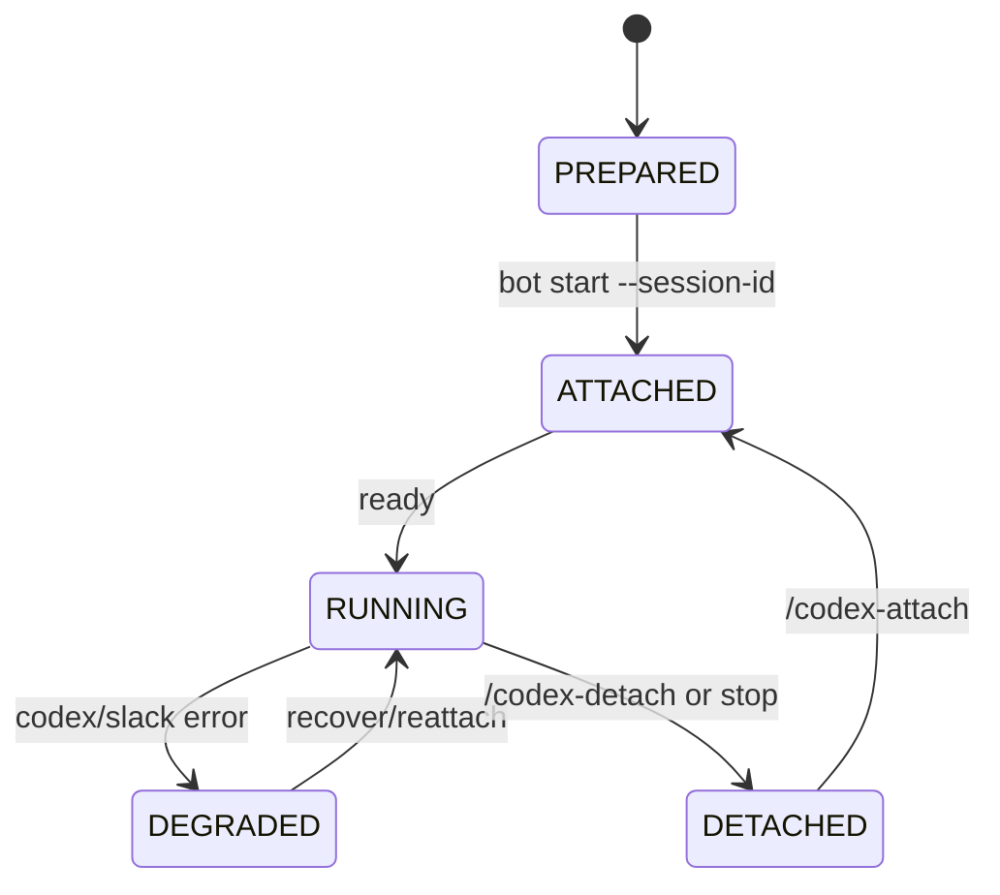
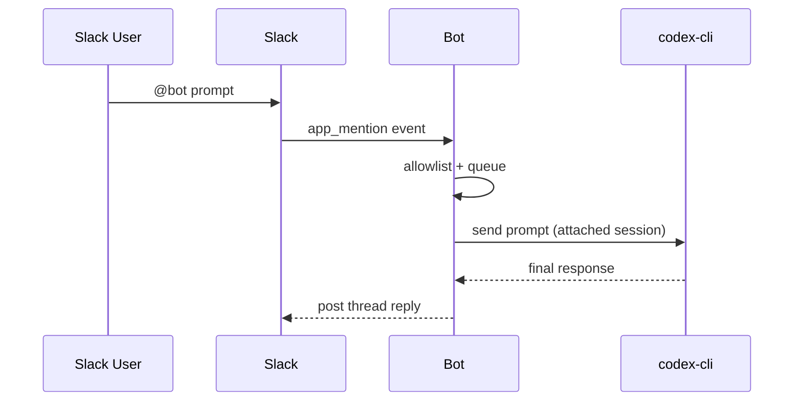

# Codex Slack Bridge

Connect an existing local Codex session to Slack so channel members can send prompts and receive replies without leaving Slack.

## What This Project Does
- Uses a bot process running inside your local workspace.
- Attaches that process to one local Codex session (`--session-id`).
- Accepts prompts from Slack mentions.
- Sends prompts to `codex-cli` and posts final responses back to Slack.

## MVP Scope
- Python runtime.
- Slack Socket Mode (no public webhook URL required).
- Single active Codex session per bot process.
- Allowlisted channel IDs only.
- FIFO queue for prompt processing.
- Final response only (no token streaming).

## Lifecycle

## Prompt Flow

## Commands
- Mentions: `@codex <prompt>`
- `/codex-status` show attach, queue state, and current running prompt
- `/codex-attach <session_id>` attach another local session
- `/codex-detach` detach without deleting local session
- `/codex-conv-cancel` cancel the currently running prompt
- `/codex-help` show usage summary

## Security Model
- Keep secrets in environment variables only.
- Do not commit tokens or session metadata.
- Restrict responses to `SLACK_ALLOWED_CHANNELS`.

## Next Reading
- Build and setup: `BUILD.md`
- Detailed Slack app configuration: `docs/SLACK_SETUP.md`
- Logging configuration: `docs/LOGGING.md`
- Container runtime: `docs/CONTAINER.md`
- Multi-agent setup (same Slack workspace): `docs/MULTI_AGENT_SETUP.md`
- Daily operation and troubleshooting: `USAGE.md`
