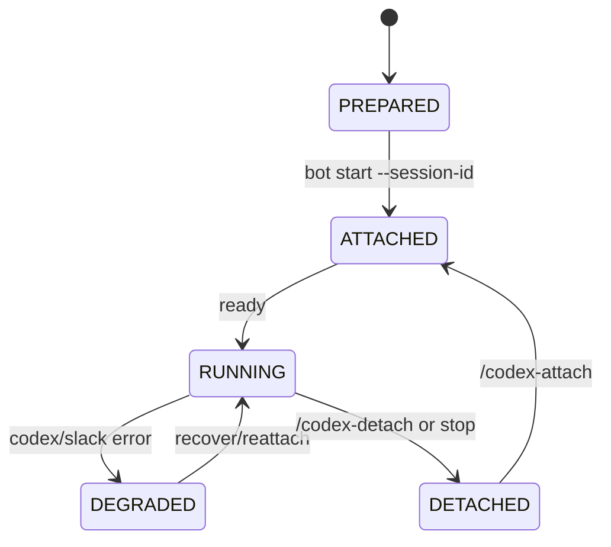
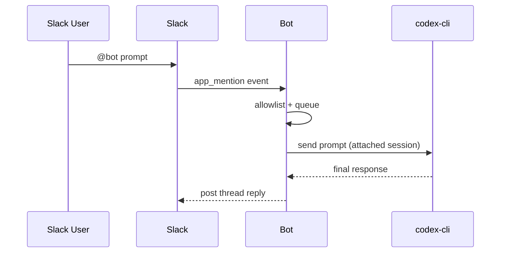

# Codex Slack Bridge

Connect an existing local Codex session to Slack so channel members can send prompts and receive replies without leaving Slack.

## Version Focus
- `v2.2` is a housekeeping and session wrap-up cycle.
- Scope is bugfixes, documentation hardening, and tutorial quality.
- Net-new features are intentionally out of scope for this cycle.

## What This Project Does
- Uses a bot process running inside your local workspace.
- Attaches that process to one local Codex session (`--session-id`).
- Accepts prompts from Slack mentions.
- Continues thread replies after an initial bot mention (no repeated mention required).
- Sends prompts to `codex-cli` and posts final responses back to Slack.

## MVP Scope
- Python runtime.
- Slack Socket Mode (no public webhook URL required).
- Single active Codex session per bot process.
- Allowlisted channel IDs only.
- FIFO queue for prompt processing.
- Final response only (no token streaming).

## Lifecycle

## Prompt Flow

## Commands
- Mentions: `@codex <prompt>`
- `/codex-status` show attach, queue state, and current running prompt
- `/codex-attach <session_id>` attach another local session
- `/codex-detach` detach without deleting local session
- `/codex-conv-cancel` cancel the currently running prompt
- `/codex-help` show usage summary

## Master CLI (Phase 1)
Local orchestrator CLI is available for early master-agent implementation work:

- `python -m src.master.cli --registry data/master/agents.json list`
- `python -m src.master.cli --registry data/master/agents.json load <name> <repo_path> <channel_id>`
- `python -m src.master.cli --registry data/master/agents.json --dry-run start <name>`
- `python -m src.master.cli --registry data/master/agents.json --dry-run status <name>`

## Master Slack Mode (Phase 3 WIP)
Master control plane Socket Mode entrypoint:

- `python -m src.master.main`

Required env:

- `MASTER_FRONTENDS` (comma-separated: `slack`, `discord`; default `slack`)
- Slack frontend requires:
  - `SLACK_BOT_TOKEN`
  - `SLACK_APP_TOKEN`
  - `MASTER_ADMIN_CHANNELS` (comma-separated Slack channel IDs)
- Discord frontend requires:
  - `DISCORD_BOT_TOKEN`
  - `DISCORD_ADMIN_CHANNELS` (comma-separated Discord channel IDs)
- `podman` CLI available inside the master runtime image/container when using real lifecycle operations
- For rootless Podman socket access in a containerized master, use `--userns=keep-id --security-opt label=disable` and mount `/run/user/<uid>/podman/podman.sock`
- Optional: `MASTER_AGENT_BASE_IMAGE` (default `codex-slack-bot:latest`; set this to the rebuilt image tag you want agent containers to run, e.g. `codex-slack-v1-uat`)
- Optional: `MASTER_CODEX_AUTH_JSON_PATH` (host path to the shared Codex `auth.json`; mounted into agents as `/run/secrets/codex_auth.json:ro`)
- Optional: `MASTER_SSH_AUTH_SOCK_PATH` (host path to the SSH agent socket; mounted into agents as `/run/secrets/ssh-auth.sock`)
- Optional: `MASTER_SSH_KNOWN_HOSTS_PATH` (host path to `known_hosts`; mounted into agents as `/run/secrets/ssh_known_hosts:ro`. If omitted, SSH defaults to `StrictHostKeyChecking=no` with `/dev/null` known hosts.)
- Optional: `MASTER_GIT_USER_NAME` and `MASTER_GIT_USER_EMAIL` (passed into agents and written to repo-local `git config user.name` / `user.email` during worker startup)
- Optional: `MASTER_REGISTRY_PATH` (default `data/master/agents.json`)
- Optional: `MASTER_DRY_RUN=true` for non-destructive runtime testing
- Optional: `MASTER_AGENT_COMMAND_TEMPLATE` (legacy/default fallback for Codex template)
- Optional: `MASTER_CODEX_COMMAND_TEMPLATE` (default `codex exec --dangerously-bypass-approvals-and-sandbox resume --last -`)
- Optional: `MASTER_CLAUDE_COMMAND_TEMPLATE` (default `claude -p`)
- Optional: `MASTER_DEFAULT_AGENT_ADAPTER` (`codex` default, supported: `codex`, `claude-code`)
- Optional: `MASTER_AGENT_TIMEOUT_SECONDS`
- Optional: `MASTER_COMMAND_RATE_LIMIT_COUNT` (default `20`)
- Optional: `MASTER_COMMAND_RATE_LIMIT_WINDOW_SECONDS` (default `60`)
- Optional auth pass-through env from master to agents:
  - `GH_TOKEN` / `GITHUB_TOKEN`
  - `OPENAI_API_KEY` (Codex/OpenAI tooling)
  - `CLAUDE_CODE_OAUTH_TOKEN` (preferred for headless Claude Code subscription auth)
  - `ANTHROPIC_API_KEY` (Claude Console/API billing path; used only when OAuth token is absent)
- For a Compose-based master runtime, use `docker-compose.master-agent.example.yml` (Podman Compose-oriented example for the v1 master container)
  Set `MASTER_RUNTIME_IMAGE` to override the master container image tag used by that compose example.

v3 compose changes to apply:
- Add `MASTER_FRONTENDS` (`slack`, `discord`, or `slack,discord`).
- For Discord frontend add `DISCORD_BOT_TOKEN` and `DISCORD_ADMIN_CHANNELS`.
- Add `MASTER_DEFAULT_AGENT_ADAPTER` (`codex` default) and optional adapter templates:
  - `MASTER_CODEX_COMMAND_TEMPLATE`
  - `MASTER_CLAUDE_COMMAND_TEMPLATE`
- Keep Slack vars (`SLACK_BOT_TOKEN`, `SLACK_APP_TOKEN`, `MASTER_ADMIN_CHANNELS`) only if Slack frontend is enabled.

Admin slash commands (Slack + Discord parity):
- `/master-agent-list`
- `/master-agent-load <name> <repo_path> <channel_id> [branch] [--adapter codex|claude-code]`
- `/master-agent-start <name>`
- `/master-agent-stop <name>`
- `/master-agent-status <name>`
- `/master-agent-usage [name]`
- `/master-agent-remove <name>`
- `/master-agent-refresh-auth <name>` (re-seeds the agent workspace `CODEX_HOME/auth.json` from `MASTER_CODEX_AUTH_JSON_PATH`)

Operator notes:
- Slash-command replies are optimized for readability (status, code, message, and compact data block).
- `/master-agent-status <name> --full` returns chunked full JSON output across multiple Slack messages.
- Image attachments in mapped channel conversations are forwarded to agents as `url_private` references appended to the prompt.
- For Slack private image fetch, ensure bot scope includes `files:read`.
- Agent records persist `platform` and `agent_adapter` fields (defaults: `slack`, `codex`).
- For lean worker deployments, this repo includes `Dockerfile.agent-minimal`.
- CI/CD workflow `.github/workflows/publish-agent-minimal.yml` publishes the minimal agent image to `ghcr.io/<owner>/codex-slack-agent-minimal` on `master` and version tags.

## Agent Worker Mode (Phase 2 WIP)
The container can run as a worker (no Slack connection) by setting:

- `CODEX_CONTAINER_MODE=agent-worker`

Required env for worker init:

- `AGENT_REPO_URL` (repo to clone/fetch)
- Optional: `AGENT_REPO_REF` (default `main`)
- Optional: `AGENT_REPO_DIR` (default `repo`)
- Optional: `AGENT_STATUS_FILE` (default `/tmp/master-agent/status.json`)

## Security Model
- Keep secrets in environment variables only.
- Do not commit tokens or session metadata.
- Restrict responses to `SLACK_ALLOWED_CHANNELS`.

## Next Reading
- Build and setup: `BUILD.md`
- Canonical documentation map: `docs/DOCUMENTATION_INDEX.md`
- Tutorials and release checklist: `docs/TUTORIALS.md`
- Detailed Slack app configuration: `docs/SLACK_SETUP.md`
- Detailed Discord app configuration: `docs/DISCORD_SETUP.md`
- Logging configuration: `docs/LOGGING.md`
- Container runtime: `docs/CONTAINER.md`
- Multi-agent setup (same Slack workspace): `docs/MULTI_AGENT_SETUP.md`
- Master-agent orchestration design (draft): `docs/MASTER_AGENT_ARCHITECTURE.md`
- Master-agent implementation plan (draft): `docs/MASTER_AGENT_PLAN.md`
- Master-agent operations runbook: `docs/MASTER_AGENT_RUNBOOK.md`
- Master-agent UAT test cases: `docs/MASTER_AGENT_UAT.md`
- Daily operation and troubleshooting: `USAGE.md`
