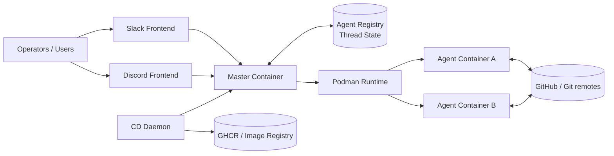
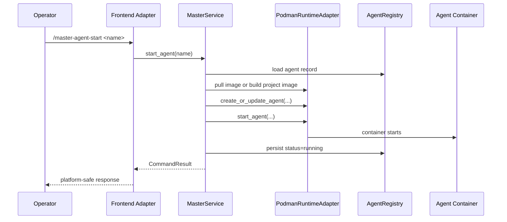
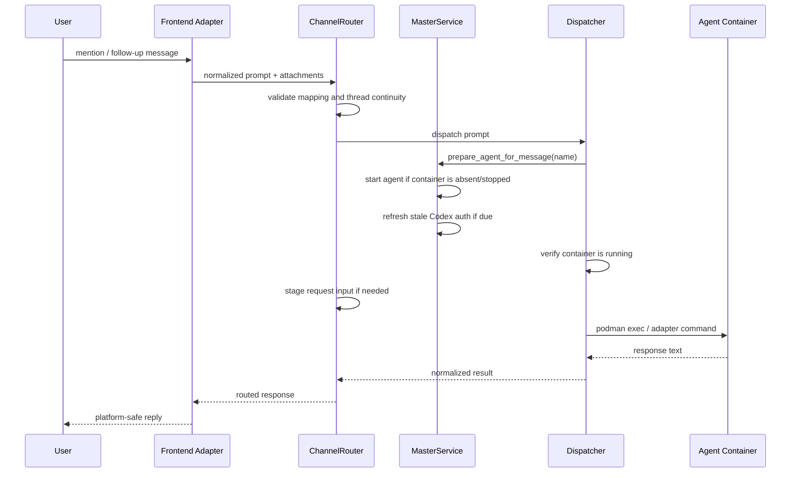
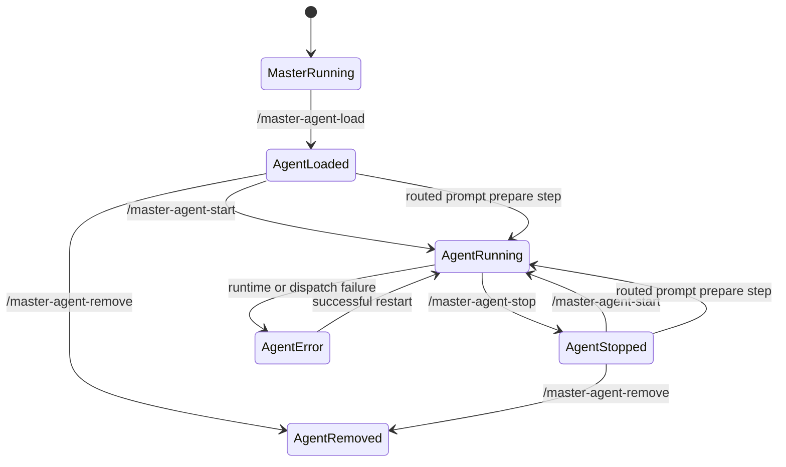

# Master-Agent Architecture

**Status:** archived / historical — describes the v2-era architecture with Slack/Discord frontends. The v3 architecture (web UI + REST API + MQTT, no chat-platform frontends) is documented in [`docs/decisions/0005-v3-system-architecture.md`](../../decisions/0005-v3-system-architecture.md), [`docs/design/v3-system-architecture.md`](../../design/v3-system-architecture.md), and [ADR-0006](../../decisions/0006-drop-slack-discord-integration.md). This document is retained for context on how the system evolved.

**Scope (historical):** system-level architecture for the master control plane, agent worker
containers, frontends, and CD daemon

## Goal

Define the current architecture of the multi-agent system at the highest level:

- major runtime components
- control-plane and data-plane boundaries
- startup and lifecycle relationships
- storage and trust boundaries
- how the more detailed design documents fit together

This document is the system-level overview. It does not replace the lower-level
contract documents.

## Architecture Summary

The system is split into four runtime roles:

- frontend adapters
  - Slack and Discord event intake and response emission
- master container
  - orchestration control plane
- agent containers
  - per-repository worker runtimes
- CD daemon container
  - deploy automation for the master container

Core principle:

- orchestration belongs to master
- execution belongs to agents
- deployment automation belongs to CD
- platform-specific chat behavior belongs to the frontend adapters

## Runtime Roles

### Master Container

The master container is the control plane. It is responsible for:

- starting frontend adapters
- owning the agent registry and tracked thread state
- handling admin commands such as load, start, stop, status, remove, and
  provisioning
- creating, recreating, inspecting, and removing agent containers through
  Podman
- routing prompts from mapped channels to the correct agent
- staging transient request input

### Agent Containers

Each agent container is a worker plane for exactly one repo at a time. It is
responsible for:

- preparing writable runtime homes
- syncing the target repo into its workspace
- consuming mounted auth, config, and request-manifest inputs
- executing Codex or Claude Code
- writing durable work back into the repo workspace

### Frontend Adapters

Slack and Discord frontends are responsible for:

- chat-platform event intake
- admin-command parsing and validation at the platform boundary
- attachment extraction and staging inputs
- emitting platform-safe replies back to users

### CD Daemon

The CD daemon is a separate deployment runtime. It is responsible for:

- polling the registry for new master images
- redeploying the master container through compose
- rolling back the master container if health checks fail

## System Diagram

## Control Plane vs Data Plane

### Control Plane

The control plane covers:

- container lifecycle operations
- registry updates
- provisioning
- command execution
- thread and channel mapping

Owner:

- master container

### Data Plane

The data plane covers:

- user prompts flowing from frontend to agent
- staged attachments and request manifests
- agent stdout/result text flowing back to the frontend

Owners:

- frontend adapters
- master router/dispatcher
- agent runtime

## Control-Plane Flow

Example: `/master-agent-start <name>`

## Routed Prompt Flow

## Container Startup Relationships

### Master Startup

The master startup path is:

1. load env
2. configure logging
3. load settings
4. initialize registry/runtime/router/service
5. start frontend threads

The master does not use the shell-entrypoint-heavy startup model used by the
agent image.

### Agent Startup

The agent startup path is:

1. container starts from image selected by master
2. shell entrypoint prepares writable runtime homes and seed inputs
3. worker preflight checks auth prerequisites
4. repo sync clones or refreshes `/workspace/repo`
5. workspace prepare applies global config and repo-local runtime state
6. container becomes ready for dispatch

### CD Startup

The CD daemon startup path is:

1. load env
2. load persisted state
3. reconcile the master container on startup
4. enter the poll / deploy / health-check / rollback loop

## Lifecycle Model

Important separation:

- master-container lifecycle is independent from individual agent logical state
- CD manages master deployment lifecycle, not agent lifecycle directly

## Storage Model

### Master-Owned Durable State

- agent registry file
- tracked thread state file

### Agent-Owned Durable State

- named workspace volume per agent
- checked-out repo under `/workspace/repo`
- writable user-scope runtime homes under `/workspace/home`

### Transient State

- request-staged input under `/workspace/message/...`
- process memory in all runtimes
- read-only mounted seed inputs under `/run/secrets/...`

## Trust Boundaries

### Master Trust Boundary

The master container is privileged relative to agents because it can:

- control Podman
- create and remove agent containers
- inject runtime env and mounts

This makes the Podman socket mount a privileged control-plane capability.

### Agent Trust Boundary

Agents are isolated worker runtimes:

- one repo workspace per agent volume
- no direct Slack or Discord credentials required for normal operation
- request-scoped inputs are transient and must not be treated as durable state

### CD Trust Boundary

The CD daemon is trusted to redeploy the master container but not to operate on
agent workspaces or routing state directly.

## Security and Operational Invariants

The architecture preserves these invariants:

- master is the only orchestrator of agent containers
- frontend adapters do not manage containers directly
- agents do not manage other agents or the master
- request-scoped attachment input is transient
- durable repo state stays in agent workspaces, not the master container
- deployment automation is separated from prompt-routing logic

## Canonical Detail Documents

Use these for the lower-level contracts:

- [docs/design/containers/master-container-design.md](containers/master-container-design.md)
- [docs/design/containers/agent-container-design.md](containers/agent-container-design.md)
- [docs/design/containers/cd-container-design.md](containers/cd-container-design.md)
- [docs/design/containers/environment-variable-passdown-design.md](containers/environment-variable-passdown-design.md)
- [docs/design/master-agent-interface-design.md](master-agent-interface-design.md)
- [docs/design/frontend-master-interface-design.md](frontend-master-interface-design.md)
- [docs/guides/runbooks/master-agent.md](../guides/runbooks/master-agent.md)
- [docs/guides/runbooks/cd-daemon.md](../guides/runbooks/cd-daemon.md)
