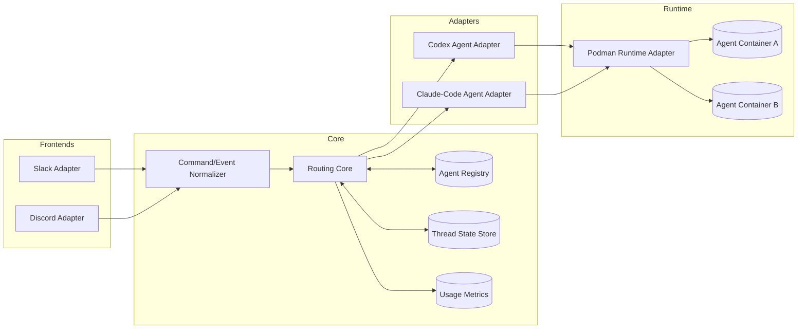
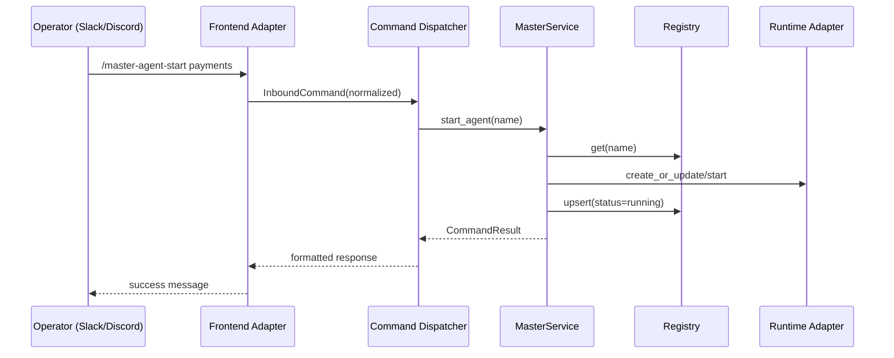
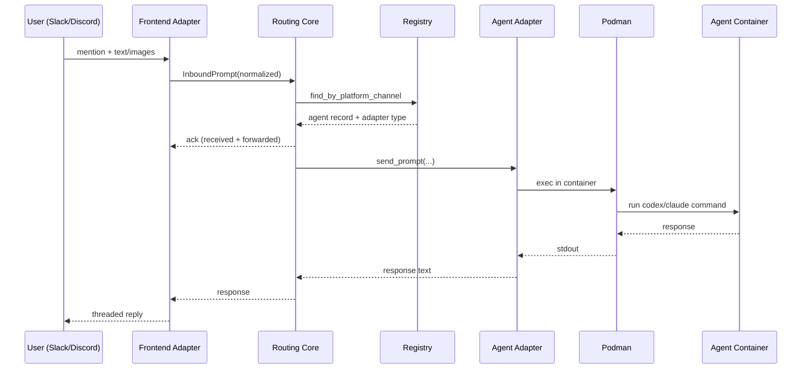

# v3.0 Plan: Multi-Adapter + Multi-Frontend Master Runtime

**Status:** archived historical plan  
**Superseded by:** [`docs/decisions/0006-drop-slack-discord-integration.md`](../../decisions/0006-drop-slack-discord-integration.md) (which dropped the multi-frontend design altogether), [`docs/design/v3-system-architecture.md`](../../design/v3-system-architecture.md), and the container design set under [`docs/design/containers/`](../../design/containers/). The v2 frontend and architecture designs originally referenced here have themselves been archived under [`docs/archive/design/`](.).

This document is preserved as historical planning context for the v3.0
multi-adapter frontend rollout.

It is no longer the canonical source for the current frontend or architecture
contract.

## Scope and Decisions (Locked)
This plan implements the following confirmed decisions:

1. One agent maps to exactly one channel.
2. One channel maps to exactly one agent.
3. Claude Code adapter follows Codex model (container exec dispatch).
4. Discord must expose the same slash command set as Slack.

## Goals
- Run one master runtime that serves both Slack and Discord concurrently.
- Route prompts to two supported agent adapters: `codex` and `claude-code`.
- Keep current operational semantics for lifecycle commands and thread continuity.
- Preserve strong channel ownership guarantees.

## Non-Goals (v3.0)
- Multi-channel fanout for one agent.
- One channel broadcasting to multiple agents.
- Cross-agent cooperative routing.
- Breaking changes to current `/master-agent-*` command names.

## High-Level Architecture

## Core Contracts

### 1. Frontend Adapter Contract
Each frontend must implement:
- Event ingestion (`mention`, `thread follow-up`, `command`).
- Normalization to a shared internal model.
- Reply emitter (`ack`, `result`, `error`).

Shared normalized models:
- `InboundPrompt`
  - `platform`: `slack | discord`
  - `channel_id`: string
  - `thread_id`: string | null
  - `message_id`: string
  - `user_id`: string
  - `text`: string
  - `image_urls`: list[string]
- `InboundCommand`
  - `platform`: `slack | discord`
  - `command_name`: string (`/master-agent-*`)
  - `args_text`: string
  - `channel_id`: string
  - `user_id`: string

### 2. Agent Adapter Contract
Each agent adapter must implement:
- `send_prompt(agent_record, prompt, context) -> response_text`
- `cancel(agent_record, context) -> bool`
- `health(agent_record) -> AdapterHealth`

Adapter implementations:
- `CodexAgentAdapter` (existing podman exec behavior).
- `ClaudeCodeAgentAdapter` (same dispatch pattern, command template configurable).

### 3. Registry Contract Changes
Agent record changes for v3.0:
- Add `platform`: `slack | discord`
- Keep single `channel_id`.
- Add `agent_adapter`: `codex | claude-code`

Invariants:
- Unique `(platform, channel_id)`.
- Unique `agent.name`.
- Exactly one channel binding per agent.

## Routing and Ownership Rules

### Channel Ownership
- Channel key is `(platform, channel_id)`.
- Routing lookup always uses the full key.
- If no mapping exists: ignore or setup hint (current behavior policy).

### Thread Continuity
- Thread key is `platform:channel_id:thread_id`.
- Mention initializes tracked thread.
- Follow-up in tracked thread routes without repeated mention.
- Thread state persists across reboot.

## Command Parity Plan (Slack + Discord)
Target same command set on both frontends:
- `/master-agent-list`
- `/master-agent-load <name> <repo_path> <channel_id> [branch] [--adapter codex|claude-code]`
- `/master-agent-start <name>`
- `/master-agent-stop <name>`
- `/master-agent-status <name> [--full]`
- `/master-agent-usage [name]`
- `/master-agent-remove <name>`
- `/master-agent-refresh-auth <name>`

Discord implementation note:
- Register Discord application commands with same names and arguments.
- Command handler reuses shared command dispatcher used by Slack.

## Control-Plane Sequence (Command)

## Data-Plane Sequence (Prompt)

## Configuration Model
Add or revise settings:
- `MASTER_FRONTENDS=slack,discord`
- Slack:
  - `SLACK_BOT_TOKEN`
  - `SLACK_APP_TOKEN`
  - `MASTER_ADMIN_CHANNELS` (Slack IDs)
- Discord:
  - `DISCORD_BOT_TOKEN`
  - `DISCORD_APPLICATION_ID`
  - `DISCORD_ADMIN_CHANNELS` (Discord IDs)
- Agent adapters:
- `MASTER_ADAPTERS=codex,claude-code`
- `MASTER_CODEX_COMMAND_TEMPLATE`
- `MASTER_CLAUDE_COMMAND_TEMPLATE`

## Slack vs Discord Mapping

| Concept | Slack | Discord | Notes |
|---|---|---|---|
| Workspace/server | Workspace | Guild (Server) | Top-level container |
| Channel ID | `C...` | Snowflake ID (numeric string) | Persist as string in registry |
| Admin channel allowlist | `MASTER_ADMIN_CHANNELS` | `DISCORD_ADMIN_CHANNELS` | Keep separate allowlists |
| Mention trigger | `app_mention` | `on_message` + bot mention | Starts tracked conversation context |
| Thread identifier | `thread_ts` | message/thread ID | Normalize to internal `thread_id` |
| Message ID | `ts` | message ID | Used in dedupe keys |
| Slash commands | Slack Slash Commands | Discord Application Commands | Maintain `/master-agent-*` parity |
| Reply primitives | `say/respond` | interaction response / message reply | Adapter hides platform differences |
| Image attachments | `files[]` + `url_private(_download)` | `attachments[]` + `url` | Normalize to `image_urls[]` |
| Bot token | `SLACK_BOT_TOKEN` | `DISCORD_BOT_TOKEN` | Frontend-specific secret |
| Event transport | Socket Mode (`SLACK_APP_TOKEN`) | Discord Gateway | Different ingress, same normalized model |

## Discord Prerequisites

| Prerequisite | Required Value / Setup |
|---|---|
| Frontend enablement | `MASTER_FRONTENDS=slack,discord` |
| Discord bot token | `DISCORD_BOT_TOKEN` |
| Discord application id | `DISCORD_APPLICATION_ID` |
| Discord admin channels | `DISCORD_ADMIN_CHANNELS` (comma-separated channel IDs) |
| Agent adapters enabled | `MASTER_ADAPTERS=codex,claude-code` |
| Claude command template | `MASTER_CLAUDE_COMMAND_TEMPLATE` |
| Codex command template | `MASTER_CODEX_COMMAND_TEMPLATE` |
| Gateway intents | Enable Message Content intent and required guild/message intents |
| OAuth2 scopes | `bot`, `applications.commands` |
| Bot permissions | View channels, send messages, read message history, thread permissions if threads are used |
| Command registration | Register Discord application commands for full `/master-agent-*` parity |
| Channel ID extraction | Enable Discord developer mode to copy channel IDs |
| Runtime dependency | `discord.py` installed in master runtime image |

## Delivery Phases

### Phase 1: Core Refactor (No Behavior Change)
- Extract shared command dispatcher from Slack module.
- Extract platform-neutral routing service.
- Keep Slack + Codex behavior unchanged.

### Phase 2: Dual Agent Adapters
- Introduce adapter factory and adapter selection per agent record.
- Implement `ClaudeCodeAgentAdapter` via podman exec.
- Keep usage metrics and image staging compatible.

### Phase 3: Dual Frontends Concurrently
- Introduce frontend runner manager.
- Run Slack and Discord adapters concurrently in one process.
- Add graceful startup/shutdown and health logs per frontend.

### Phase 4: Discord Command Parity
- Implement Discord slash command registration.
- Reuse command dispatcher and response formatting.
- Match command validations and error codes.

### Phase 5: Hardening + Migration
- Registry migration script for `platform` and `agent_adapter` fields.
- Backward compatibility for old records (default `platform=slack`, `agent_adapter=codex`).
- Update runbook/tutorials and UAT matrix.

## Testing Strategy

### Unit
- Registry uniqueness for `(platform, channel_id)`.
- Router lookup correctness by platform+channel.
- Adapter selection and fallback errors.
- Discord command argument parsing parity with Slack.

### Integration
- Slack->Codex prompt routing.
- Slack->Claude prompt routing.
- Discord->Codex prompt routing.
- Discord->Claude prompt routing.
- Both frontends active simultaneously.

### E2E/UAT
- Lifecycle command parity on both frontends.
- Thread follow-up continuity and dedupe.
- Reboot persistence for tracked threads.
- Failure drills: adapter exec failure, frontend reconnect, runtime timeout.

## Risks and Mitigations
- Discord command registration drift:
  - Mitigation: generate command specs from one shared manifest.
- Adapter behavior drift (Codex vs Claude):
  - Mitigation: normalized adapter contract + shared conformance tests.
- Concurrent frontend event races:
  - Mitigation: centralized lock strategy and deterministic routing keys.

## Implementation Readiness Checklist
- [ ] Confirm canonical Discord command UX (ephemeral vs channel replies).
- [ ] Confirm Discord thread/reply mapping semantics for `thread_id`.
- [ ] Confirm Claude command template defaults.
- [ ] Confirm migration behavior for existing `agents.json`.
