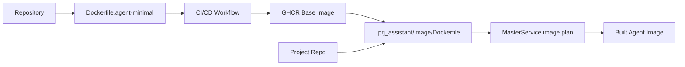

# 0002 Separate Base Agent Image

- Status: proposed
- Date: 2026-04-03
- Issue: [#38](https://github.com/pandazxx/codex-slack/issues/38)

## Context

The repository currently has two image definitions:

- `Dockerfile`
  - used for the broader runtime and master-oriented workflows
  - includes tools such as `gh`, `jq`, `make`, and `podman`
  - copies repository docs/config content into the image
- `Dockerfile.agent-minimal`
  - intended as a leaner worker image for agent runtime

The existing docs already hint at a published agent base image:

- `ghcr.io/<owner>/codex-slack-agent-minimal:latest`
- repo-specific customization through `.prj_assistant/image/Dockerfile`

However, issue `#38` calls out that the contract is still incomplete:

1. establish a bare minimum base agent image
2. add CI/CD to publish it to GHCR
3. provide clear project-facing instructions for building on it

In this ADR, "project specific manifest" means the repo-local image customization contract:

- `.prj_assistant/image/Dockerfile`

That is already the implemented project-specific image input:

- `MasterService._resolve_image_plan()` in `src/master/service.py` detects `.prj_assistant/image/Dockerfile`
- there is no implemented project image manifest loader in the current runtime path

## Decision

Adopt a dedicated published base agent image and keep repo-level customization Dockerfile-based for v1.

### Base image split

Treat `Dockerfile.agent-minimal` as the canonical base image for agent containers.

Treat `Dockerfile` as the broader master/runtime image, not the project extension point.

### Published image contract

Publish a dedicated base image to GHCR:

- image name: `ghcr.io/<owner>/codex-slack-agent-minimal`

Tagging policy:

- immutable `sha-<commit>` tags for every publishable build
- exact git tag mirrors for RC and release tags
- `latest` for the current default branch publish target

### Base image contents

The base agent image should include only the runtime dependencies required for `src.agent.main` and the supported adapters:

- Python runtime
- `codex` CLI
- `claude` CLI
- `git`
- `openssh-client`
- `bash`
- `curl`
- `ca-certificates`
- `tini`
- agent entrypoint and Python dependencies needed by `src.agent.main`

The base image should not carry master-only operational tooling by default:

- `podman`
- `podman-compose`
- `gh`
- `jq`
- `make`
- repository docs/config payload not required for agent runtime

If a project needs additional tools, it should layer them in its own repo-local image.

### Project customization contract

For v1, the project-specific extension point remains:

- `.prj_assistant/image/Dockerfile`

Project image builds should extend the published base image with:

```dockerfile
FROM ghcr.io/<owner>/codex-slack-agent-minimal:<tag>
```

The project image contract is:

- add project-specific OS packages, CLIs, or runtimes
- do not replace the entrypoint unless there is a documented reason
- preserve the agent runtime assumptions around `/workspace`, `/workspace/home`, and `CODEX_CONTAINER_MODE=agent-worker`

### Project-specific manifest decision

Standardize the term "project specific manifest" in docs for this issue to mean:

- `.prj_assistant/image/Dockerfile`

Do not introduce a second project image metadata format in this change.

A richer metadata manifest can be considered later, but it should not block:

- base image publication
- GHCR CI/CD
- project onboarding guidance

## Boundary diagram



## Alternatives Considered

### 1. Keep using the monolithic `Dockerfile` as the extension base

Rejected.

This couples agent customization to master-only tooling and a broader image payload than worker runtime actually needs.

### 2. Introduce a new project image manifest now

Rejected for v1.

The implemented runtime already uses `.prj_assistant/image/Dockerfile`. Adding a second manifest format before the published base contract is stabilized would create documentation and implementation drift.

### 3. Publish only local/manual images and skip GHCR automation

Rejected.

Issue `#38` explicitly asks for CI/CD publication and clear project usage instructions. Manual-only publication would keep onboarding inconsistent and fragile.

## Consequences

Positive:

- gives projects a clear and stable extension point
- removes master-only tooling from the default agent base
- makes CI/CD image publication explicit and repeatable
- aligns docs with the already-implemented `.prj_assistant/image/Dockerfile` flow

Tradeoffs:

- requires maintaining two image definitions with distinct purposes
- requires release/tag discipline for GHCR publishing
- pushes some tool installation burden to project-specific images

## Documentation deliverables

The implementation should update or add project-facing guidance that explains:

- which image is the base image
- which tag types are safe to consume
- how to write `.prj_assistant/image/Dockerfile`
- which base-image invariants must not be broken
- how `MASTER_AGENT_BASE_IMAGE` relates to the published base image

## Implementation Guidance

Engineer and tester should treat this ADR as the v1 boundary:

- keep `Dockerfile.agent-minimal` as the agent base source
- add GHCR publication for the base image
- keep `.prj_assistant/image/Dockerfile` as the project customization contract
- do not introduce a new project image manifest format in this issue
- add tests or validation for image-plan resolution and documentation updates where practical
