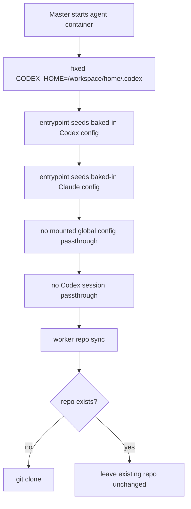

# 0004 Agent Runtime Cleanup

- Status: proposed
- Date: 2026-04-07
- Issues:
  - [#53](https://github.com/pandazxx/codex-slack/issues/53)
  - [#54](https://github.com/pandazxx/codex-slack/issues/54)
  - [#55](https://github.com/pandazxx/codex-slack/issues/55)
  - [#56](https://github.com/pandazxx/codex-slack/issues/56)

## Context

The current agent startup path still carries several transitional behaviors that
make the runtime contract harder to reason about:

1. `docker/entrypoint.sh` can select `CODEX_HOME` from either:
   - explicit `CODEX_HOME`
   - `/workspace/.codex`
   - `/home/appuser/.codex`
2. global Codex and Claude config can come from either:
   - read-only mounts injected by master
   - baked-in image content
3. Codex sessions can be seeded from `/run/secrets/codex_sessions`
4. repo refresh in `src/agent/worker.py` uses:
   - `git fetch`
   - `git checkout`
   - `git reset --hard`

These behaviors were useful during bring-up, but they now create ambiguity:

- user-scope config can be sourced from more than one place
- startup behavior differs depending on prior volume contents
- mounted config and mounted sessions blur the boundary between secret seeding
  and durable writable home state
- repo refresh can discard uncommitted changes in a durable workspace volume

The current canonical docs already call these out as later-phase cleanup
targets:

- [`docs/design/containers/agent-container-design.md`](../design/containers/agent-container-design.md)
- [`docs/design/agent-container-runtime-design.md`](../design/agent-container-runtime-design.md)

## Decision

Simplify the agent runtime contract around a single writable home location,
baked-in shared defaults, no session passthrough, and a non-destructive repo
refresh model.

### 1. Fixed writable home

For master-managed agent containers, the canonical writable Codex home is:

- `/workspace/home/.codex`

`/workspace/.codex` should no longer participate in `CODEX_HOME` selection.

The entrypoint should still honor an explicit `CODEX_HOME` env override for
non-standard or test-only execution paths, but master-managed startup should not
rely on dynamic home-path discovery.

### 2. Baked-in shared global config only

Shared default instructions and config should come only from baked-in image
content:

- `/opt/codex-slack/config/codex-global`
- `/opt/codex-slack/config/claude-global`

Master should stop mounting global Codex and Claude config directories into
agents, and the agent should stop reading:

- `/run/secrets/master_codex_config`
- `/run/secrets/master_claude_config`
- `AGENT_GLOBAL_CODEX_CONFIG_DIR`
- `AGENT_GLOBAL_CLAUDE_CONFIG_DIR`

This keeps the runtime contract simple:

- image content defines shared defaults
- writable home stores runtime-local mutable state
- repo-local config remains project scope

### 3. Remove Codex session passthrough

Master should stop mounting `/run/secrets/codex_sessions`, and the entrypoint
should stop seeding `CODEX_HOME/sessions` from it.

Session state becomes local runtime state inside the agent workspace volume,
not startup passdown state.

### 4. Clone-only startup repo behavior

The agent worker should stop force-aligning existing repos with:

- `git reset --hard origin/<ref>`

The cleanup target is:

- clone when the repo is absent
- if `/workspace/repo` is already a valid git repo, do nothing during startup
- treat repo startup as repo presence validation, not repo refresh

This makes repo startup behavior safer and easier to diagnose.

## Decision Diagram

## Target Runtime Contract

### User scope

- Codex user scope: `/workspace/home/.codex`
- Claude user scope: `/workspace/home/.claude`
- XDG config home: `/workspace/home/.config`

### Shared defaults

- come from the built image, not master-mounted directories
- are refreshed into writable home on startup

### Project scope

- remains repo-local:
  - `/workspace/repo/.codex`
  - `/workspace/repo/.claude`
  - repo-root `AGENTS.md`

### Secret/auth scope

Startup may still seed auth materials that are true secrets, such as:

- Codex auth file
- SSH agent socket
- token env vars

But session history and global config are no longer treated as secret-mount
startup inputs.

## Alternatives Considered

### 1. Keep the current mixed-source startup behavior

Rejected.

It preserves compatibility but keeps the runtime contract ambiguous and makes
operator diagnosis harder.

### 2. Remove only the destructive repo reset and keep the rest

Rejected.

That would address issue `#56` but would leave the broader startup contract
split across mounts, image content, and volume state.

### 3. Move all shared config fully into repo-local scope

Rejected.

Global container-level instructions still need a shared default independent of
any specific repo. Baked-in image config is the cleaner boundary.

### 4. Keep mounted config but make it read-only precedence only

Rejected.

It would still preserve two authoritative sources for shared defaults and would
keep master-to-agent passdown more complex than necessary.

## Consequences

Positive:

- startup behavior becomes deterministic
- agent images become the single source of shared default instructions
- durable session state is no longer injected from master
- startup no longer mutates an existing durable repo checkout
- troubleshooting becomes simpler because path precedence shrinks

Tradeoffs:

- updating shared defaults now requires an updated agent image
- operators lose the ability to hot-swap shared config through master-only mount
  changes
- some existing deployments may depend on the old transitional behavior and need
  migration

## Migration Guidance

Implementation should land in a coordinated slice:

1. remove `/workspace/.codex` selection from `docker/entrypoint.sh`
2. remove master-side mounted global config passdown
3. remove session-seed mount and startup copy
4. replace destructive repo refresh with clone-only startup behavior
5. update docs and startup diagnostics to reflect the simplified contract

During rollout, operator guidance should explicitly note:

- shared global instruction changes now require a newer agent image
- `/master-agent-start` must refresh the image source before recreating agents
- existing valid repo checkouts will now be left unchanged during startup

## Implementation Guidance

Engineer and tester should treat this ADR as the boundary for issues `#53`
through `#56`:

- remove `/workspace/.codex` support from master-managed startup
- remove mounted global Codex and Claude config support
- remove Codex session passthrough support
- replace destructive repo reset with clone-only startup behavior for existing
  valid repos
- update tests and docs together because this changes the published runtime
  contract
