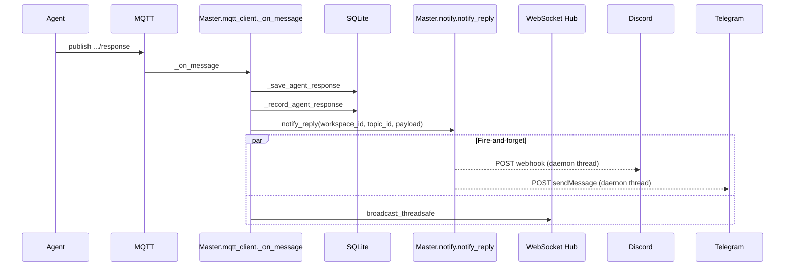

# Design: Agent Message Notification

**Status:** draft
**Author:** architect
**Date:** 2026-05-05
**Related ADRs:** [ADR-0011](../decisions/0011-agent-message-notification.md), [ADR-0006](../decisions/0006-drop-slack-discord-integration.md), [ADR-0009](../decisions/0009-runtime-configuration-and-staff-system.md), [ADR-0010](../decisions/0010-workspace-env-var-overrides.md)
**Issue:** [#118](https://github.com/pandazxx/codex-slack/issues/118)

## Problem Statement

Agent replies can take minutes. The web UI is the canonical interface but
users do not keep tabs open while waiting. We need an out-of-band ping —
"your agent replied" — that lands on a chat platform the user already
watches and links back to the topic in the web UI.

This is **outbound notification only**. It is not a return to chat-as-UI
(see ADR-0006); it is a pager-style heads-up.

## Goals

- Deliver a one-line notification to **Discord** (webhook) and **Telegram**
  (Bot API) when an agent emits a final reply on a topic.
- Notification body contains: workspace name, topic subject, optional first
  N characters of the reply as preview, and a deep link to the topic in the
  web UI.
- Configuration uses the **existing config layer** (ADR-0009 §4): global env
  vars as defaults, per-workspace `config` rows as overrides.
- Delivery is **fire-and-forget**: it must not delay or fail the existing
  MQTT → SQLite → WebSocket reply path.
- All errors are logged and swallowed; per-channel failures do not affect
  delivery on the other channel.

## Non-Goals

- **WhatsApp.** Documented as a future extension (ADR-0011 — Business API
  onboarding cost dwarfs the rest of the feature).
- **Slack.** Out of scope to keep alignment with ADR-0006 unambiguous; the
  same pattern would extend to Slack trivially if added later.
- **Inbound chat events** (commands, replies posted in Discord/Telegram and
  routed back to master). That is the "external adapter" path called out in
  ADR-0006 and is a separate piece of work.
- **Presence-aware notifications** ("only when nobody is watching the
  topic"). Deferred — would require WebSocket presence tracking.
- **Per-user preferences.** Notifications are per-workspace, not per-user;
  the deployment is single-user (ADR-0009 §E threat model).
- **Notification on agent `status` transitions** (running/idle). Only on
  final agent `response`.
- **Streaming chunks.** The agent publishes one `response` per dispatch
  (`src/agent/mqtt_loop.py:231`); there are no chunks to coalesce.
- **Retry on delivery failure.** Single attempt with timeout; matches
  `cd/notify.py` posture.

## Proposed Design

### Where the hook fires

Master subscribes to MQTT topic
`codex-slack/workspace/+/topic/+/response` (`src/master/mqtt_client.py:16`).
Each message lands in `_on_message()` (`src/master/mqtt_client.py:116`).

Today the response branch (msg_type == `"response"`) does three things in
order:

1. Build the WebSocket message dict.
2. `_save_agent_response(db_path, topic_id, payload)` — INSERT into
   `messages`, UPDATE `sessions.llm_session_id`.
3. `_record_agent_response(db_path, topic_id)` — UPDATE
   `workspaces.last_responded_at`.
4. `hub.broadcast_threadsafe(topic_id, message, loop)` — push to WebSocket
   subscribers.

We add **step 3a** between `_record_agent_response` and the broadcast: a
single call into a new module `src/master/notify.py` that resolves the
effective notification config for the workspace and dispatches to the
configured channels on background threads.



The notification dispatch must not block broadcast: `notify_reply` returns
immediately after starting the daemon threads; the threads themselves use
the same bounded `urlopen(timeout=10)` + 15s join shape as `cd/notify.py`.

### Channels

#### Discord

Webhook delivery, identical shape to `src/cd/notify.py`:

```http
POST {webhook_url}
Content-Type: application/json

{"content": "Agent replied in {workspace_name} / {topic_subject}\n{preview}\n{topic_url}"}
```

#### Telegram

Bot API delivery:

```http
POST https://api.telegram.org/bot{bot_token}/sendMessage
Content-Type: application/json

{
  "chat_id": "{chat_id}",
  "text": "Agent replied in {workspace_name} / {topic_subject}\n{preview}\n{topic_url}",
  "disable_web_page_preview": true
}
```

`chat_id` may be a numeric user/group id or a `@channelusername`. Master
does not interpret it — it is forwarded to the API verbatim.

#### Common adapter shape

Both channels go through `post_webhook(url, payload)` (lifted from
`src/cd/notify.py`). Each channel adapter is a small function that builds
its provider-specific payload from a common `NotificationContent`:

```python
@dataclass(frozen=True)
class NotificationContent:
    workspace_name: str
    topic_subject: str
    topic_url: str | None     # None if MASTER_PUBLIC_URL unset
    preview: str              # already trimmed, may be ""
```

```python
def _discord_payload(c: NotificationContent) -> dict: ...
def _telegram_payload(c: NotificationContent, chat_id: str) -> dict: ...
```

Adding a third channel later means: one new payload builder + one new
config-resolution branch. No new tables, no new endpoints.

### Configuration schema

Two layers, merged at notification time per the rules in ADR-0009 §4 and
the `runtime_config.load_agent_env` pattern:

#### Layer 1 — global env (read once at master startup)

| Env var | Type | Default | Notes |
|---|---|---|---|
| `MASTER_PUBLIC_URL` | string | unset | Externally reachable base URL of the web UI, e.g. `https://codex.example.com`. If unset, notifications omit the URL. **No default**: in-cluster `MASTER_URL` is wrong here. |
| `MASTER_NOTIFY_DISCORD_WEBHOOK_URL` | string | unset | Discord channel webhook URL. Empty/unset disables Discord globally. |
| `MASTER_NOTIFY_TELEGRAM_BOT_TOKEN` | string | unset | Telegram bot token. Required together with `_CHAT_ID`. |
| `MASTER_NOTIFY_TELEGRAM_CHAT_ID` | string | unset | Telegram chat / channel id. |
| `MASTER_NOTIFY_PREVIEW_CHARS` | int | `200` | Max characters of agent reply included as preview. `0` disables preview. |

These are added to `MasterSettings` in `src/master/config.py` alongside the
existing entries.

#### Layer 2 — workspace `config` table (per ADR-0009 §4 / ADR-0010)

The same keys (without the `MASTER_` prefix; matching how
`runtime_config.load_agent_env` strips/treats them — confirm in
implementation) can be set per-workspace:

| Key in `config` table | Effect |
|---|---|
| `NOTIFY_DISCORD_WEBHOOK_URL` | Override or set Discord destination for this workspace. |
| `NOTIFY_TELEGRAM_BOT_TOKEN` | Workspace-specific bot token. |
| `NOTIFY_TELEGRAM_CHAT_ID` | Workspace-specific chat id. |
| `NOTIFY_PREVIEW_CHARS` | Workspace-specific preview length. |
| `NOTIFY_DISABLED` | If truthy, skip all notifications for this workspace regardless of global config. Lets a user mute one workspace without unsetting the global webhook. |

Resolution at notification time:

```python
effective = {**global_env, **workspace_config_rows}  # workspace wins, per ADR-0009
```

For Telegram, both `BOT_TOKEN` and `CHAT_ID` must be present in the
effective set, otherwise Telegram is skipped (logged at INFO).

The workspace-config UI (ADR-0010 `WorkspaceEnvVarsPanel.vue`) already
exposes a generic key-value editor and heuristic-masks `*TOKEN*`. We extend
its `SECRET_KEY_SUBSTRINGS` constant with `WEBHOOK` so that
`NOTIFY_DISCORD_WEBHOOK_URL` is masked by default.

### Integration point — exact call site

In `src/master/mqtt_client.py::_on_message`, after `_record_agent_response`
and before the WebSocket broadcast:

```python
elif msg_type == "response":
    message = {"type": "message", "sender": "agent", **payload}
    if db_path:
        _save_agent_response(db_path, topic_id, payload)
        _record_agent_response(db_path, topic_id)
        notify.notify_reply(                       # <-- new
            db_path=db_path,
            settings=userdata["settings"],         # <-- threaded through build_client
            topic_id=topic_id,
            payload=payload,
        )
```

`notify_reply` is the only public symbol; everything else stays in
`src/master/notify.py`. The function:

1. Looks up `workspace_id`, `workspace_name`, `topic_subject` from SQLite
   in one query joining `topics` and `workspaces` on `topic_id`. If the
   join returns no row (deleted topic), log and return.
2. Reads workspace `config` rows for the `NOTIFY_*` keys via the existing
   helper used by `load_agent_env`. Merges with `settings.notify_*`
   fields.
3. If `NOTIFY_DISABLED` is truthy in the merged set, log
   `master.notify.skipped reason=disabled` and return.
4. Builds a `NotificationContent` (preview trimmed to
   `NOTIFY_PREVIEW_CHARS`).
5. For each channel with sufficient config: spawn a daemon thread running
   `post_webhook(url, payload)`. **Do not join.** The thread itself has a
   10s urlopen timeout; if master shuts down before delivery, the message
   is dropped (acceptable per the fire-and-forget contract).

`build_client()` (`src/master/mqtt_client.py:147`) gains a `settings`
parameter so `_on_message` can read notification config without re-loading
env vars. The caller in `src/master/main.py` already has
`MasterSettings` in scope.

### URL construction

Frontend route is `/workspaces/{wsId}/topics/{topicId}` (verified in
`frontend/src/views/TopicChat.vue` and `frontend/src/main.js`).

```python
def build_topic_url(public_url: str | None, workspace_id: str, topic_id: str) -> str | None:
    if not public_url:
        return None
    base = public_url.rstrip("/")
    return f"{base}/workspaces/{workspace_id}/topics/{topic_id}"
```

If `MASTER_PUBLIC_URL` is unset, `build_topic_url` returns `None` and the
notification body omits the URL line; the workspace and topic identifiers
are still included so the user can navigate manually. This degrades
gracefully for first-run installs without a public URL.

### Notification content

Rendered as a single string for both providers:

```
Agent replied in {workspace_name} / {topic_subject}

{preview}

{topic_url}
```

Where:

- **`preview`** is the agent's `last_response` truncated to
  `NOTIFY_PREVIEW_CHARS` characters (default 200), with trailing `…` if
  truncation occurred. If `NOTIFY_PREVIEW_CHARS` is `0`, the line is
  omitted entirely (and the leading blank line collapsed). If
  `last_response` is empty (transcript-only reply), the line is omitted.
- **`topic_url`** is omitted if `MASTER_PUBLIC_URL` is unset.
- Markdown / HTML escaping: **none in v1**. Discord renders the content as
  plain markdown by default; Telegram renders as plain text by default
  (we do not pass `parse_mode`, so `_`, `*`, `[` are inert). This avoids
  accidental injection of formatting from agent output.

### Failure modes

| Condition | Behaviour |
|---|---|
| No channels configured (global or workspace) | `notify_reply` is a no-op. Logged once at DEBUG. |
| Webhook URL invalid / 4xx / 5xx | `post_webhook` logs `master.notify.failed url=… status=…` and returns. Other channel still attempted. |
| Webhook URL hangs | 10s `urlopen` timeout hits, logged as `URLError`. |
| `MASTER_PUBLIC_URL` unset | URL line omitted; notification still sent. |
| Workspace deleted between agent dispatch and reply | DB lookup returns no row; log and skip notification. |
| Master shutting down with notifications in flight | Threads are daemons; messages may be dropped. Acceptable. |
| `dry_run` mode (`MASTER_DRY_RUN=true`) | Log `master.notify.dry_run message=…`, do not POST. Mirrors `cd/notify.py`. |

### Tests

Unit tests in `tests/master/test_notify.py`:

- `notify_reply` is a no-op when no channels are configured.
- Discord-only configured: one POST, payload shape correct.
- Telegram-only configured: one POST to the right URL with `chat_id` in body.
- Both configured: two POSTs, no ordering dependency.
- Workspace `NOTIFY_DISCORD_WEBHOOK_URL` overrides global.
- Workspace `NOTIFY_DISABLED=true` skips even when channels are configured.
- `MASTER_PUBLIC_URL` unset → URL line omitted in body.
- `NOTIFY_PREVIEW_CHARS=0` → preview omitted.
- Long reply truncated to `NOTIFY_PREVIEW_CHARS` with `…`.
- Provider returns 500 → logged, does not raise, sibling channel still
  delivered.
- `dry_run=True` → no HTTP call, log line emitted.

UAT cases (in `docs/test-plans/agent-message-notification.md`, written by
tester):

| Case | Type |
|---|---|
| Configure Discord webhook globally; send agent message; receive Discord ping with topic URL | needs-human |
| Configure Telegram bot + chat id at workspace scope; send agent message; receive Telegram ping | needs-human |
| Set `NOTIFY_DISABLED=true` on workspace; send agent message; observe no notification | needs-human |
| Leave all notification config unset; send agent message; verify no errors in master log | automated |
| Click the URL in a real notification; verify it lands on the correct topic | needs-human |

## Alternatives Considered

### A. Generic webhook with operator-supplied JSON template

A single `MASTER_NOTIFY_WEBHOOK_URL` plus a Jinja-style template lets
operators target any service. Rejected — pushes JSON-template authoring
onto every operator, poor first-time UX, and the only service that really
needs a custom shape (Slack vs Discord) differs by one field name. The
named-channel approach is shorter for users.

### B. Notification dispatched from the WebSocket hub instead of MQTT callback

The hub already broadcasts every message; we could hook there. Rejected —
the hub also receives status events and possibly synthetic / replayed
messages; gating "only on first-time agent reply" is cleaner at the MQTT
boundary where we already distinguish `response` from `status`.

### C. New `notifications` table to record every send

Persist each delivery attempt for an audit trail. Rejected for v1.
Notifications are advisory; loss is tolerable; storing them adds a table,
a retention policy, and a UI without a clear use case. The CD daemon's
`notify` does not persist either, and that has been adequate.

### D. Reuse `MASTER_URL` for the topic deep link

`MASTER_URL` is an in-cluster address (default `http://master:8080`)
already used by agent containers calling back to the API. Embedding it in
a chat message would produce a non-clickable URL for users on a different
network. The new `MASTER_PUBLIC_URL` keeps the two concerns separate.

### E. Per-user preferences keyed by some user identity

The deployment is single-user (ADR-0009 §E). A second user dimension is
unwarranted and would compound with the workspace dimension.

### F. Build the external adapter referenced in ADR-0006 instead

A separate service that bridges Discord/Telegram events to
`POST /api/workspaces/{id}/topics/{tid}/messages` would be a much larger
piece of work covering inbound flows, identity mapping, message
formatting, and per-platform thread tracking. That work is still on the
table for the future; it does not block the user-visible win of
"notify me when my agent finished".

## Open Questions

- [ ] Does `runtime_config.load_agent_env` (ADR-0009 §4) expose a clean
      programmatic merge for arbitrary key prefixes, or do we need a
      thin wrapper that reads `config` rows directly with
      `scope_type IN ('global','workspace')`? (Owner: engineer at slice
      start.)
- [ ] Should `MASTER_PUBLIC_URL` be a global-only setting or also
      overrideable per workspace (e.g. for users hosting different
      projects on different domains)? Defaulting to global-only for v1
      since most deployments expose a single web UI; revisit if a real
      multi-domain user appears.
- [ ] Telegram `disable_web_page_preview` — set true (cleaner) or false
      (lets users see the topic title at a glance via OG metadata)?
      Defaulting to true; the UI does not yet emit Open Graph tags.
- [ ] Markdown escaping in agent previews. v1 sends plain text, but if a
      future provider (e.g. Slack) is added with markdown rendering, we
      will need a per-provider escape pass. Track when that channel
      lands.
- [ ] Should we surface the configured channels in the workspace UI as a
      "Notifications" sub-panel with a "send test message" button, or is
      raw key-value editing in `WorkspaceEnvVarsPanel.vue` enough for
      v1? (Owner: frontend engineer; a "test" button is a small,
      valuable add but not blocking.)

## Implementation Plan

Single slice, sequenced top-to-bottom inside the slice:

1. **`src/master/notify.py`** — new module with `post_webhook`,
   `_discord_payload`, `_telegram_payload`, `NotificationContent`,
   `build_topic_url`, `notify_reply`. Lift `post_webhook` from
   `src/cd/notify.py` (keep both copies; do not refactor across
   master/cd boundaries in this slice).
2. **`src/master/config.py`** — add `master_public_url`,
   `notify_discord_webhook_url`, `notify_telegram_bot_token`,
   `notify_telegram_chat_id`, `notify_preview_chars` to `MasterSettings`
   and `load_master_settings`.
3. **`src/master/mqtt_client.py`** — thread `settings` through
   `build_client(...)` and `userdata`; call `notify.notify_reply` after
   `_record_agent_response`.
4. **`src/master/main.py`** — pass `settings` into `build_client`.
5. **Frontend** — extend `SECRET_KEY_SUBSTRINGS` in
   `WorkspaceEnvVarsPanel.vue` (ADR-0010) with `WEBHOOK` so the Discord
   URL is masked by default.
6. **Docs** — `docs/references/config.md` updated with the five new env
   vars and the five workspace `config` keys; `.env.example` updated.
7. **Tests** — unit tests per the list above; test plan committed.
8. **UAT** — needs-human cases against a real Discord channel and a real
   Telegram bot.

No DB migration. No new HTTP endpoints. No new MQTT topics.
