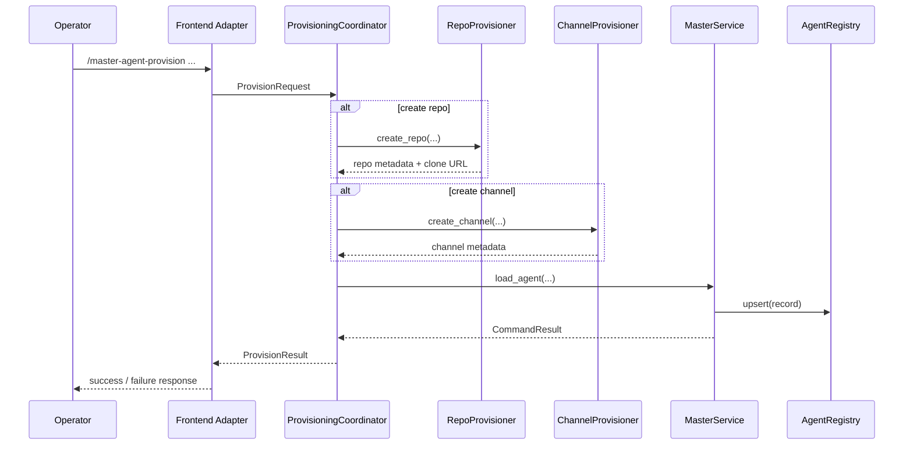

# Agent Provisioning Detailed Design

**Status:** canonical design  
**Issue:** [#37](https://github.com/pandazxx/codex-slack/issues/37)  
**ADR:** [`docs/decisions/0001-agent-provisioning-orchestration.md`](../decisions/0001-agent-provisioning-orchestration.md)

## Goal

Define the implementation-oriented design for provisioning a new agent when some or all dependencies do not already exist.

This design covers:

- automatic channel creation
- optional GitHub repository auto-creation
- orchestration boundaries between frontends and master core
- command UX, result contract, error handling, and tests

## Scope

### In Scope

- add a new high-level provisioning workflow
- create Slack or Discord channels for new agents
- optionally create a GitHub repository as part of provisioning
- bind created resources through the existing agent registry/load flow
- return provisioning metadata to operators

### Out of Scope

- project template scaffolding inside the new repo
- automatic branch protection or repository policy setup
- provisioning voice channels, forum channels, or Discord threads
- automatic rollback of already-created resources beyond best-effort cleanup notes

## Product Decision

The provisioning workflow is a new command, not a change to `/master-agent-load`.

Command:

- `/master-agent-provision`

Rationale:

- `/master-agent-load` is already a stable low-level bind operation
- provisioning introduces external side effects in GitHub and frontend APIs
- separating the workflows keeps the existing operational command deterministic

## High-Level Architecture

Provisioning introduces a coordinator layer between frontend command handling and `MasterService.load_agent()`.



## Component Boundaries

### Frontend Adapter

Frontend adapters own:

- command intake and argument parsing
- platform API client context
- channel creation for their platform
- final operator response rendering

Slack and Discord should each own their own `ChannelProvisioner` implementation because the API contracts and permission models differ.

### ProvisioningCoordinator

Coordinator responsibilities:

- validate the provisioning request shape
- invoke repo creation when requested
- invoke channel creation when requested
- derive final `repo_path` / `repo_source` and `channel_id`
- call existing `MasterService.load_agent()`
- return a normalized result with created-resource metadata

This layer is the orchestration boundary. It should not directly own frontend SDK code or registry persistence logic.

### MasterService

`MasterService` remains responsible for:

- repo source normalization
- checkout / branch fallback
- image-plan resolution
- registry upsert

`MasterService.load_agent()` should not create channels or repositories directly.

### RepoProvisioner

GitHub-specific repository creation is implemented behind a provider interface.

Current provider:

- GitHub REST API provider using `GH_TOKEN` or `GITHUB_TOKEN`

Why REST API instead of `gh repo create`:

- easier to unit test
- avoids CLI-specific formatting and subprocess coupling
- aligns with service-style provider boundaries

## Command Surface

### Slack

Current text form:

```text
/master-agent-provision <name> [repo_spec] [--create-repo] [--repo-owner <owner>] [--repo-name <name>] [--repo-visibility private|public] [--create-channel] [--channel-name <name>] [--adapter codex|claude-code] [--branch <branch>]
```

### Discord

Current application command arguments:

- `name`
- `repo_spec`
- `create_repo`
- `repo_owner`
- `repo_name`
- `repo_visibility`
- `create_channel`
- `channel_name`
- `branch`
- `adapter`

### Required v1 rules

- at least one of `repo_spec` or `--create-repo` must be present
- at least one of `channel_id` or `--create-channel` equivalent must be available
- the final resolved request passed into `load_agent()` must include a concrete `repo_path`/`repo_source` and a concrete `channel_id`

## Request Model

Current internal request shape:

```json
{
  "name": "payments-api",
  "platform": "slack",
  "repo": {
    "mode": "existing|create",
    "source": "pandazxx/payments-api",
    "owner": "pandazxx",
    "name": "payments-api",
    "visibility": "private"
  },
  "channel": {
    "mode": "existing|create",
    "channel_id": "C123",
    "name": "agent-payments-api"
  },
  "repo_ref": "main",
  "agent_adapter": "codex"
}
```

## Resource Naming Rules

### Agent name

Continue using the existing agent-name rule from `MasterService`:

- `^[a-z0-9][a-z0-9-]{1,30}$`

### Repository name

Default:

- `<agent-name>`

Rules:

- slug normalization should mirror GitHub repository naming rules where practical
- operator-supplied override wins

### Channel name

Default:

- `agent-<agent-name>`

Rules:

- Slack name normalization must follow Slack channel naming constraints
- Discord name normalization must follow Discord text-channel naming constraints

## Channel Provisioning Design

### Slack

Current behavior:

- create a text channel named `agent-<name>`
- default to a policy-driven channel type:
  - either explicit flag required
  - or configured default via master config
- ensure the bot is present in the created channel

Provider output:

```json
{
  "platform": "slack",
  "channel_id": "C123456",
  "channel_name": "agent-payments-api",
  "visibility": "private"
}
```

### Discord

Current behavior:

- create a text channel, not a thread
- create it in a configured guild/category
- use the created channel id as the registry-mapped destination

Provider output:

```json
{
  "platform": "discord",
  "channel_id": "1483608068142010560",
  "channel_name": "agent-payments-api",
  "guild_id": "123456789012345678",
  "category_id": "234567890123456789"
}
```

### Why channels, not threads

- the current mapping model uses stable `channel_id` values
- Discord thread creation depends on a parent channel and different lifecycle semantics
- Slack thread routing is already a data-plane behavior after the mapped channel exists

## Repository Provisioning Design

### GitHub v1 behavior

Required inputs:

- repo name

Optional inputs:

- owner or org
- visibility

Optional later:

- template repository
- default branch selection
- branch protection bootstrap

Provider output:

```json
{
  "provider": "github",
  "owner": "pandazxx",
  "repo_name": "payments-api",
  "visibility": "private",
  "html_url": "https://github.com/pandazxx/payments-api",
  "clone_url": "https://github.com/pandazxx/payments-api.git",
  "ssh_url": "git@github.com:pandazxx/payments-api.git"
}
```

Default resolution rules:

- if `owner` is omitted, resolve it from the current authenticated GitHub token identity
- if the token belongs to a user account, create the repository under that user by default
- if the token is scoped for org automation and repo creation should target an org, require an explicit owner override in v1
- if `visibility` is omitted, default to `private`
- new repositories are auto-initialized so the requested default branch exists before `load_agent()` binds the repo
- when provisioning creates a repo, the final agent bind uses `ssh_url` rather than `clone_url`

### Existing repo reuse

Current behavior:

- if repo creation was requested and the target repo already exists, provisioning fails instead of silently reusing it
- there is no explicit reuse-if-exists mode yet

## Persistence Design

### Immediate result payload

The provisioning response returns:

- final `channel_id`
- final `repo_source`
- created channel metadata
- created repo metadata
- `repo_ref`
- `agent_adapter`

### Registry extension

Optional registry fields:

- `channel_name`
- `provisioned_channel`
- `repo_owner`
- `repo_name`
- `provisioned_repo`

These fields are useful for later operator visibility and diagnostics but are not required to make v1 function if the response already includes them.

## Error Handling

Stable provisioning error codes:

- `ERR_PROVISION_INVALID_ARGS`
- `ERR_CHANNEL_CREATE_FAILED`
- `ERR_REPO_CREATE_FAILED`
- `ERR_PROVISION_CONFLICT`
- `ERR_PROVISION_PARTIAL`

Error payloads should report:

- which step failed
- what had already been created
- whether manual cleanup is required

Example:

```json
{
  "ok": false,
  "code": "ERR_PROVISION_PARTIAL",
  "message": "channel created but repo creation failed",
  "data": {
    "created_channel_id": "C123456",
    "cleanup_required": true,
    "failed_step": "repo_create"
  }
}
```

## Rollout Strategy

Rollout order used:

1. request/result types and coordinator
2. GitHub repo provisioner
3. Slack channel provisioner
4. Discord channel provisioner
5. command wiring
6. docs and UAT

## Test Design

### Unit tests

- request parsing and validation
- repo provisioner success/failure
- channel provisioner success/failure
- coordinator success path
- coordinator partial-failure path
- result rendering

### Integration-style tests

- Slack provisioning -> `load_agent()` bind call
- Discord provisioning -> `load_agent()` bind call
- created resource metadata visible in output

### UAT

- create repo + channel + load agent from Slack
- create repo + channel + load agent from Discord
- repo creation disabled, channel creation enabled
- channel creation disabled, repo creation enabled
- conflict and partial-failure operator messaging

## Open Questions

Current resolved decisions and remaining gaps:

- Discord target guild/category is inferred from the invoking admin channel
- provisioning remains load-only in v1 and does not auto-start the agent
- omitted repo input defaults to create-repo
- omitted channel input defaults to create-channel
- explicit reuse-if-exists mode is still not implemented
- Slack default channel type still depends on the current frontend implementation and runtime permissions; operators should treat it as an implementation detail unless a stronger product rule is added
