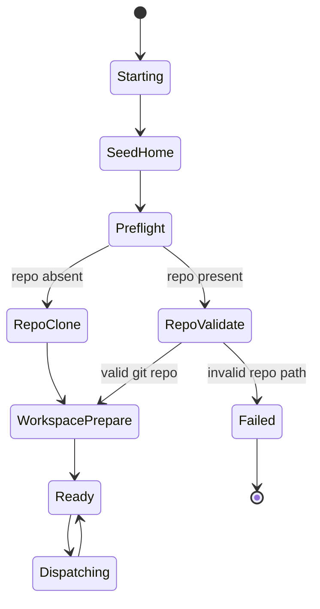
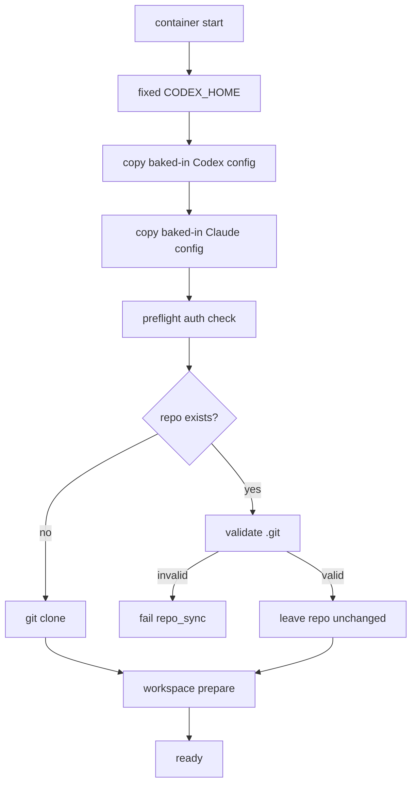

# Agent Runtime Cleanup Detailed Design

**Status:** proposed  
**Issues:** [#53](https://github.com/pandazxx/codex-slack/issues/53), [#54](https://github.com/pandazxx/codex-slack/issues/54), [#55](https://github.com/pandazxx/codex-slack/issues/55), [#56](https://github.com/pandazxx/codex-slack/issues/56)  
**ADR:** [`docs/decisions/0004-agent-runtime-cleanup.md`](../decisions/0004-agent-runtime-cleanup.md)

## Goal

Implement the later-phase runtime cleanup that removes transitional startup
behaviors from agent containers.

This design covers:

- fixed `CODEX_HOME` behavior
- removal of mounted global config support
- removal of Codex session passthrough
- clone-only repo startup rules
- required code, test, and documentation updates

## Current Behavior

### Entrypoint

`docker/entrypoint.sh` currently:

- chooses `CODEX_HOME` from explicit env, `/workspace/.codex`, or
  `/home/appuser/.codex`
- prefers mounted global config under `/run/secrets/...`
- seeds Codex sessions from `/run/secrets/codex_sessions`
- falls back to baked-in config only when the mounts are absent

### Worker

`src/agent/worker.py` currently:

- copies mounted global config again during `workspace_prepare`
- clones the repo when absent
- forcibly resets an existing repo to `origin/<ref>`

### Master

`src/master/service.py` currently:

- passes `AGENT_GLOBAL_CODEX_CONFIG_DIR`
- passes `AGENT_GLOBAL_CLAUDE_CONFIG_DIR`
- mounts `MASTER_CODEX_CONFIG_DIR_PATH`
- mounts `MASTER_CLAUDE_CONFIG_DIR_PATH`
- may mount Codex session seed paths through the runtime adapter

## Target Behavior

### Canonical startup contract

Master-managed agent startup should behave as follows:

1. master sets:
   - `HOME=/workspace/home`
   - `XDG_CONFIG_HOME=/workspace/home/.config`
   - `CODEX_HOME=/workspace/home/.codex`
2. entrypoint uses that fixed path and does not inspect `/workspace/.codex`
3. entrypoint copies baked-in Codex config into `CODEX_HOME`
4. entrypoint copies baked-in Claude config into `~/.claude`
5. worker does not re-import shared config from master-mounted paths
6. worker clones the repo only when absent and otherwise leaves an existing
   valid repo unchanged

## Component Changes

### 1. `docker/entrypoint.sh`

### Remove dynamic home fallback

Replace:

- explicit `CODEX_HOME`
- else `/workspace/.codex`
- else `/home/appuser/.codex`

With:

- explicit `CODEX_HOME` if already provided
- otherwise `/workspace/home/.codex`

For master-managed startup, `CODEX_HOME` is already provided by master, so the
entrypoint should simply normalize and create the target directory.

### Remove mounted global config inputs

Delete support for:

- `/run/secrets/master_codex_config`
- `/run/secrets/master_claude_config`

Startup should seed from baked-in image paths only:

- `/opt/codex-slack/config/codex-global`
- `/opt/codex-slack/config/claude-global`

### Remove session passthrough

Delete support for:

- `/run/secrets/codex_sessions`

and stop copying that directory into:

- `CODEX_HOME/sessions`

### Keep true secret/auth seeding

Retain:

- Codex auth seeding from `/run/secrets/codex_auth.json`
- Git user config setup
- existing runtime mode selection

### 2. `src/agent/worker.py`

### Remove mounted global config copy

Delete `workspace_prepare` support for:

- `AGENT_GLOBAL_CODEX_CONFIG_DIR`
- `AGENT_GLOBAL_CLAUDE_CONFIG_DIR`

The worker should no longer treat mounted config directories as an input source.

The remaining workspace prepare responsibilities should be:

- ensure writable home directories exist
- log repo-local project-scope config state
- apply repo-local git identity

### Replace destructive update path with clone-only startup

Current update path:

```text
git fetch origin <ref>
git checkout <ref>
git reset --hard origin/<ref>
```

Target startup policy:

1. if `/workspace/repo/.git` is missing:
   - `git clone --branch <ref> <url> /workspace/repo`
2. if repo exists:
   - validate that `/workspace/repo` is a git repo
   - do not fetch
   - do not checkout
   - do not reset
   - leave the existing repo unchanged
3. if the path exists but is not a valid git repo:
   - fail startup with an explicit `AgentInitError("repo_sync", ...)`

### Repo validation rule

The worker should treat repo startup as a presence/validity check:

- absent repo: clone
- valid git repo: keep as-is
- invalid repo path: fail

The v1 cleanup intentionally removes startup-time branch alignment and remote
refresh from the worker lifecycle.

### 3. `src/master/service.py`

### Remove mounted config env passdown

Stop injecting:

- `AGENT_GLOBAL_CODEX_CONFIG_DIR`
- `AGENT_GLOBAL_CLAUDE_CONFIG_DIR`

into the agent env.

### Remove mounted config bind mounts

Stop mounting:

- `MASTER_CODEX_CONFIG_DIR_PATH` -> `/run/secrets/master_codex_config`
- `MASTER_CLAUDE_CONFIG_DIR_PATH` -> `/run/secrets/master_claude_config`

This makes agent startup independent of master-side config-directory mounts.

### Keep image refresh behavior

The current image refresh behavior remains required:

- default image: pull on every `/master-agent-start`
- project-specific image: rebuild on every `/master-agent-start`

That is now the mechanism for delivering newer baked-in shared config.

### 4. `src/master/runtime_adapter.py`

Remove runtime mount wiring for:

- global Codex config directory mounts
- global Claude config directory mounts
- Codex session seed mounts, if still present in the runtime adapter path

The runtime adapter should continue supporting:

- workspace volume
- Codex auth seed
- SSH agent socket / known hosts
- transient request staging

## Logging Changes

Startup diagnostics should be simplified to match the new contract.

### Entrypoint logs

Keep:

- selected `CODEX_HOME`
- baked-in config source/result
- auth seed result
- final launch mode

Remove references to:

- mounted global config source selection
- mounted session seed copy

### Worker logs

Keep:

- `agent.worker_settings`
- repo-local scope logs
- clone-vs-existing-repo status and failure reason

Remove references to:

- `AGENT_GLOBAL_CODEX_CONFIG_DIR`
- `AGENT_GLOBAL_CLAUDE_CONFIG_DIR`

## State Machine



## Flow Chart



## Compatibility Impact

### Breaking changes

This cleanup intentionally breaks these transitional behaviors:

- `/workspace/.codex` no longer acts as an implicit user-scope home
- master-side mounted global config no longer overrides image defaults
- Codex sessions are no longer seeded from master-managed mounts
- existing valid repo worktrees are no longer refreshed or aligned on startup

### Operational impact

Operators must treat shared instruction/config updates as an image rollout
concern, not a master env-only change.

## Test Plan

### Unit tests

Update or add coverage for:

- entrypoint fixed `CODEX_HOME` selection
- entrypoint baked-in config seeding without mounted-config branches
- absence of session seed handling
- worker repo clone path
- worker no-op path for an existing valid git repo
- worker failure on an existing invalid repo path
- master env/mount generation without global config passthrough

### Regression tests

Add explicit tests that:

- `/workspace/.codex` is ignored by the startup contract
- mounted global config env vars are not passed into agents
- startup no longer references `codex_sessions`
- startup leaves an existing valid repo unchanged
- existing non-git repo paths fail with a repo-sync error

### Manual validation

UAT should verify:

1. a fresh agent starts and receives baked-in Codex/Claude config
2. updating the agent image and restarting refreshes shared defaults
3. an existing valid `/workspace/repo` is left unchanged on startup
4. an invalid `/workspace/repo` path causes an explicit repo-sync error

## Documentation Updates

Update these docs together with implementation:

- [`docs/design/containers/agent-container-design.md`](containers/agent-container-design.md)
- [`docs/design/agent-container-runtime-design.md`](agent-container-runtime-design.md)
- [`docs/design/containers/environment-variable-passdown-design.md`](containers/environment-variable-passdown-design.md)
- [`docs/guides/container-runtime.md`](../guides/container-runtime.md)
- [`docs/references/config.md`](../references/config.md)

The later-phase cleanup notes in the container design should be converted into
current-state wording once the implementation lands.

## Rollout Order

Recommended implementation order:

1. remove master-side global config and session passdown
2. simplify entrypoint startup sources
3. simplify worker workspace-prepare logic
4. replace repo reset with clone-only/no-op repo behavior
5. update docs and UAT guidance

This order keeps the contract moving from many sources to one source instead of
mixing old and new behavior across layers.
