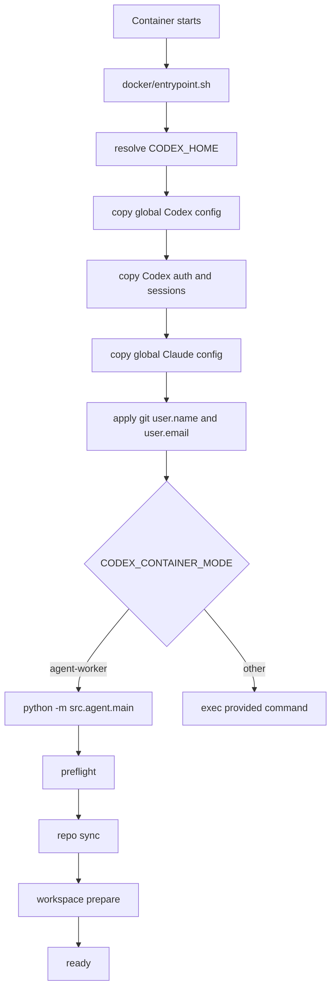
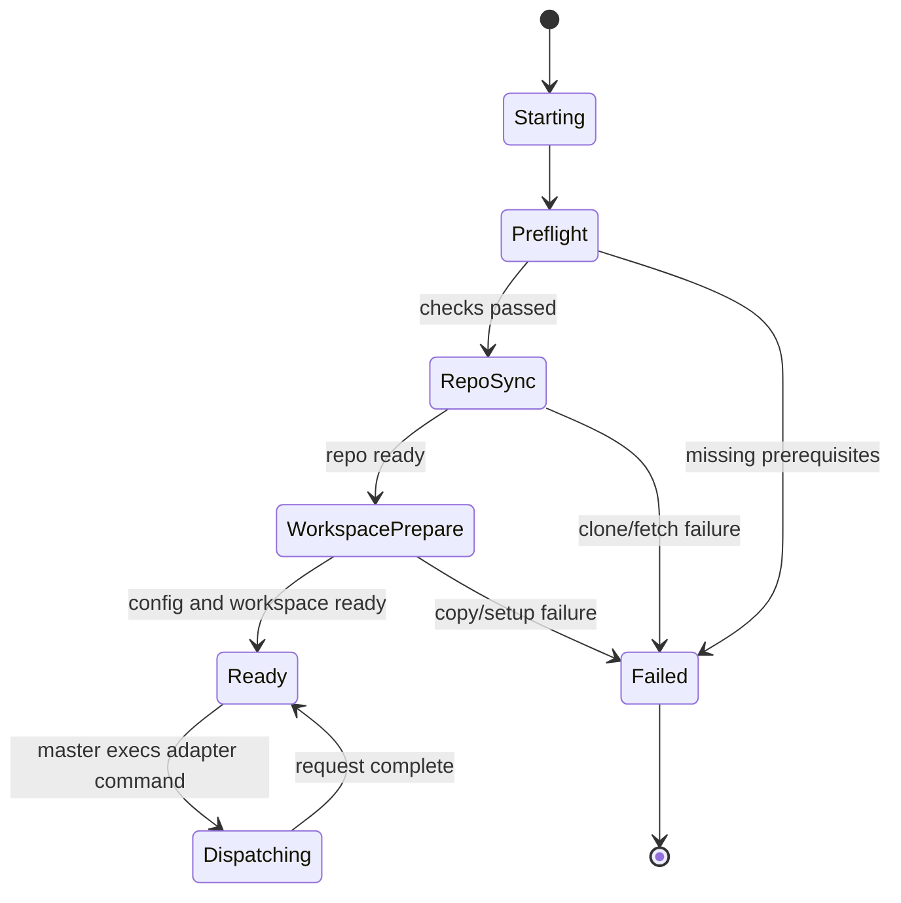

# Agent Container Design

**Status:** canonical design  
**Scope:** worker containers started by master for `codex` or `claude-code`

## Goal

Define the agent container as a runtime unit:

- shell entrypoint behavior
- worker startup stages
- master-to-agent interface contract
- storage layout and ownership
- lifecycle and failure boundaries

This is the container-focused companion to:

- `docs/design/agent-container-runtime-design.md`
- `docs/design/master-agent-interface-design.md`
- `docs/references/config.md`
- `docs/references/logging.md`

## Responsibilities

The agent container is the worker plane. It is responsible for:

- receiving a prepared environment from master
- selecting and preparing writable user-scope runtime state
- syncing the target repository into `/workspace/repo`
- executing the configured agent adapter
- consuming transient request manifests and staged files
- writing durable work back into the repo workspace

It is not responsible for:

- Slack or Discord connectivity
- container orchestration
- registry ownership
- cross-agent routing

## Entry Point Model

The agent container uses the shell entrypoint at `docker/entrypoint.sh`.

That entrypoint is responsible for:

- selecting `CODEX_HOME`
- seeding global Codex config into writable user scope
- seeding Codex auth and sessions when available
- seeding global Claude config into writable user scope
- applying global Git identity if configured
- selecting the runtime mode
- launching either `src.agent.main` or another provided command

## Startup Flow

## Runtime Modes

The image can participate in multiple modes, but the normal master-managed mode
is:

- `CODEX_CONTAINER_MODE=agent-worker`

In that mode, the entrypoint converts the default bot launch into:

- `python -m src.agent.main`

The entrypoint can also exec an explicit command, which is how adapter dispatch
and testing paths stay flexible.

## Interface Contract

### Required Inputs from Master

The agent container depends on master-provided env vars such as:

- `HOME=/workspace/home`
- `XDG_CONFIG_HOME=/workspace/home/.config`
- `CODEX_HOME=/workspace/home/.codex`
- `AGENT_REPO_DIR=repo`
- `AGENT_REPO_URL`
- `AGENT_REPO_REF`
- `AGENT_FRONTEND`
- `AGENT_ADAPTER`

Optional but common inputs:

- `GH_TOKEN` / `GITHUB_TOKEN`
- `OPENAI_API_KEY`
- `CLAUDE_CODE_OAUTH_TOKEN`
- `AGENT_GLOBAL_CODEX_CONFIG_DIR`
- `AGENT_GLOBAL_CLAUDE_CONFIG_DIR`
- `SSH_AUTH_SOCK`
- `GIT_SSH_COMMAND`
- `AGENT_REQUEST_MANIFEST`

### Mount Contract

The master typically mounts:

- workspace volume at `/workspace`
- global Codex config at `/run/secrets/master_codex_config`
- global Claude config at `/run/secrets/master_claude_config`
- Codex auth seed at `/run/secrets/codex_auth.json`
- Codex sessions seed at `/run/secrets/codex_sessions` when applicable
- SSH agent socket at `/run/secrets/ssh-auth.sock`
- transient request data under `/workspace/message/...`

## Storage Layout

Important paths inside the running container:

- `/workspace/repo`
  - durable checked-out project state
- `/workspace/home/.codex`
  - writable Codex user-scope home
- `/workspace/home/.claude`
  - writable Claude user-scope home
- `/workspace/home/.config`
  - XDG config home
- `/workspace/message/...`
  - transient request-scoped staged input

Repo-local project scope remains inside the repo:

- `/workspace/repo/.codex`
- `/workspace/repo/.claude`
- repo-root `AGENTS.md`

## Storage Ownership

| Path | Owner | Durability | Purpose |
|---|---|---|---|
| `/workspace/repo` | agent workspace volume | durable | checked-out project and committed changes |
| `/workspace/home/.codex` | agent workspace volume | durable | writable Codex user scope |
| `/workspace/home/.claude` | agent workspace volume | durable | writable Claude user scope |
| `/workspace/message/...` | master-staged | transient | request-scoped files and manifest |
| `/run/secrets/...` | master-mounted | transient/read-only | seed inputs only |

## Worker Lifecycle

The worker process emits staged lifecycle states:

- `preflight`
- `repo_sync`
- `workspace_prepare`
- `ready`

## Startup Behavior in Detail

### 1. User-scope setup

The entrypoint chooses `CODEX_HOME` in this order:

1. explicit `CODEX_HOME`
2. project-level `/workspace/.codex` if present
3. default `/home/appuser/.codex`

It then ensures the directory exists and refreshes global config into it.

### 2. Global config refresh

Codex:

- prefers `/run/secrets/master_codex_config`
- falls back to baked-in `/opt/codex-slack/config/codex-global`
- copies into writable `CODEX_HOME`

Claude:

- prefers `/run/secrets/master_claude_config`
- falls back to baked-in `/opt/codex-slack/config/claude-global`
- copies into writable `~/.claude`

### 3. Auth/session seeding

Codex auth:

- copies `/run/secrets/codex_auth.json` into `CODEX_HOME/auth.json` when the
  target auth file is missing

Codex sessions:

- copies `/run/secrets/codex_sessions` into `CODEX_HOME/sessions` only when the
  target session directory is absent or empty

Claude auth:

- remains env-driven, not file-copy driven

### 4. Repo sync and workspace prepare

`src.agent.main` and the worker then:

- verify prerequisites
- clone or update the target repo into `/workspace/repo`
- prepare workspace/home directories
- copy shared global config into writable user scope again from the mounted env
  path when configured
- record status for master-side inspection

## Request Handling Contract

When master stages request input, the agent should treat:

- `/workspace/message/...`

as transient input only. The manifest pointed to by `AGENT_REQUEST_MANIFEST` is
the canonical request descriptor.

Rules:

- prefer manifest-derived Markdown and staged image paths
- do not treat request storage as durable state
- copy anything that must survive into `/workspace/repo/...`

## Observability

The agent container is intentionally verbose at startup.

Important logs include:

- `agent.entrypoint startup`
- `agent.entrypoint codex_config`
- `agent.entrypoint codex_config_result`
- `agent.entrypoint codex_home_result`
- `agent.entrypoint claude_config_result`
- `agent.worker_settings`
- `agent.stage ...`
- `agent.workspace_prepare_state`
- `agent.workspace_prepare_copied`
- `agent.workspace_prepare_copy_skipped`

The entrypoint also runs with shell tracing enabled to make copy and launch
behavior diagnosable.

## Failure Model

Typical failure classes:

- missing auth or SSH prerequisites
- repo clone/fetch failures
- missing or stale shared config inputs
- adapter command failure during dispatch

The agent container should fail fast on startup preconditions and return request
errors through master for per-dispatch failures.

## Operational Invariants

The agent container must preserve these invariants:

- user-scope config is writable inside the workspace volume
- read-only secret mounts are seed inputs, not live writable homes
- repo-local config remains project scope
- request-scoped staged files remain transient
- master remains the only orchestrator

## Related Documents

- `docs/design/agent-container-runtime-design.md`
- `docs/design/master-agent-interface-design.md`
- `docs/design/containers/environment-variable-passdown-design.md`
- `docs/guides/container-runtime.md`
- `docs/references/config.md`
- `docs/references/logging.md`
- `docs/guides/runbooks/master-agent.md`
