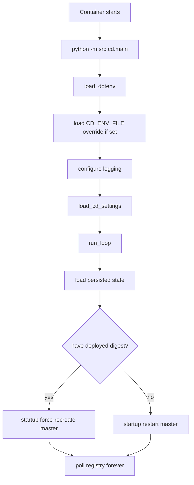
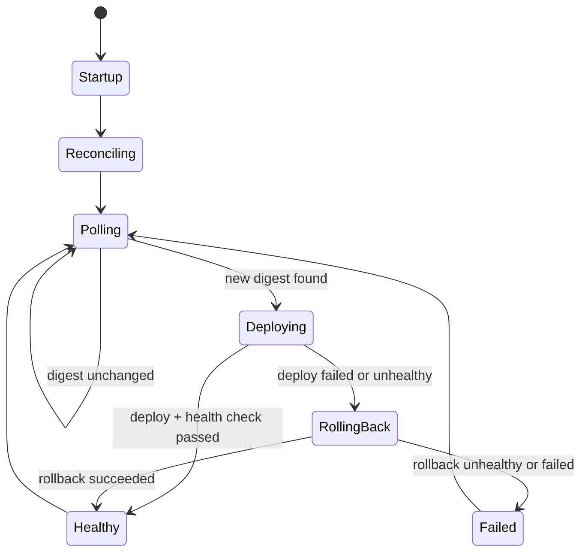

# CD Container Design

**Status:** canonical design  
**Scope:** the CD daemon container started with `python -m src.cd.main`

## Goal

Define the CD daemon container as a runtime unit:

- startup behavior and deploy loop
- interface contracts to GHCR, compose, and the master container
- lifecycle and rollback behavior
- persisted state and failure handling

This document complements:

- [`docs/guides/runbooks/cd-daemon.md`](../../guides/runbooks/cd-daemon.md)
- [`docs/references/config.md`](../../references/config.md)
- [`docs/references/logging.md`](../../references/logging.md)

## Responsibilities

The CD daemon is a deployment automation container. It is responsible for:

- loading CD settings
- polling the registry for new image digests
- redeploying the master container when the tracked digest changes
- rolling back to the previous digest when the new deployment is unhealthy
- persisting deploy state
- sending deployment notifications

It is not responsible for:

- running frontend logic
- owning the agent registry
- dispatching user prompts
- managing agent containers directly

## Process Model

Like the master container, the CD container is Python-process driven rather than
shell-entrypoint driven for its core logic.

Startup sequence:

1. load default `.env`
2. if `CD_ENV_FILE` is set, load that env file with override
3. configure logging
4. load `CdSettings`
5. enter the blocking deploy loop

## Startup Flow

## External Interfaces

The CD daemon depends on:

- GHCR or another OCI registry for image pulls
- compose tooling on the host or in the container
- a compose file that defines the master service
- an env file for master runtime variables
- optional Slack and Discord webhooks for notifications

It drives only one runtime target:

- the master container defined by `CD_CONTAINER_NAME` and the compose service

## Interface Contract

### Required Inputs

The CD container depends on configuration such as:

- `CD_IMAGE`
- `CD_IMAGE_TAG`
- `CD_CONTAINER_NAME`
- `CD_COMPOSE_FILE`
- `CD_COMPOSE_SERVICE`
- `CD_COMPOSE_BINARY`
- `CD_STATE_FILE`

Optional but common inputs:

- `CD_ENV_FILE`
- `CD_NOTIFY_SLACK_WEBHOOK_URL`
- `CD_NOTIFY_DISCORD_WEBHOOK_URL`
- `CD_DRY_RUN`
- `CD_ROLLBACK_ON_FAILURE`

### Outbound Actions

The daemon performs:

- image pull operations
- compose redeploy operations
- direct restart/force-recreate operations
- health checks against the master container
- webhook notifications
- persisted state updates

## Lifecycle

### Container Lifecycle

The daemon container itself is host-managed:

- created
- running
- restarted
- replaced

Its internal service loop is long-lived.

### Deploy Loop Lifecycle

## Startup Reconciliation Behavior

On startup the daemon reloads `CD_STATE_FILE` and reconciles the master
container:

- if `deployed_digest` exists
  - force-recreate the master container using that digest
- if no `deployed_digest` exists
  - restart the named master container

This makes daemon startup self-healing after daemon restarts and helps ensure
the master picks up the env and image currently represented by daemon state.

## Polling and Deployment Behavior

Normal loop behavior:

1. pull `<image>:<tag>`
2. read the resolved repo digest
3. compare against `state.deployed_digest`
4. if unchanged, sleep until next poll
5. if changed, deploy the new digest through compose
6. wait the configured health delay
7. inspect the master container health/running state
8. persist success or trigger rollback

## Rollback Contract

Rollback uses `state.previous_digest`.

Rules:

- rollback happens only when enabled and a previous digest exists
- the daemon redeploys the previous digest via compose
- the rolled-back container is health-checked again
- a rollback that is also unhealthy becomes a manual-intervention case

## Storage Model

Primary durable state:

- `CD_STATE_FILE`

This file persists:

- `deployed_digest`
- `previous_digest`
- `deployed_at`
- `consecutive_failures`

The daemon should treat container-local ephemeral files as disposable. Durable
behavior depends on the mounted state file and compose/env inputs.

## Storage Boundaries

| Path / resource | Owner | Durability | Purpose |
|---|---|---|---|
| `CD_STATE_FILE` | CD daemon | durable | last known-good deploy state |
| compose file | host/config repo | durable | defines master deployment |
| env file | host/config repo | durable | feeds master and daemon runtime config |
| process memory | daemon | transient | current loop state |

## Failure Model

Failure classes the daemon is designed to tolerate:

- image pull failures
- compose deploy failures
- master health-check failures
- webhook notification failures

Handling rules:

- webhook failures are logged and swallowed
- deploy failures increment failure state and may trigger rollback
- unchanged digests do not redeploy
- exceptions in the poll loop are logged and the loop continues

## Observability

Important logs include:

- `cd.daemon_start`
- `cd.daemon_loaded_state`
- `cd.startup_force_recreate`
- `cd.startup_restart`
- `cd.new_image`
- `cd.deploy_success`
- `cd.deploy_failed`
- `cd.health_check_failed`
- `cd.rollback_also_unhealthy`
- `cd.loop_error`

The daemon is designed so its deploy reasoning can be reconstructed from logs
plus `CD_STATE_FILE`.

## Operational Invariants

The CD container must preserve these invariants:

- it manages only the master deployment, not agents directly
- the repo digest is the authoritative deploy identity
- startup reconciliation must use persisted state when available
- a failed notification must not block deployment logic
- rollback targets the last known-good digest, not the moving tag

## Related Documents

- [`docs/guides/runbooks/cd-daemon.md`](../../guides/runbooks/cd-daemon.md)
- [`docs/design/containers/environment-variable-passdown-design.md`](environment-variable-passdown-design.md)
- [`docs/references/config.md`](../../references/config.md)
- [`docs/references/logging.md`](../../references/logging.md)
- [`docs/manuals/ops-manual.md`](../../manuals/ops-manual.md)
