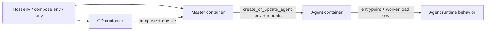
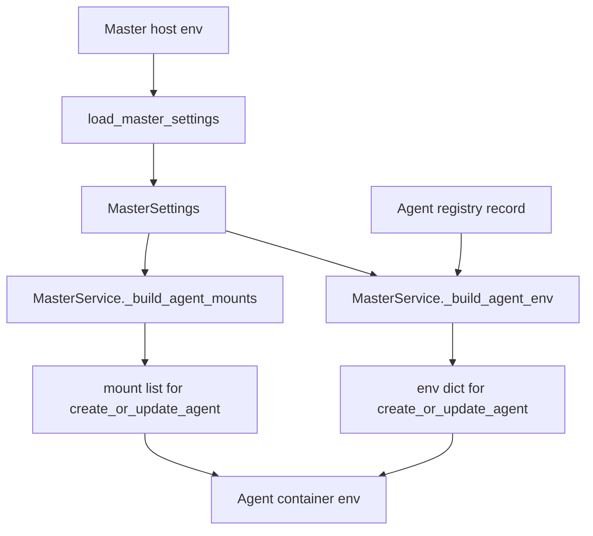

# Environment Variable Passdown Design

**Status:** canonical design  
**Scope:** how environment variables are loaded, renamed, persisted, and passed
between the CD, master, and agent container runtimes

## Goal

Explain the end-to-end environment-variable flow with explicit ownership:

- which container reads which environment variable
- which module loads and normalizes it
- which internal field name stores it
- whether the value stays local or is passed down to another runtime
- what final name the downstream runtime sees

This document focuses on environment flow. It complements:

- [`docs/references/config.md`](../../references/config.md)
- [`docs/design/containers/master-container-design.md`](master-container-design.md)
- [`docs/design/containers/agent-container-design.md`](agent-container-design.md)
- [`docs/design/containers/cd-container-design.md`](cd-container-design.md)

## High-Level Flow

## Design Rules

- CD env stays in the CD process and is not passed directly into the agent.
- Master env is normalized into `MasterSettings` before use.
- Agent container env is built by master from registry state plus selected master
  settings.
- Some host inputs are passed as env vars.
- Other host inputs are passed as mounts and then represented inside the agent as
  mount paths such as `/run/secrets/...`.

## 1. CD Container Env Flow

The CD container loads env in `src/cd/main.py` and normalizes it in
`src/cd/config.py`.

| Host env key | Loaded by | Stored as | Used by | Passed further |
|---|---|---|---|---|
| `CD_IMAGE` | `load_cd_settings()` | `CdSettings.image` | registry polling and deploy selection | no |
| `CD_IMAGE_TAG` | `load_cd_settings()` | `CdSettings.image_tag` | tracked tag | no |
| `CD_CONTAINER_NAME` | `load_cd_settings()` | `CdSettings.container_name` | health checks and startup reconcile | no |
| `CD_COMPOSE_FILE` | `load_cd_settings()` | `CdSettings.compose_file` | compose deploy/restart operations | no |
| `CD_COMPOSE_SERVICE` | `load_cd_settings()` | `CdSettings.compose_service` | compose target service | no |
| `CD_COMPOSE_BINARY` | `load_cd_settings()` | `CdSettings.compose_binary` | compose command execution | no |
| `CD_ENV_FILE` | `src.cd.main` and `load_cd_settings()` | `CdSettings.env_file` | daemon env override and compose `--env-file` | indirectly to master via compose |
| `CD_STATE_FILE` | `load_cd_settings()` | `CdSettings.state_file` | persisted daemon state | no |
| `CD_POLL_INTERVAL_SECONDS` | `load_cd_settings()` | `CdSettings.poll_interval_seconds` | polling loop | no |
| `CD_HEALTH_CHECK_DELAY_SECONDS` | `load_cd_settings()` | `CdSettings.health_check_delay_seconds` | post-deploy checks | no |
| `CD_ROLLBACK_ON_FAILURE` | `load_cd_settings()` | `CdSettings.rollback_on_failure` | rollback behavior | no |
| `CD_DRY_RUN` | `load_cd_settings()` | `CdSettings.dry_run` | side-effect guard | no |
| `CD_NOTIFY_SLACK_WEBHOOK_URL` | `load_cd_settings()` | `CdSettings.notify_slack_webhook_url` | notifications | no |
| `CD_NOTIFY_DISCORD_WEBHOOK_URL` | `load_cd_settings()` | `CdSettings.notify_discord_webhook_url` | notifications | no |

Important nuance:

- `CD_ENV_FILE` is the bridge to master runtime config because the daemon passes
  that file to compose when redeploying the master container.
- The CD process does not translate `CD_*` vars into `MASTER_*` vars itself.

## 2. Master Container Env Flow

The master container loads env in `src/master/main.py` and normalizes it in
`src/master/config.py` into `MasterSettings`.

### Frontend and process-local settings

| Host env key | Loaded by | Stored as | Used by | Passed to agent |
|---|---|---|---|---|
| `MASTER_FRONTENDS` | `load_master_settings()` | `MasterSettings.frontends` | decide which frontend threads start | no |
| `SLACK_BOT_TOKEN` | `load_master_settings()` | `MasterSettings.slack_bot_token` | Slack app and dispatcher URL access | not as agent env |
| `SLACK_APP_TOKEN` | `load_master_settings()` | `MasterSettings.slack_app_token` | Slack Socket Mode | no |
| `DISCORD_BOT_TOKEN` | `load_master_settings()` | `MasterSettings.discord_bot_token` | Discord frontend | no |
| `MASTER_ADMIN_CHANNELS` | `load_master_settings()` | `MasterSettings.admin_channels` | Slack admin guard | no |
| `DISCORD_ADMIN_CHANNELS` | `load_master_settings()` | `MasterSettings.discord_admin_channels` | Discord admin guard | no |
| `MASTER_REGISTRY_PATH` | `load_master_settings()` | `MasterSettings.registry_path` | `AgentRegistry` | no |
| `MASTER_THREAD_STATE_PATH` | `load_master_settings()` | `MasterSettings.thread_state_path` | `ChannelRouter` | no |
| `MASTER_DRY_RUN` | `load_master_settings()` | `MasterSettings.dry_run` | `PodmanRuntimeAdapter` | no |
| `MASTER_COMMAND_RATE_LIMIT_COUNT` | `load_master_settings()` | `MasterSettings.command_rate_limit_count` | `CommandRateLimiter` | no |
| `MASTER_COMMAND_RATE_LIMIT_WINDOW_SECONDS` | `load_master_settings()` | `MasterSettings.command_rate_limit_window_seconds` | `CommandRateLimiter` | no |

### Agent-runtime seed settings

These host env vars are loaded into `MasterSettings`, then later transformed by
`MasterService._build_agent_env()` and `_build_agent_mounts()` into agent env
vars or mount points.

| Host env key | Stored as | Agent sees env name | Agent sees mount / value |
|---|---|---|---|
| `MASTER_AGENT_BASE_IMAGE` | `agent_base_image` | none | image reference used at container create/start time |
| `MASTER_CODEX_AUTH_JSON_PATH` | `agent_codex_auth_json_path` | none | mount at `/run/secrets/codex_auth.json` |
| `MASTER_CODEX_CONFIG_DIR_PATH` | `agent_codex_config_dir_path` | `AGENT_GLOBAL_CODEX_CONFIG_DIR` | env value `/run/secrets/master_codex_config` plus matching mount |
| `MASTER_CLAUDE_CONFIG_DIR_PATH` | `agent_claude_config_dir_path` | `AGENT_GLOBAL_CLAUDE_CONFIG_DIR` | env value `/run/secrets/master_claude_config` plus matching mount |
| `MASTER_SSH_AUTH_SOCK_PATH` | `agent_ssh_auth_sock_path` | `SSH_AUTH_SOCK` | env value `/run/secrets/ssh-auth.sock` plus matching mount |
| `MASTER_SSH_KNOWN_HOSTS_PATH` | `agent_ssh_known_hosts_path` | `GIT_SSH_COMMAND` | env embeds known-hosts path if configured |
| `MASTER_GIT_USER_NAME` | `git_user_name` | `AGENT_GIT_USER_NAME` and `GIT_USER_NAME` | string passed through |
| `MASTER_GIT_USER_EMAIL` | `git_user_email` | `AGENT_GIT_USER_EMAIL` and `GIT_USER_EMAIL` | string passed through |
| `MASTER_DEFAULT_AGENT_ADAPTER` | `default_agent_adapter` | `AGENT_ADAPTER` | selected per agent record |
| `MASTER_CODEX_COMMAND_TEMPLATE` | `codex_command_template` | none | used only by master dispatcher |
| `MASTER_CLAUDE_COMMAND_TEMPLATE` | `claude_command_template` | none | used only by master dispatcher |
| `MASTER_AGENT_TIMEOUT_SECONDS` | `dispatch_timeout_seconds` | none | used only by master dispatcher |

### Auto-detected master env

`MASTER_PROJECT_DIR` is special:

- it is loaded by `load_master_settings()`
- it may be used to auto-detect:
  - `MASTER_CODEX_CONFIG_DIR_PATH`
  - `MASTER_CLAUDE_CONFIG_DIR_PATH`
- it is not passed to the agent directly

## 3. Master-to-Agent Env Construction

The master builds the agent container env in `MasterService`.

The important agent env keys built by master are:

| Agent env key | Built from | Consumed by |
|---|---|---|
| `HOME` | fixed runtime contract | entrypoint and worker |
| `XDG_CONFIG_HOME` | fixed runtime contract | entrypoint and worker |
| `CODEX_HOME` | fixed runtime contract | entrypoint and worker |
| `AGENT_REPO_DIR` | fixed runtime contract / registry | worker |
| `AGENT_REPO_URL` | agent record `repo_source` | worker |
| `AGENT_REPO_REF` | agent record `repo_ref` | worker |
| `AGENT_ADAPTER` | agent record or master default | dispatch-time semantics and logs |
| `AGENT_GLOBAL_CODEX_CONFIG_DIR` | master mount contract | worker |
| `AGENT_GLOBAL_CLAUDE_CONFIG_DIR` | master mount contract | worker |
| `AGENT_GIT_USER_NAME` | `MASTER_GIT_USER_NAME` | worker |
| `AGENT_GIT_USER_EMAIL` | `MASTER_GIT_USER_EMAIL` | worker |
| `SSH_AUTH_SOCK` | SSH mount contract | worker / git |
| `GIT_SSH_COMMAND` | known-hosts handling | git subprocesses |
| `GH_TOKEN` | host runtime env | worker preflight / git auth |
| `OPENAI_API_KEY` | host runtime env | Codex runtime |
| `CLAUDE_CODE_OAUTH_TOKEN` | host runtime env | Claude runtime |

Important nuance:

- some values are pass-through from the master process environment at container
  creation time
- some values come from the logical agent record
- some values are stable runtime constants

## 4. Agent Container Env Consumption

The agent consumes env in two stages:

### Stage 1: shell entrypoint

`docker/entrypoint.sh` reads:

- `CODEX_WORKSPACE_PATH`
- `CODEX_HOME`
- `HOME`
- `XDG_CONFIG_HOME`
- `CODEX_CONTAINER_MODE`
- `CODEX_SESSION_ID`
- `GIT_USER_NAME`
- `GIT_USER_EMAIL`

It uses those values to:

- choose the writable Codex home
- seed global config and auth from mounted sources
- configure global Git identity
- decide whether to launch `src.agent.main`

### Stage 2: worker runtime

`src/agent/worker.py` loads a smaller normalized settings object:

| Agent env key | Stored as | Used for |
|---|---|---|
| `CODEX_WORKSPACE_PATH` | `WorkerSettings.workspace_path` | workspace root |
| `AGENT_REPO_URL` | `WorkerSettings.repo_url` | clone/fetch source |
| `AGENT_REPO_REF` | `WorkerSettings.repo_ref` | branch/ref sync |
| `AGENT_REPO_DIR` | `WorkerSettings.repo_dir_name` | repo checkout dir |
| `AGENT_STATUS_FILE` | `WorkerSettings.status_file` | status JSON path |
| `CODEX_HOME` | `WorkerSettings.codex_home` | writable Codex home |
| `AGENT_READY_POLL_SECONDS` | `WorkerSettings.ready_poll_seconds` | readiness polling |

The worker also reads some env directly instead of storing them in
`WorkerSettings`:

- `AGENT_GLOBAL_CODEX_CONFIG_DIR`
- `AGENT_GLOBAL_CLAUDE_CONFIG_DIR`
- `SSH_AUTH_SOCK`
- `GH_TOKEN`
- `GITHUB_TOKEN`
- `GH_TOKEN_FILE`
- `HOME`
- `XDG_CONFIG_HOME`

## 5. Name Translation Rules

The main env-name translation patterns are:

| Host-side name | Agent-side name | Reason |
|---|---|---|
| `MASTER_CODEX_CONFIG_DIR_PATH` | `AGENT_GLOBAL_CODEX_CONFIG_DIR` | host path becomes in-container mounted source path |
| `MASTER_CLAUDE_CONFIG_DIR_PATH` | `AGENT_GLOBAL_CLAUDE_CONFIG_DIR` | same pattern for Claude |
| `MASTER_GIT_USER_NAME` | `AGENT_GIT_USER_NAME` | explicit agent-scoped identity input |
| `MASTER_GIT_USER_EMAIL` | `AGENT_GIT_USER_EMAIL` | explicit agent-scoped identity input |
| `CD_*` | none | CD settings stay local to the daemon |

Mount-path translation is just as important as env translation:

| Host path env | In-container mounted path |
|---|---|
| `MASTER_CODEX_AUTH_JSON_PATH` | `/run/secrets/codex_auth.json` |
| `MASTER_CODEX_CONFIG_DIR_PATH` | `/run/secrets/master_codex_config` |
| `MASTER_CLAUDE_CONFIG_DIR_PATH` | `/run/secrets/master_claude_config` |
| `MASTER_SSH_AUTH_SOCK_PATH` | `/run/secrets/ssh-auth.sock` |

## 6. Observability

These logs are the main passdown diagnostics:

- `cd.env_load ...`
- `master.env ...`
- `master.startup ...`
- `master.start_agent_config ...`
- `runtime.create_or_update_agent ...`
- `agent.entrypoint ...`
- `agent.worker_settings ...`
- `agent.workspace_prepare_paths ...`

Use them in order:

1. confirm the container loaded the source env
2. confirm normalization into settings
3. confirm master rendered the expected agent env/mount contract
4. confirm the agent saw the final in-container values

## Related Documents

- [`docs/references/config.md`](../../references/config.md)
- [`docs/references/logging.md`](../../references/logging.md)
- [`docs/design/containers/master-container-design.md`](master-container-design.md)
- [`docs/design/containers/agent-container-design.md`](agent-container-design.md)
- [`docs/design/containers/cd-container-design.md`](cd-container-design.md)
