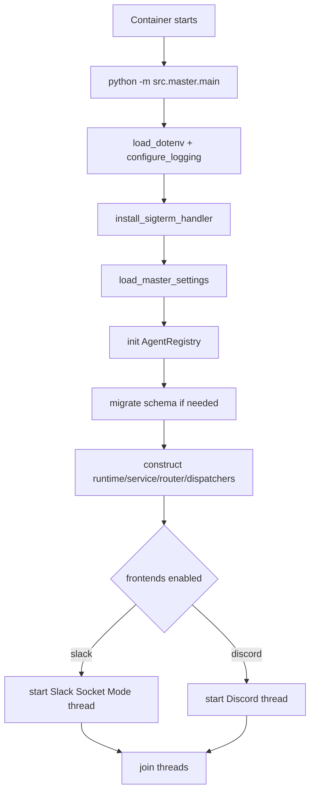
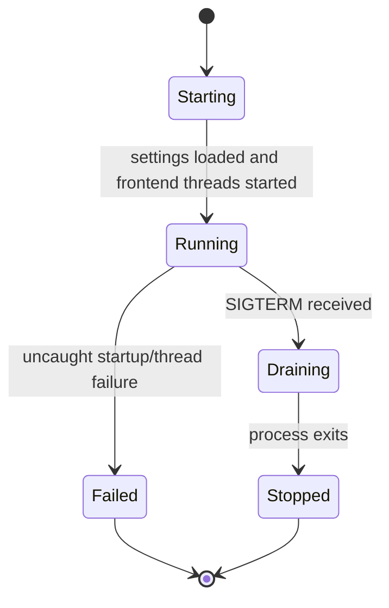

# Master Container Design

**Status:** canonical design  
**Scope:** the `master` control-plane container started with `python -m src.master.main`

## Goal

Define the behavior of the master container as a runtime unit:

- startup path and process model
- external and internal interface contracts
- lifecycle and state transitions
- durable versus transient storage
- operational observability and failure boundaries

This document describes the container itself. It complements:

- [`docs/design/master-agent-interface-design.md`](../master-agent-interface-design.md)
- [`docs/design/frontend-master-interface-design.md`](../frontend-master-interface-design.md)
- [`docs/guides/runbooks/master-agent.md`](../../guides/runbooks/master-agent.md)
- [`docs/references/config.md`](../../references/config.md)
- [`docs/references/logging.md`](../../references/logging.md)

## Responsibilities

The master container is the system control plane. It is responsible for:

- loading runtime settings from environment
- starting the configured frontends
- accepting admin commands from Slack and Discord
- owning the agent registry and thread-routing state
- provisioning repos and channels when requested
- creating, starting, stopping, removing, and inspecting agent containers
- dispatching user prompts into running agent containers

The master container does not:

- execute coding work itself
- keep durable repository workspaces for agents
- act as the CD daemon

## Process Model

Unlike the agent image, the master container does not rely on a custom shell
entrypoint flow for normal behavior. Its startup path is the Python process in
`src/master/main.py`.

Startup sequence:

1. load `.env` values
2. configure logging
3. install the SIGTERM dispatch guard
4. load `MasterSettings`
5. initialize the registry and migrate schema if needed
6. construct runtime, service, router, dispatcher, rate-limiter, and
   provisioning components
7. start the enabled frontends as background threads
8. join those frontend threads for the life of the process

## Startup Flow

## Runtime Components

The master process composes these main subsystems:

- `AgentRegistry`
  - persists logical agent records and routing metadata
- `MasterService`
  - owns command-side lifecycle operations
  - prepares agents for routed messages by starting absent/stopped containers
    and refreshing stale Codex auth when needed
- `PodmanRuntimeAdapter`
  - translates lifecycle operations into container runtime commands
- `ChannelRouter`
  - maps incoming frontend traffic to the correct agent
- `PodmanExecDispatcher` / `ClaudeCodeDispatcher`
  - executes the adapter command inside the target agent container
- frontend adapters
  - Slack Socket Mode app
  - Discord bot client
- provisioning helpers
  - GitHub repo creation
  - frontend-specific channel creation

## Interface Contracts

### Inbound Interfaces

The master container accepts input through:

- Slack events and slash-command style admin messages
- Discord messages in configured admin or routed channels
- environment variables at process startup
- host Podman socket access for container control

### Outbound Interfaces

The master container emits output through:

- Slack replies
- Discord replies
- GitHub API calls for provisioning flows
- Podman operations against agent containers
- structured logs to stdout/stderr

### Internal Contract to Agent Containers

The master is the only control plane for agents. It injects:

- environment variables such as `HOME`, `CODEX_HOME`, `AGENT_REPO_URL`,
  `AGENT_REPO_REF`, `AGENT_FRONTEND`, and adapter selection
- shared mounts such as workspace volume, auth seed, global config, SSH agent
  socket, and transient request storage
- prompt dispatch via `podman exec`

Before dispatching a routed prompt, the dispatcher calls back into
`MasterService.prepare_agent_for_message()`. That prepare step uses the same
agent startup path as `/master-agent-start` when the container is absent or not
running, and refreshes Codex auth if the registry timestamp is stale.

Detailed agent-side semantics belong in:

- [`docs/design/agent-container-runtime-design.md`](../agent-container-runtime-design.md)
- [`docs/design/master-agent-interface-design.md`](../master-agent-interface-design.md)

## Lifecycle

### Container Lifecycle

The master container has a simple host-managed lifecycle:

- created
- running
- stopped
- replaced by CD or operator action

It is intentionally stateless in memory. Durable state lives on mounted storage.

### Service Lifecycle

### Agent Lifecycle Owned by Master

The master also owns the logical lifecycle of agents:

- `loaded`
- `running`
- `stopped`
- `error`

Those are registry states, not master-container states.

## Storage Model

The master container should treat all durable state as mounted host-backed data.

Primary durable paths:

- `data/master/agents.json`
  - agent registry
- `data/master/thread_state.json` or configured equivalent
  - tracked conversation threads and routing continuity

Operationally important mounted inputs:

- compose-provided environment
- Podman socket
- host auth/config paths
- optional SSH socket and known-hosts inputs

The master container should not store durable agent repo state inside its own
filesystem layer. Agent workspaces belong to agent containers and their volumes.

## Storage Boundaries

| Path / resource | Owner | Durability | Notes |
|---|---|---|---|
| `data/master/agents.json` | master | durable | registry source of truth |
| thread state file | master | durable | routing continuity |
| process memory | master | transient | rebuilt on restart |
| agent workspace volumes | agent runtime | durable | not owned by master filesystem |
| `/workspace/message/...` in agent | master-created input | transient | request-scoped only |

## Failure Model

The master container is expected to survive and report:

- invalid configuration at startup
- frontend authentication failure
- agent build/start/stop/remove errors
- prompt dispatch timeouts and command failures
- provisioning failures

Failure boundaries:

- frontend/process startup failures can fail the whole container
- agent runtime failures should not crash the master process
- dispatch failures should be contained to the specific request

## Observability

Key startup and lifecycle logs include:

- `master.startup`
- `master.frontend_started`
- `master.registry_schema_migrated`
- `master.start_agent_config`
- `runtime.create_or_update_agent`
- command audit logs
- router dispatch logs

The master container should be diagnosable from logs plus:

- registry file contents
- thread state file contents
- Podman container inspect output for the managed agents

## Operational Invariants

The master container must preserve these invariants:

- it is the only control plane for agent containers
- registry and thread state are durable across container restart
- Codex auth refresh timestamps live in the registry and must remain durable
  across master restart for age-based refresh decisions
- agent work happens in agent containers, not inside the master process
- request staging is transient and isolated from durable repo state
- frontend adapters may differ, but they share the same service and router core

## Operator Notes

- Restarting or replacing the master container must not wipe `agents.json` or
  thread state if the data mount is correct.
- The container must have access to the host Podman socket to manage agents.
- Provisioning features additionally depend on GitHub and frontend permissions.

## Related Documents

- [`docs/design/master-agent-interface-design.md`](../master-agent-interface-design.md)
- [`docs/design/frontend-master-interface-design.md`](../frontend-master-interface-design.md)
- [`docs/design/containers/environment-variable-passdown-design.md`](environment-variable-passdown-design.md)
- [`docs/guides/runbooks/master-agent.md`](../../guides/runbooks/master-agent.md)
- [`docs/references/config.md`](../../references/config.md)
- [`docs/references/logging.md`](../../references/logging.md)
- [`docs/guides/runbooks/cd-daemon.md`](../../guides/runbooks/cd-daemon.md)
