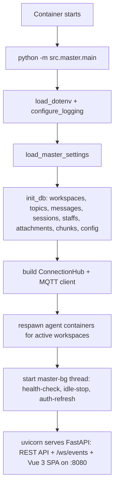
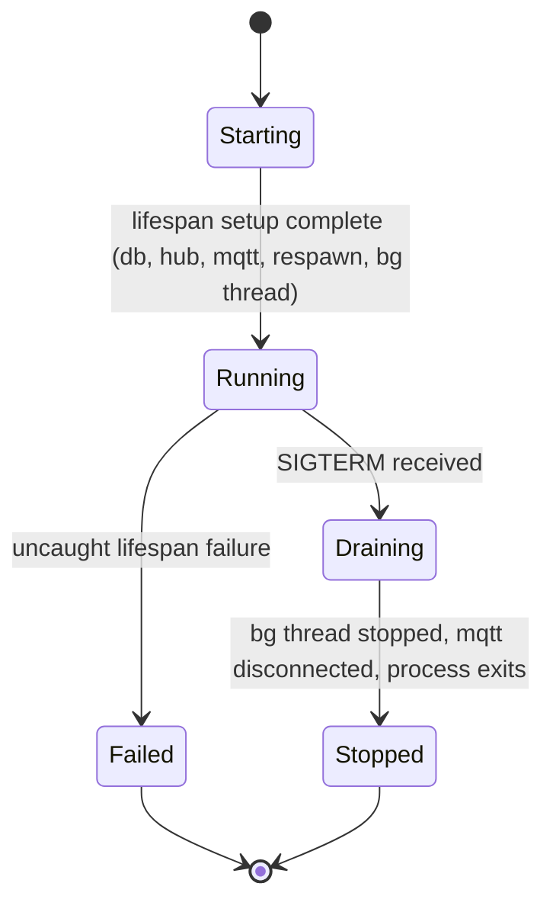

# Master Container Design

**Status:** canonical design (v3)
**Scope:** the `master` control-plane container started with `python -m src.master.main`

This document supersedes the v2 description in which the master ran Slack
Socket Mode and Discord client threads. v3 dropped both chat-platform
frontends — see [ADR-0006](../../decisions/0006-drop-slack-discord-integration.md)
and [ADR-0005 (v3 system architecture)](../../decisions/0005-v3-system-architecture.md).

## Goal

Define the behavior of the master container as a runtime unit:

- startup path and process model
- external and internal interface contracts
- lifecycle and state transitions
- durable versus transient storage
- operational observability and failure boundaries

This document describes the container itself. It complements:

- [`docs/design/agent-container-runtime-design.md`](../agent-container-runtime-design.md)
- [`docs/guides/runbooks/master-agent.md`](../../guides/runbooks/master-agent.md)
- [`docs/references/api.md`](../../references/api.md)
- [`docs/references/config.md`](../../references/config.md)
- [`docs/references/logging.md`](../../references/logging.md)

## Responsibilities

The master container is the system control plane. It is responsible for:

- loading runtime settings from environment
- serving the Vue 3 SPA, REST API, and `/ws/events` WebSocket on port `8080`
- running an MQTT client that bridges agent events to WebSocket subscribers
- owning the SQLite database that stores workspaces, topics, messages, sessions, attachments, and per-workspace agent configs
- creating, starting, stopping, removing, and inspecting agent containers per workspace
- dispatching user messages to the appropriate agent over MQTT
- background loops: idle auto-stop, health-check respawn, and Codex auth auto-refresh

The master container does not:

- execute coding work itself — `claude` and `codex` CLIs run inside agent containers
- keep durable repository workspaces — those live in agent containers and per-workspace volumes
- act as the CD daemon — that is `src/cd/`, a separate container

## Process Model

The master starts with `python -m src.master.main`. Its event loop is the
FastAPI/uvicorn ASGI server; long-running work runs as either a
FastAPI lifespan task (MQTT) or a daemon thread (background maintenance).

Startup sequence (FastAPI `lifespan`):

1. `load_dotenv()` and `configure_logging()`.
2. `load_master_settings()` — reads env into `MasterSettings`.
3. `init_db()` at `{MASTER_DATA_DIR}/master_data.db` — creates / migrates schema.
4. Construct the `ConnectionHub` (WebSocket fan-out) and the MQTT client; `mqtt.loop_start()`.
5. Create the `LocalAttachmentStore` rooted at the configured attachment dir.
6. `_respawn_agents()` — for every non-archived workspace with a `container_name`, spawn the agent container if it is missing.
7. Start the `master-bg` daemon thread that runs the maintenance loop every 60s.
8. Yield to the running ASGI app; on shutdown, signal the bg thread, stop the MQTT loop, and disconnect.

## Startup Flow

## Runtime Components

The master process composes these main subsystems:

- **FastAPI app** (`src/master/main.py`)
  - Mounts REST routers under `/api/` (workspaces, topics, messages, attachments, staffs, runtime config).
  - Serves the Vue 3 SPA from `src/master/static/` and the `/ws/events` WebSocket.
  - Exposes `/health` and `/schema`.
- **SQLite store** (`src/master/db.py`)
  - Tables: `workspaces`, `staffs`, `staff_sessions`, `config`, `topics`, `sessions`, `messages`, `attachments`, `chunks`.
  - File: `{MASTER_DATA_DIR}/master_data.db`.
- **`ConnectionHub`** (`src/master/ws_hub.py`)
  - Tracks connected WebSocket clients on the global `_global` channel.
  - Replays in-progress chunk streams to fresh connections.
- **MQTT client** (`src/master/mqtt_client.py`)
  - Subscribes to agent-published events and re-broadcasts them through the hub.
  - Publishes outbound prompts to `agent/{workspace_id}/...` topics.
- **Agent runtime** (`src/master/agent_runner.py`, `runtime_adapter.py`)
  - Wraps the Docker / Podman SDK to spawn, start, stop, pause, refresh, and inspect agent containers.
- **`MasterService`** (`src/master/service.py`)
  - Orchestrates workspace lifecycle and `prepare_agent_for_message()`.
- **Notification dispatcher** (`src/master/notify.py`)
  - Optional outbound webhook (Discord / Telegram) used to ping users when an agent reply lands. *Discord is used here as a webhook destination only — it is not a frontend.*
- **Attachment store** (`src/master/storage.py`)
  - `LocalAttachmentStore` writes uploaded files under the configured attachment dir.
- **Background tasks** (`master-bg` thread in `main.py`)
  - Health-check and respawn exited containers.
  - Idle auto-stop (`MASTER_AGENT_IDLE_TIMEOUT_SECONDS`).
  - Periodic Codex auth refresh (`MASTER_AGENT_AUTH_REFRESH_INTERVAL_SECONDS`).

## Interface Contracts

### Inbound

The master container accepts input through:

- **HTTP** on `:8080` — the Vue 3 SPA and the REST API under `/api/` (see [`docs/references/api.md`](../../references/api.md)).
- **WebSocket** at `/ws/events` — clients receive live agent activity for any topic on a single global channel; the frontend filters by `topic_id`.
- **MQTT** — agent containers publish events on topics master subscribes to (`agent/+/event`, chunk streams for streaming replies).
- **Container socket** (`CONTAINER_SOCKET_PATH`) — required to spawn and manage agent containers.
- Environment variables at process startup.

### Outbound

The master container emits output through:

- HTTP responses on `/api/`.
- WebSocket frames on `/ws/events`.
- MQTT publishes to `agent/{workspace_id}/...` topics.
- Optional notification webhooks (Discord webhook, Telegram bot) when an agent reply completes.
- Container runtime calls to spawn / stop / exec / pause agent containers.
- Structured logs to stdout/stderr.

### Internal Contract to Agent Containers

The master is the only control plane for agents. On spawn it injects:

- environment: `HOME`, `CODEX_HOME`, `AGENT_REPO_URL`, `AGENT_REPO_REF`, `MQTT_HOST`, `MQTT_PORT`, `ANTHROPIC_API_KEY` / `CLAUDE_CODE_OAUTH_TOKEN`, `GH_TOKEN`, adapter selection, and any per-workspace overrides from the `config` table;
- mounts: per-workspace volume (`codex-claude-{workspace_id}`), Codex auth seed (when present), global Codex/Claude config dirs, optional SSH agent socket and known_hosts;
- inbound prompts via MQTT;
- outbound dispatch via MQTT and (for some operations) `docker exec`.

Before dispatching a routed prompt, the dispatcher calls back into
`MasterService.prepare_agent_for_message()`. That step starts the agent
container if it is absent or paused, and refreshes Codex auth if the
workspace's `last_refreshed_at` timestamp is stale.

Detailed agent-side semantics belong in
[`docs/design/agent-container-runtime-design.md`](../agent-container-runtime-design.md).

## Lifecycle

### Container Lifecycle

The master container has a simple host-managed lifecycle:

- created
- running
- stopped
- replaced by CD or operator action

It is intentionally stateless in memory — durable state lives in the SQLite
file on the `master_data` volume.

### Service Lifecycle

### Agent Lifecycle Owned by Master

The master also owns the logical lifecycle of agent containers per workspace:

- `loaded` — workspace exists, no container yet
- `running` — container exists and is up
- `paused` — container stopped via idle-stop (will auto-start on next message)
- `error` — last operation failed

These are derived from the `workspaces` row plus a live `docker inspect`.

## Storage Model

All durable master state lives in SQLite on the `master_data` volume.

Primary durable paths:

- `{MASTER_DATA_DIR}/master_data.db` — the only source of truth for workspaces, topics, messages, sessions, staffs, attachments metadata, runtime config overrides, and in-progress chunk streams.
- `{MASTER_DATA_DIR}/attachments/` (or the configured override) — uploaded file blobs.

Operationally important mounted inputs:

- compose-provided environment.
- container runtime socket (`CONTAINER_SOCKET_PATH`).
- optional global Codex / Claude config dirs.
- optional SSH socket and known-hosts inputs.

The master container does not store durable agent repo state inside its own
filesystem layer. Agent workspaces belong to agent containers and their
per-workspace volumes.

## Storage Boundaries

| Path / resource | Owner | Durability | Notes |
|---|---|---|---|
| `master_data.db` | master | durable | source of truth for workspaces, topics, messages, sessions, staffs, chunks, config |
| attachment store dir | master | durable | uploaded file blobs |
| process memory | master | transient | rebuilt on restart |
| `codex-claude-{workspace_id}` volume | agent runtime | durable | per-workspace Claude session state; not owned by master filesystem |
| `/workspace/...` in agent | agent | transient or volume-backed | request and worktree state |

## Failure Model

The master container is expected to survive and report:

- invalid configuration at startup
- container runtime authentication / socket failures
- agent build / start / stop / remove errors
- MQTT broker connectivity loss (with reconnect)
- prompt dispatch timeouts and command failures

Failure boundaries:

- Lifespan-stage failures fail the whole container — uvicorn exits.
- Agent runtime failures are logged and surfaced via the API; they do not crash master.
- MQTT disconnects are handled by the paho client's reconnect loop.
- Background-task exceptions are caught and logged; the loop continues.

## Observability

Key startup and lifecycle log lines:

- `master.startup version=... mqtt=... data_dir=... base_image=... runtime=...`
- `master.db_init path=...`
- `master.mqtt_loop_start host=... port=...`
- `master.respawned container=... workspace_id=...`
- `master.bg_task_start idle_timeout=... auth_refresh=...`
- `master.health_restart container=... exit_code=...`
- `master.idle_stop container=... idle_s=...`
- `master.auto_refresh_auth container=...`
- `master.shutdown`

The master container should be diagnosable from logs plus:

- `GET /health` (status + version)
- `GET /schema` (database table list)
- the `master_data.db` SQLite file
- `docker inspect` output for the managed agent containers

## Operational Invariants

The master container must preserve these invariants:

- It is the only control plane for agent containers.
- `master_data.db` is durable across container restart.
- Codex auth refresh timestamps live in the `workspaces` row and must remain
  durable across master restart for age-based refresh decisions.
- Agent work happens in agent containers, not inside the master process.
- Request staging (attachments, chunks) is transient and isolated from durable
  repo state on the agent side.
- The HTTP, REST, and WebSocket interfaces share a single FastAPI process —
  there are no separate frontend threads to coordinate.

## Operator Notes

- Restarting or replacing the master container must not wipe `master_data.db`
  or the attachment store if the `master_data` mount is correct.
- The container must have access to `CONTAINER_SOCKET_PATH` to manage agents.
- Notification webhooks (Discord / Telegram) are optional; leave them unset to
  disable.

## Related Documents

- [`docs/design/agent-container-runtime-design.md`](../agent-container-runtime-design.md)
- [`docs/design/containers/agent-container-design.md`](agent-container-design.md)
- [`docs/design/containers/cd-container-design.md`](cd-container-design.md)
- [`docs/design/containers/environment-variable-passdown-design.md`](environment-variable-passdown-design.md)
- [`docs/decisions/0005-v3-system-architecture.md`](../../decisions/0005-v3-system-architecture.md)
- [`docs/decisions/0006-drop-slack-discord-integration.md`](../../decisions/0006-drop-slack-discord-integration.md)
- [`docs/guides/runbooks/master-agent.md`](../../guides/runbooks/master-agent.md)
- [`docs/references/api.md`](../../references/api.md)
- [`docs/references/config.md`](../../references/config.md)
- [`docs/references/logging.md`](../../references/logging.md)
- [`docs/guides/runbooks/cd-daemon.md`](../../guides/runbooks/cd-daemon.md)
