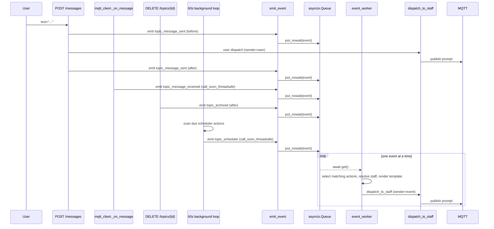

# Design: Event-based staff actions

**Status:** accepted
**Author:** architect
**Date:** 2026-05-08
**Related ADRs:** [ADR-0013](../decisions/0013-event-based-staff-action.md);
builds on ADR-0009 (Staff system) and ADR-0011 (Outbound notifications).
**Issue:** [#143](https://github.com/pandazxx/codex-slack/issues/143)

## Context

The Staff system (ADR-0009) gives users named LLM invocation profiles
addressable by `@mention`. Today the only way to fire a Staff is for a human
to type in the topic chat. We want to bind in-system events — a user message
arrives, an agent reply lands, a topic is archived, a cron tick — to the same
dispatch path, so a Staff can run automatically.

The mechanism must reuse the existing dispatch logic in `messages.py`
(`send_message`) end-to-end, including session sharing through
`_staff_session_key()`, MQTT topic conventions, and `staff_sessions`
bookkeeping. Event-triggered runs are mechanically identical to user-triggered
ones — only the trigger and the `sender` column on the `messages` row differ.

## Goals

- One declarative table (`event_actions`) for all four event types in scope.
- Topic-scope events: `topic_message_sent` (before/after), `topic_message_received` (after), `topic_scheduler`, `topic_archived` (after — post-commit). The `-ed` suffix marks observe-only post-fact events; `-ing` is reserved for future pre-commit interceptors (e.g. `topic_archiving`).
- Variable substitution in prompt templates with safe handling of unknown placeholders.
- Multiple actions on the same event fire independently (failure isolation).
- Event-triggered messages share sessions with user-triggered ones per `staff.session_scope`.
- Full CRUD HTTP API and Vue UI under topic settings, including enable/disable.
- Loop-safe by construction: events cannot infinitely retrigger themselves.

## Non-Goals

- **Workspace-scope events.** Schema admits `scope_type='workspace'` for
  forward compatibility, but only `'topic'` is implemented in v1. Workspace
  scope needs an output-channel decision out of scope here.
- **Sub-minute scheduler precision.** Minute-level resolution only.
- **Pipeline / message-modification hooks.** Events are observe-only; they do
  not mutate the original user/agent message. A `before` hook fires before
  the original message is published to MQTT but cannot edit or veto it.
- **Global-scope events.** Schema does not admit `'global'`; that is a future
  ADR if demand emerges.
- **Chained events** (a Staff action causing another action to fire). The
  loop-prevention rule blocks this on purpose. If chaining is needed later,
  add it via a separate "depth counter" mechanism.

## Design

### 1. Data model

New table `event_actions` in `src/master/db.py` — pure additive migration
(append a `CREATE TABLE IF NOT EXISTS` to `_SCHEMA`; no `ALTER` step).

```sql
CREATE TABLE IF NOT EXISTS event_actions (
    id              TEXT PRIMARY KEY,
    event_type      TEXT NOT NULL CHECK (event_type IN (
                        'topic_message_sent',
                        'topic_message_received',
                        'topic_scheduler',
                        'topic_archived'
                    )),
    scope_type      TEXT NOT NULL CHECK (scope_type IN ('topic')),
    scope_id        TEXT NOT NULL,                 -- topic_id
    staff_name      TEXT NOT NULL,                 -- references staffs.name (cascade-resolved at fire time)
    prompt_template TEXT NOT NULL,                 -- {variable} placeholders, str.format_map syntax;
                                                   -- no application-level length cap, bounded only by SQLite
                                                   -- TEXT default (SQLITE_MAX_LENGTH, ~1 GB).
    timing          TEXT CHECK (timing IN ('before', 'after')),
    cron_expr       TEXT,
    last_fired_at   TEXT,                          -- scheduler watermark (UTC ISO-8601);
                                                   -- advanced by tick BEFORE enqueue (optimistic);
                                                   -- used as anchor for next cron evaluation.
    last_run_at     TEXT,                          -- UTC ISO-8601; updated by worker AFTER each
                                                   -- dispatch attempt (success or failure).
    last_run_status TEXT CHECK (last_run_status IN (
                        'ok',
                        'staff_missing',
                        'render_error',
                        'dispatch_error'
                    )),                            -- worker-only; written after each dispatch.
    last_run_output TEXT,                          -- on ok: rendered prompt prefix + dispatched
                                                   -- message_id; on error: error message.
    enabled         INTEGER NOT NULL DEFAULT 1 CHECK (enabled IN (0, 1)),
    created_at      TEXT NOT NULL,
    updated_at      TEXT NOT NULL,

    CHECK (
        (event_type = 'topic_scheduler'      AND cron_expr IS NOT NULL AND timing IS NULL)
        OR
        (event_type = 'topic_message_sent'   AND cron_expr IS NULL     AND timing IN ('before','after'))
        OR
        (event_type IN ('topic_message_received','topic_archived')
                                              AND cron_expr IS NULL     AND (timing IS NULL OR timing = 'after'))
    )
);
CREATE INDEX IF NOT EXISTS idx_event_actions_scope_event
    ON event_actions (scope_type, scope_id, event_type, enabled);
CREATE INDEX IF NOT EXISTS idx_event_actions_scheduler
    ON event_actions (event_type, enabled) WHERE event_type = 'topic_scheduler';
```

Notes:
- `id` is a UUIDv4 string (consistent with other tables in this codebase).
- The CHECK on `scope_type` lists only `'topic'` for v1. Adding `'workspace'`
  later is a `DROP TABLE … CREATE TABLE …` rebuild (SQLite cannot ALTER a
  CHECK), but since the rest of the schema is forward-compatible the rebuild
  is local.
- **`last_fired_at` vs. `last_run_*` — distinct concepts, different writers.**
  - `last_fired_at` is the **scheduler watermark**. It is mutated *only* by
    the scheduler tick (`_scheduler_tick`), advanced *before* enqueueing the
    event (optimistic), and used as the anchor passed to `croniter` to
    compute the next slot. It says nothing about whether dispatch
    succeeded — it says only "the tick has accounted for this slot".
  - `last_run_at`, `last_run_status`, `last_run_output` are the **worker's
    per-action run record**. They are mutated *only* by the worker, *after*
    each dispatch attempt, regardless of outcome. They describe what
    actually happened on the wire and feed the UI's "what happened last
    time" surface.
  - For non-scheduler event types (`topic_message_*`, `topic_archived`)
    `last_fired_at` is unused — those events are not anchored on a
    schedule.
- `enabled=0` rows are kept entirely for audit and operator UX; resolution
  filters them out.
- `prompt_template` has no application-level length limit; SQLite TEXT is
  bounded only by `SQLITE_MAX_LENGTH` (default ~1 GB). The form input
  surfaces a soft visual cue if the template grows large, but does not
  enforce a cap.

### 2. Variable substitution

```python
from collections import defaultdict

def render_template(template: str, variables: dict[str, str]) -> str:
    # defaultdict returning {name} keeps unknown placeholders literal
    # so a misconfigured template logs a warning but does not crash.
    return template.format_map(_SafeDict(variables))

class _SafeDict(dict):
    def __missing__(self, key: str) -> str:
        LOGGER.warning("event_action.unknown_variable key=%s", key)
        return "{" + key + "}"
```

Variables exposed per event type:

| event_type | variables |
|---|---|
| `topic_message_sent` | `msgbody`, `topic_name` |
| `topic_message_received` | `msgbody`, `topic_name` |
| `topic_scheduler` | `topic_name`, `workspace_name` |
| `topic_archived` | `topic_name` |

`msgbody` is the raw `text` of the triggering message (user input for `*_sent`,
`last_response` for `*_received`). Future variables can be added without
schema changes; the dict is built per-event-type at the emit site.

Literal `{` characters in templates can be escaped as `{{` per Python's
standard `format_map` rules. This is documented in the UI help text next to
the template input.

### 3. Dispatch core extraction

Today `messages.py:send_message` does six things:

1. Validate workspace + topic.
2. Parse `@mention`, resolve Staff (or default).
3. Resolve session UUID via `_staff_session_key` + `_get_staff_session`.
4. Insert a row into `messages`.
5. Build the JSON dispatch payload, write it to the row's `transcript`,
   broadcast on the WebSocket hub.
6. Auto-start the agent container, publish to MQTT.

We extract steps 3–6 into a shared helper:

```python
# src/master/dispatch.py (new module, or near send_message in messages.py)

async def dispatch_to_staff(
    *,
    app_state,          # request.app.state — exposes db_path, hub, mqtt, settings, attachment_store
    workspace_id: str,
    topic_id: str,
    staff: sqlite3.Row, # already resolved
    prompt_text: str,
    sender: str,        # 'user' | 'event'
    raw_text: str | None = None,  # text written into messages.text; defaults to prompt_text
    attachments: list[dict] | None = None,  # optional; events do not attach files in v1
) -> str:
    """Insert message row, build payload, broadcast, MQTT-publish.
    Returns the new message_id. Mirrors what send_message did inline.
    """
```

`send_message` becomes:

1. Validate workspace + topic.
2. Parse `@mention`, resolve Staff.
3. Handle file uploads (writes to `attachments` table — stays in
   `send_message` because it is request-bound).
4. **Emit `topic_message_sent` (before)** — `emit_event(...)` returns
   immediately; handling happens in the worker.
5. Call `dispatch_to_staff(..., sender='user', raw_text=text, attachments=...)`.
6. **Emit `topic_message_sent` (after)** — same as step 4.

The event-handling side (see §4) is a single async worker that calls
`dispatch_to_staff` with `sender='event'` for each matching action. Session
sharing falls out: both paths feed the same `staff` row into
`_staff_session_key()` and `_get_staff_session()`, so an event-triggered call
and a user-triggered call land on the same `staff_sessions` row and the same
`--resume <uuid>` flag. The user-message dispatch in step 5 happens directly
on the request thread (unchanged today behaviour); event-triggered dispatches
go through the queue + worker.

### 4. Event emission points

The four emit sites push events onto a shared `asyncio.Queue` via a single
`emit_event(...)` call. A single async worker task drains the queue and does
the lookup → resolve → render → dispatch sequence per event.



Concrete emit sites:

| Hook | File | Insertion point |
|---|---|---|
| `topic_message_sent` (before) | `messages.py:send_message` | After staff resolution, **before** the user's `dispatch_to_staff` call |
| `topic_message_sent` (after)  | `messages.py:send_message` | After the user's `dispatch_to_staff` returns |
| `topic_message_received`      | `mqtt_client.py:_on_message` (`msg_type == "response"` branch) | After `_save_agent_response` and `_record_agent_response`, alongside the existing `notify.notify_reply` call |
| `topic_archived`               | `topics.py:delete_topic` | After the `UPDATE topics SET archived_at = ?` commit |
| `topic_scheduler`             | `main.py:_background_tasks` | New per-minute pass over scheduler actions, see §6 |

#### `emit_event` — single threadsafe entry point

```python
def emit_event(
    *,
    app_state,
    event_type: str,
    topic_id: str,
    workspace_id: str,
    timing: str | None = None,           # 'before'|'after'|None
    variables: dict[str, str],
    # Scheduler-only: identifies the cron slot this event represents.
    # Carried through purely so the worker can log it; the watermark itself
    # has already been advanced by the scheduler tick (see §6).
    scheduler_slot: datetime | None = None,
    scheduler_action_id: str | None = None,
) -> None:
    """Push an event onto the global event queue. Safe to call from any
    thread (FastAPI handler, MQTT thread, scheduler thread). Returns
    immediately; handling happens later in event_worker."""
    event = {
        'event_type': event_type,
        'topic_id': topic_id,
        'workspace_id': workspace_id,
        'timing': timing,
        'variables': variables,
        'scheduler_slot': scheduler_slot,
        'scheduler_action_id': scheduler_action_id,
    }
    queue = app_state.event_queue
    loop = app_state.event_loop  # captured at lifespan startup
    try:
        running = asyncio.get_running_loop()
    except RuntimeError:
        running = None
    if running is loop:
        queue.put_nowait(event)
    else:
        loop.call_soon_threadsafe(queue.put_nowait, event)
```

`app_state.event_loop` is the asyncio loop captured at FastAPI lifespan
startup; `app_state.event_queue` is the `asyncio.Queue()` created at the
same point. Both are stable for the process lifetime.

Queue is unbounded (`asyncio.Queue()` with default `maxsize=0`). Acceptable
because emission is human-driven (max ~1/s) and events are tiny dicts. If
abuse appears, bound it later — that's a one-line change with no caller
impact.

#### `event_worker` — single consumer

```python
DISPATCH_TIMEOUT_S = 10.0

async def event_worker(app_state) -> None:
    queue: asyncio.Queue = app_state.event_queue
    while True:
        event = await queue.get()
        try:
            await _handle_event(app_state, event)
            app_state.event_worker_last_progress = now_utc()
        except Exception:
            LOGGER.exception(
                "event_worker.handle_failed type=%s",
                event.get('event_type'),
            )
        finally:
            queue.task_done()


async def _handle_event(app_state, event: dict) -> None:
    conn = get_connection(app_state.db_path)
    try:
        rows = conn.execute(
            "SELECT * FROM event_actions"
            " WHERE scope_type='topic'"
            "   AND scope_id=?"
            "   AND event_type=?"
            "   AND enabled=1"
            "   AND (timing IS NULL OR timing=?)",
            (event['topic_id'], event['event_type'], event['timing']),
        ).fetchall()
    finally:
        conn.close()

    # Within-event fanout is PARALLEL: every matching action dispatches at the
    # same time. return_exceptions=True ensures one bad sibling does not
    # cancel its peers; per-action errors are recorded inside _dispatch_one.
    # The worker waits at most DISPATCH_TIMEOUT_S (~10 s) per event,
    # regardless of N — the slowest single dispatch sets the ceiling.
    await asyncio.gather(
        *(_dispatch_one(app_state, row, event) for row in rows),
        return_exceptions=True,
    )
    # Scheduler watermark already advanced by tick; nothing to do here.


async def _dispatch_one(app_state, row, event: dict) -> None:
    """Dispatch a single matching action, recording last_run_* on completion."""
    try:
        staff = resolve_staff(
            get_connection(app_state.db_path),
            row['staff_name'],
            event['workspace_id'], event['topic_id'],
        )
        if staff is None:
            LOGGER.warning("event_action.staff_missing id=%s", row['id'])
            _record_run(
                app_state, row['id'],
                status='staff_missing',
                output=f"staff_name={row['staff_name']!r} not resolvable at fire time",
            )
            return
        try:
            prompt = render_template(row['prompt_template'], event['variables'])
        except Exception as e:
            LOGGER.exception("event_action.render_failed id=%s", row['id'])
            _record_run(app_state, row['id'], status='render_error', output=str(e))
            return
        try:
            message_id = await asyncio.wait_for(
                dispatch_to_staff(
                    app_state=app_state,
                    workspace_id=event['workspace_id'],
                    topic_id=event['topic_id'],
                    staff=staff,
                    prompt_text=prompt,
                    sender='event',
                    raw_text=prompt,
                ),
                timeout=DISPATCH_TIMEOUT_S,
            )
        except asyncio.TimeoutError:
            _record_run(
                app_state, row['id'],
                status='dispatch_error',
                output=f"timeout after {DISPATCH_TIMEOUT_S:.0f}s",
            )
            return
        _record_run(
            app_state, row['id'],
            status='ok',
            output=f"message_id={message_id} prompt={prompt[:120]!r}",
        )
    except Exception as e:
        LOGGER.exception("event_action.dispatch_failed id=%s", row['id'])
        _record_run(app_state, row['id'], status='dispatch_error', output=str(e))


def _record_run(app_state, action_id: str, *, status: str, output: str) -> None:
    """Write last_run_at / last_run_status / last_run_output for a dispatch."""
    conn = get_connection(app_state.db_path)
    try:
        conn.execute(
            "UPDATE event_actions"
            "   SET last_run_at=?, last_run_status=?, last_run_output=?"
            " WHERE id=?",
            (now_utc().isoformat(), status, output[:4096], action_id),
        )
        conn.commit()
    finally:
        conn.close()


async def _worker_watchdog(app_state) -> None:
    """Observation-only: log when the worker has not made progress for >60 s
    while the queue is non-empty. Never cancels the worker."""
    while True:
        await asyncio.sleep(30)
        last = getattr(app_state, 'event_worker_last_progress', None)
        if last is None:
            continue
        idle = (now_utc() - last).total_seconds()
        qsize = app_state.event_queue.qsize()
        if idle > 60 and qsize > 0:
            LOGGER.warning(
                "event_worker.stalled idle_for=%ds qsize=%d",
                int(idle), qsize,
            )
```

Worker properties:

- **Cross-event concurrency is exactly 1, FIFO.** One worker task, one event
  at a time. This removes races between MQTT-thread, request-thread, and
  scheduler-thread emissions firing against the same `event_actions` row
  without needing explicit locking. The `_handle_event` call is awaited, so
  the next event waits behind it.
- **Within-event fanout is parallel** via
  `asyncio.gather(..., return_exceptions=True)`. All matching actions for
  the same event dispatch concurrently. One bad sibling does not block its
  peers; siblings finish in parallel; the worker advances to the next event
  once the slowest sibling finishes.
- **Per-dispatch hard timeout = 10 s** via
  `asyncio.wait_for(dispatch_to_staff(...), timeout=10.0)`. On expiry the
  dispatch is recorded as `dispatch_error` and `_dispatch_one` returns
  cleanly. The effective worker block per event is therefore bounded at
  ~10 s regardless of how many actions match — the slowest single dispatch
  sets the ceiling.
- **Per-action error isolation.** `_dispatch_one` swallows every internal
  exception path and records the appropriate `last_run_status` (one of
  `ok`, `staff_missing`, `render_error`, `dispatch_error`) via
  `_record_run`. The outer `gather(return_exceptions=True)` catches
  anything `_dispatch_one` somehow lets escape.
- **Per-event error isolation.** Each iteration of the worker loop is wrapped
  in `try/except`. One bad event logs `event_worker.handle_failed` and the
  worker continues.
- **Stall watchdog runs as a separate task** (`_worker_watchdog`), started
  from the same lifespan startup as the worker. It is purely observational:
  it logs `event_worker.stalled` when the worker has made no progress for
  >60 s *and* the queue is non-empty. It never cancels or restarts the
  worker. The non-empty gate prevents spurious "stalled" warnings during
  legitimate idle periods. The 30 s sleep is the polling cadence; the 60 s
  threshold is the alert level. A wedged dispatch hits the per-dispatch
  10 s timeout long before the watchdog notices, so in practice the
  watchdog only fires for the long-tail "stuck somewhere `wait_for` doesn't
  cover" case (e.g. lock contention, infinite loop in a renderer).
- **Lifecycle.** Both `event_worker` and `_worker_watchdog` are started
  from FastAPI's lifespan startup
  (`asyncio.create_task(event_worker(app.state))` and
  `asyncio.create_task(_worker_watchdog(app.state))`), cancelled on
  shutdown. Pending events still in the queue at shutdown are lost —
  accepted, see ADR-0013 Consequences.
- **No backpressure on emitters.** The queue is unbounded; `emit_event`
  always returns immediately. Emitter call sites never block.

### 5. Loop prevention

The `messages.sender` column gets a third valid value: `'event'`. Hook gates:

| Hook | Fires only when |
|---|---|
| `topic_message_sent` (before/after) | the triggering message has `sender='user'` |
| `topic_message_received` | the agent message has `sender='agent'` (the only sender produced by `_save_agent_response`) |
| `topic_archived` | always (no message involved) |
| `topic_scheduler` | always (no message involved) |

Because `dispatch_to_staff(..., sender='event')` writes
`sender='event'` into `messages`, no event-triggered insertion can match the
`sender='user'` predicate that gates `topic_message_sent`. Agent replies are
produced exclusively by `_save_agent_response` with `sender='agent'`,
independently of who initiated the dispatch — so an event-triggered run that
yields an agent reply *will* fire `topic_message_received` exactly like a
user-triggered run does. This is the desired behaviour: a scheduled
`@summariser` posting a summary should be eligible to trigger a downstream
`@translator` if one is configured. It is **not** an infinite loop because
`@translator`'s reply will fire `topic_message_received` only if a third
action subscribes to it, and so on — chains terminate because each step
requires explicit operator configuration. (If we later want to harden this,
ADR-0013 alternative Z — a depth counter — is the lift.)

### 6. Scheduler

Hooked into the existing 60 s loop in `main.py:_background_tasks` (currently
~lines 65–150). New pass at the top of each tick, before per-workspace work.
The tick is responsible for *deciding due-ness and advancing the watermark*;
all actual handling (resolve staff, render, dispatch) happens later in the
worker.

```python
def _scheduler_tick(db_path: str, app_state, now_utc_aware: datetime) -> None:
    """now_utc_aware is timezone-aware UTC (datetime.now(timezone.utc))."""
    tz = get_configured_timezone(app_state)   # ZoneInfo from system.timezone setting
    now_local = now_utc_aware.astimezone(tz)
    conn = get_connection(db_path)
    try:
        rows = conn.execute(
            "SELECT a.*, t.workspace_id, t.name AS topic_name, w.name AS workspace_name"
            " FROM event_actions a"
            " JOIN topics t ON t.id = a.scope_id"
            " JOIN workspaces w ON w.id = t.workspace_id"
            " WHERE a.event_type='topic_scheduler'"
            "   AND a.enabled=1"
            "   AND t.archived_at IS NULL"
        ).fetchall()
        for row in rows:
            # Anchor is stored UTC; interpret cron in configured TZ.
            anchor_utc = _parse_iso_utc(row['last_fired_at']) \
                         or _parse_iso_utc(row['created_at'])
            anchor_local = anchor_utc.astimezone(tz)
            next_fire_local = croniter(
                row['cron_expr'], anchor_local
            ).get_next(datetime)
            # Convert back to UTC for storage and the now comparison.
            next_fire_utc = next_fire_local.astimezone(timezone.utc)
            if next_fire_utc > now_utc_aware:
                continue
            # Optimistic watermark: advance BEFORE enqueueing. If the worker
            # never gets to it (cancelled / process crash), the slot is lost.
            # Chosen because duplicate fires are worse than missed fires for
            # the dominant summary/digest use case (ADR-0013).
            try:
                _update_last_fired(conn, row['id'], next_fire_utc)
            except Exception:
                LOGGER.exception(
                    "event_action.scheduler_watermark_failed id=%s",
                    row['id'],
                )
                continue
            try:
                emit_event(
                    app_state=app_state,
                    event_type='topic_scheduler',
                    topic_id=row['scope_id'],
                    workspace_id=row['workspace_id'],
                    variables={
                        'topic_name': row['topic_name'],
                        'workspace_name': row['workspace_name'],
                    },
                    scheduler_slot=next_fire_utc,
                    scheduler_action_id=row['id'],
                )
            except Exception:
                LOGGER.exception(
                    "event_action.scheduler_emit_failed id=%s",
                    row['id'],
                )
    finally:
        conn.close()
```

**Timezone semantics** — applies project-wide; codified by ADR-0013:

- All datetimes are stored as UTC ISO-8601 with `Z` suffix.
- `cron_expr` is interpreted in the **configured display TZ**, not UTC.
- The configured TZ comes from a new system setting `system.timezone`.
  Default is `tzlocal.get_localzone()` (OS local TZ); operators can override
  via `/settings`. This setting is a **prerequisite** for the scheduler — it
  must land either as a precursor PR or as the first commit of this
  feature's implementation. `requirements.txt` gains both `croniter` and
  `tzlocal`.
- The UI surfaces the configured TZ next to every cron input field (e.g.
  `0 9 * * *` — fires daily at 09:00 in `Asia/Shanghai`).
- The broader TZ-awareness audit of existing date columns and rendering
  sites is tracked separately as a cross-cutting effort (see issue [#158](https://github.com/pandazxx/codex-slack/issues/158)); it
  is not a blocker for this feature.

The tick does **not** call `dispatch_to_staff` — it only advances the
watermark and enqueues. That's the entire point of the queue + worker
split: the 60 s background thread stays cheap and predictable, and slow
agent dispatches do not block the next tick.

#### "Is this action due?" — exact rule

Let `now` = the moment the tick reads its clock. Let `anchor` be the stored
`last_fired_at` (or the action's `created_at` if `last_fired_at IS NULL`).
Compute `next_fire = croniter(cron_expr, anchor).get_next(datetime)`.

Rule: **enqueue iff `next_fire <= now`**, and atomically set
`last_fired_at = next_fire` (not `now`) before the enqueue. Setting to
`next_fire` rather than `now` prevents drift and ensures that a tick delayed
beyond a single cron interval still advances the watermark by exactly one
slot.

#### Watermark policy — optimistic, tick-side

The scheduler tick advances `last_fired_at` *before* it calls `emit_event`.
The worker does not touch `last_fired_at` for scheduler events. Trade-offs:

- **Loss on failure.** If the worker is cancelled at shutdown, the process
  crashes after the watermark write, or `emit_event` fails to enqueue, the
  slot is silently dropped. The next tick computes `next_fire` from the
  already-advanced `last_fired_at` and waits for the *following* slot.
- **No duplicates from slow workers.** Even if the worker lags by minutes,
  the next tick sees the advanced watermark and does not re-enqueue the
  same slot.
- **No in-memory dedup state needed.** All bookkeeping lives in SQLite,
  visible to operators and survives restarts cleanly.

Alternative considered: worker writes the watermark on success, tick keeps
an in-memory `(action_id, slot)` set of in-flight enqueues to suppress
duplicates within the process. Rejected — it adds a code path that doesn't
help across process restarts (the set is ephemeral) and trades a known
failure mode (silent missed fire on crash) for a more complex one
(duplicate fire if the in-memory set is dropped). For the dominant
summary/digest use case, missed fires are recoverable by manual re-trigger;
duplicate fires generate an extra agent run and an extra message in the
topic that the user has to clean up.

`scheduler_slot` and `scheduler_action_id` are passed through to the worker
purely so it can log them (`event_worker scheduler_action=… slot=…`) — no
state-mutation responsibility on the worker side for scheduler events.

#### Catch-up policy

If the loop has been paused for `K` minutes and `cron_expr='* * * * *'`,
the rule above will enqueue the action *once* this tick (advancing
`last_fired_at` by exactly one minute) and again next tick, and so on. We
deliberately **do not** burst-enqueue all `K` missed slots in the same tick
— that would flood the queue (and ultimately the agent) and is rarely what
operators want for an "every minute reminder".

If the operator wants strict "fire for every missed slot", they get it by
running the master without long pauses; sub-minute precision and lossless
catch-up are out of scope (ADR-0013).

#### Archived topics

`topic_scheduler` actions whose `scope_id` references an archived topic
**must not fire**. The tick query JOINs `topics` and filters on
`archived_at IS NULL`. The action row is *not* deleted on archive —
unarchiving (if/when that surfaces) restores firing. `topic_archived` itself
fires once on the archive transition, before the JOIN gate takes effect; this
is the design (the archive event is the last meaningful moment for the
topic).

#### Concurrent firings

The 60 s loop is single-threaded (one Python thread per master process,
fronted by `threading.Event.wait(60)`). Two `_scheduler_tick` calls cannot
overlap. The watermark-update is `UPDATE event_actions SET last_fired_at=?
WHERE id=?` and runs inside the same tick that read the row; SQLite
serialises that trivially. The worker is also single-threaded (concurrency
1), so no two events for the same action are in flight at once.

The remaining edge case is *worker starvation*: if a single dispatch hangs,
the queue grows while the scheduler tick keeps advancing watermarks and
enqueueing new slots. The resolved policy (see §4 worker properties) is:

- **Per-dispatch 10 s timeout** (`asyncio.wait_for`) bounds the cost of any
  single bad dispatch. With parallel fanout, a single wedged sibling does
  not block its peers either; the worker advances after the slowest
  sibling, capped at 10 s.
- **Observation-only stall watchdog** logs `event_worker.stalled` if the
  worker has made no progress for >60 s while the queue is non-empty. It
  never cancels the worker; it exists to make the long-tail "alive but
  stuck somewhere `wait_for` doesn't cover" case visible.

There is intentionally no per-action backpressure: the scheduler tick keeps
advancing watermarks even if the worker is slow, so a delayed dispatch does
not cause the same slot to fire twice. If sustained backpressure becomes
visible we'll add a bounded queue with drop-oldest policy (out of scope for
v1).

### 7. API surface

All endpoints live under `/api` to match existing routers. No auth — the
codebase is single-user self-hosted (consistent with all other endpoints in
ADR-0009/0010/0011).

```
GET    /api/workspaces/{wid}/topics/{tid}/event-actions
POST   /api/workspaces/{wid}/topics/{tid}/event-actions
GET    /api/workspaces/{wid}/topics/{tid}/event-actions/{id}
PATCH  /api/workspaces/{wid}/topics/{tid}/event-actions/{id}
DELETE /api/workspaces/{wid}/topics/{tid}/event-actions/{id}
```

Request/response shape (Pydantic):

```python
class EventActionIn(BaseModel):
    event_type: Literal['topic_message_sent','topic_message_received','topic_scheduler','topic_archived']
    staff_name: str
    prompt_template: str
    timing: Literal['before','after'] | None = None
    cron_expr: str | None = None
    enabled: bool = True

class EventActionOut(EventActionIn):
    id: str
    scope_type: Literal['topic']
    scope_id: str
    last_fired_at: str | None
    created_at: str
    updated_at: str
```

Validation on POST/PATCH (mirroring DB CHECK constraints, but with friendly errors):
- `event_type='topic_scheduler'` ⇒ `cron_expr` required, `timing` must be null.
- `event_type='topic_message_sent'` ⇒ `timing` required (`before` or `after`),
  `cron_expr` must be null.
- `event_type` in `{topic_message_received, topic_archived}` ⇒ `timing` null
  or `'after'`, `cron_expr` null.
- `cron_expr` is parsed with `croniter.is_valid(cron_expr)` and rejected with
  422 if invalid.
- `staff_name` is **not** validated against the staff cascade at write time —
  staffs come and go, and a topic-scope action may legitimately reference a
  global staff that is created later. Resolution happens at fire time
  (graceful skip if missing, see §4).

PATCH semantics: any subset of fields can be updated; `id`, `scope_type`,
`scope_id`, `created_at`, `last_fired_at`, `last_run_at`, `last_run_status`,
`last_run_output` are read-only. Notably, **enable/disable is just a PATCH
on `enabled`** — there is no dedicated `/disable` endpoint. One mechanism,
one code path, idempotent.

`prompt_template` has no application-level length limit (see §1 schema
notes); the only bound is SQLite's TEXT default.

### 8. Frontend

A new dedicated topic-settings page hosts the event-actions card. There is
no existing per-topic settings surface today; this is the first.

**New route** (added to `frontend/src/main.js`):

```
/workspaces/:wsId/topics/:topicId/settings   →   TopicSettings.vue
```

**New view** `frontend/src/views/TopicSettings.vue` — header showing the
topic subject and a back link to the topic chat, body containing the
event-actions card (and any future per-topic settings).

**Entry points** — two:

1. **Topic chat header** in `TopicChat.vue` — gear icon next to the topic
   subject, linking to the settings route. Keeps configuration reachable
   from where a user notices they want it ("this topic should send a
   summary every morning").
2. **Topics list in `WorkspaceDetail.vue`** — a small gear icon in the
   topic row (alongside the existing Archive button), linking to the
   settings route. Lets operators configure event actions without having
   to open the chat first.

`RecentTopicsSidebar.vue` is left untouched in v1 — it is a navigation
component for jumping between topics, not a management surface.

**Event-actions card layout:**

```
┌── Event actions ─────────────────────────────────── [+ Add action] ──┐
│ Trigger configured staffs when something happens in this topic.       │
│                                                                       │
│ [enabled] when @staff prompt-snippet-preview…                         │
│            last run: 2 min ago — ok                       [Edit][✕]  │
│ [enabled] cron @staff prompt-snippet-preview…                         │
│            (Asia/Shanghai)                                            │
│            last run: 1 hr ago — dispatch_error           [Edit][✕]  │
│            └▼ "timeout after 10s"                                     │
└───────────────────────────────────────────────────────────────────────┘
```

Per-action surface:

- `last_run_at` is rendered as relative time ("2 min ago", "yesterday",
  "never").
- `last_run_status` shown as a coloured badge: `ok` green, `staff_missing` /
  `render_error` / `dispatch_error` red.
- `last_run_output` is shown truncated (≤120 chars) with an expand toggle
  for the full message — useful for diagnosing `dispatch_error` and
  `render_error` cases without leaving the page.
- For scheduler actions, the configured TZ is shown next to the cron
  expression so operators read the schedule in local time. The form's cron
  input has the same TZ marker beside it.

This per-action surface shows **dispatch status only** — i.e., did the
master successfully publish the prompt to MQTT. Whether the agent actually
replied is visible inline in the topic chat itself (the agent's response
message lands in the same topic). Surfacing reply-tier status on the action
card is a deferred enhancement; not in v1.

The form fields drive validation client-side; DB CHECK gives the
defence-in-depth. UI help text next to the prompt template input documents
the variable list per chosen `event_type` and `{{` escaping.

Pattern mirrors `WorkspaceDetail.vue`'s staff form: single `ref` for the form
state, separate `editingActionId` ref, save handler does POST or PATCH based
on whether an id is set, error string surfaces under the submit button.

### 9. Migration

The change is a single new table — no data migration, no `ALTER` step. Add to
`_SCHEMA` in `db.py` (sqlite is `CREATE TABLE IF NOT EXISTS`-driven there)
and add the two indexes inside `init_db` after the schema script runs.
Existing deployments pick up the new table on next process start. No
follow-up cleanup is needed.

There is no schema for "staff_name references staffs.id" because (a) staff
names are not unique across scopes — they can collide between topic, workspace
and global — and (b) the cascade resolution at fire time is the source of
truth. A FK would force a hard scope choice we do not want.

## Alternatives Considered

### Internal pub/sub bus

A general `EventBus.subscribe(event_type, handler)` would let event_actions
register as one subscriber among many.

Rejected for v1. We have four hard-coded emit sites and one consumer
(`event_actions`). Adding the bus introduces ordering, error-handling, and
discoverability questions for zero benefit at this scale. The chosen
queue-plus-worker is a degenerate case of a bus with exactly one consumer;
the rejection rationale is about *making subscription pluggable*, not about
queueing.

### Two-flavour helper (`emit_event_async` + `emit_event_threadsafe`)

An earlier draft of this design proposed two emitter functions sharing a
DB-and-render core: `emit_event_async` for the asyncio loop thread (request
handlers, `topics.delete_topic`) and `emit_event_threadsafe` for the MQTT
and scheduler threads. Each call site picked the flavour matching its
thread context, and both flavours did the lookup → resolve → render →
dispatch synchronously inline. The naming followed the existing
`hub.broadcast` / `hub.broadcast_threadsafe` pattern.

Rejected. Three problems:

1. **Emission and handling are intermixed at every site.** Each emit site
   ends up paying for the full DB query and dispatch chain on its own
   thread. A slow agent dispatch on the MQTT thread blocks MQTT message
   processing; on the request thread it blocks the HTTP response.
2. **No single point for cross-cutting concerns.** Adding observability
   (queue depth, handler latency), retry, dedup, or rate limiting means
   patching both flavours in lockstep.
3. **Two parallel code paths.** The two flavours sharing a "core" still
   means two different async-vs-sync transcripts to keep correct as the
   handler grows.

The queue-plus-worker design replaces both flavours with a single
threadsafe `emit_event` that is always non-blocking and always returns
immediately, and centralises handling in one async worker.

### One table per event type

`topic_message_actions`, `scheduler_actions`, `archive_actions`, etc. Each
table has only its relevant columns; CHECK constraints become trivial.

Rejected. The shared columns (`staff_name`, `prompt_template`, `enabled`,
`scope_*`, audit timestamps) outnumber the kind-specific ones. The CRUD code
would multiply by N, and the API surface would balloon. Narrow + CHECK gives
the same correctness guarantee with one-quarter the code.

### Single JSON config blob per event_action

`event_actions(event_type, scope_*, config_json)` where `config_json` holds
`{staff_name, prompt_template, timing|cron_expr, enabled, ...}`.

Rejected. Loses SQL filterability (especially "list all scheduler actions due
now") and pushes validation entirely into Python. Schema CHECK at write time
is cheap insurance.

### External cron + webhook for scheduler

Run host cron, have it `POST /api/.../trigger` to fire scheduler actions.

Rejected. Couples deployment topology to host config; no benefit when the
60 s loop already exists; loses topic-state visibility (the trigger needs to
know which topics are archived, what the workspace_name is).

### Per-message no-retrigger flag instead of `sender="event"`

A `boolean` column on `messages` instead of widening the `sender` enum.

Rejected. The sender is genuinely different — surfacing it in the chat UI is
useful (users will want to see "this came from a scheduler"), and the
existing `messages.sender` column already discriminates user vs. agent, so a
third value fits naturally.

## Migration Plan

This is a feature addition with no behaviour change for existing deployments.

0. **Prerequisite — `system.timezone` setting.** The scheduler depends on a
   configured display TZ. Land this either as a precursor PR or as the
   first commit of this feature's branch:
   - Add `system.timezone` to the system settings table (or whatever
     mechanism currently holds `/settings` values).
   - Default the value to `tzlocal.get_localzone().key` at first read if
     unset.
   - Add a TZ picker (string input is fine for v1; validate with
     `zoneinfo.ZoneInfo(value)`) to the existing `/settings` page.
   - Add `tzlocal` to `requirements.txt`.

1. **Schema:** add `event_actions` table + indexes (including the three
   `last_run_*` columns) to `_SCHEMA` in `src/master/db.py`. No row-level
   migration required.
2. **Backend:**
   - Extract `dispatch_to_staff` from `send_message` (refactor; behaviour
     preserved). Add unit test that the user-message path still works
     identically.
   - Add `src/master/event_actions.py` with the `event_actions` CRUD router
     (mounted under `/api/workspaces/{wid}/topics/{tid}/event-actions`),
     `EventActionIn`/`EventActionOut`, and the single `emit_event` helper.
   - Add `src/master/event_worker.py` (or extend `event_actions.py`) with
     `event_worker(app_state)`, `_handle_event(app_state, event)`,
     `_dispatch_one(app_state, row, event)`, `_record_run(...)`, and
     `_worker_watchdog(app_state)`.
   - Create `app.state.event_queue = asyncio.Queue()`,
     `app.state.event_loop = asyncio.get_running_loop()`, and
     `app.state.event_worker_last_progress = None` in the FastAPI lifespan
     startup. Start both background tasks via
     `asyncio.create_task(event_worker(app.state))` and
     `asyncio.create_task(_worker_watchdog(app.state))`. Cancel both on
     lifespan shutdown.
   - Wire `emit_event(...)` calls into the four emit sites listed in §4
     and into `_scheduler_tick` (§6). The scheduler tick uses the
     configured TZ from step 0.
   - Add `croniter` to `requirements.txt` (`tzlocal` already added in
     step 0).
3. **Frontend:** add the new route and `TopicSettings.vue` view; add the
   event-actions card to that view (including the `last_run_*` surface and
   the configured-TZ marker next to cron inputs); wire entry-point gear
   icons in `TopicChat.vue` (topic header) and `WorkspaceDetail.vue`
   (topic-row action area). See §8.
4. **Tests:** unit tests for CRUD + validation; parallel-fanout test;
   per-dispatch 10 s timeout test; stall watchdog test; `last_run_status`
   coverage for all four outcomes; integration test proving shared-session
   semantics (event-triggered `@reviewer` resumes the same session as
   user-triggered `@reviewer`); scheduler tick test with a frozen clock and
   a non-UTC `system.timezone`.
5. **Docs:** update `docs/references/api.md` with the new endpoints; add
   `docs/guides/event-actions.md` with example templates, the variable
   list, and the TZ semantics for cron expressions.

Rollback: drop the `event_actions` rows + table; revert the
`dispatch_to_staff` extraction. The user-message path is dead-code-equivalent
to today's `send_message` and is safe to revert independently. The
`system.timezone` setting is independently useful and need not be reverted.

## Open Questions

All implementation-blocking questions are resolved. Items below are either
resolved (with the resolution recorded inline) or deferred-by-design with a
pointer.

### Resolved

- [x] **Topic settings page entry point.** Resolved: dedicated route
      `/workspaces/:wsId/topics/:topicId/settings` with view
      `TopicSettings.vue`. Entry-point gear icons added to both
      `TopicChat.vue` (topic header) and `WorkspaceDetail.vue` (topic-row
      action area). `RecentTopicsSidebar.vue` left untouched. See §8.
- [x] **Archive event timing.** Resolved: split into two distinct events
      with non-overlapping semantics.
      - `topic_archived` (v1, this ADR): fires *after* `archived_at` is
        committed; observe-only; landing message goes into the archived
        view. Use for closing summaries, audit-log forwarding, cleanup
        triggers.
      - `topic_archiving` (v2, deferred): pre-commit interceptor with
        synchronous request/response and structured veto capability.
        Requires a structured-output protocol from agents and a
        synchronous-await dispatch path that the v1 queue+worker design
        deliberately does not provide. Tracked in
        [#156](https://github.com/pandazxx/codex-slack/issues/156).
- [x] **Cron timezone semantics.** Resolved: TZ-aware everywhere, not naive
      UTC. All datetimes stored as UTC; all rendered/edited in a configured
      display TZ (`system.timezone` system setting, default
      `tzlocal.get_localzone()`). `cron_expr` is interpreted in the
      configured TZ. The scheduler tick converts `now` to TZ, runs
      `croniter` against the TZ-aware datetime, then stores `next_fire` as
      UTC. The UI surfaces the configured TZ next to every cron input.
      `system.timezone` is a prerequisite (precursor PR or first commit of
      this feature). `tzlocal` added to `requirements.txt`. See §6 and the
      Migration Plan.
- [x] **Maximum prompt template length.** Resolved: no application-level
      cap. Bounded only by SQLite's TEXT default (`SQLITE_MAX_LENGTH`,
      ~1 GB). Documented in §1.
- [x] **`enabled` toggle endpoint.** Resolved: PATCH-only on `enabled`. No
      dedicated `/disable` endpoint. One mechanism, idempotent. See §7.
- [x] **Worker starvation under a stuck dispatch.** Resolved: combination
      of (a) per-dispatch 10 s hard timeout via
      `asyncio.wait_for(dispatch_to_staff(...), timeout=10.0)`,
      (b) within-event parallel fanout via
      `asyncio.gather(..., return_exceptions=True)` so a slow sibling does
      not block its peers, and (c) observation-only stall watchdog
      (`_worker_watchdog`) that logs `event_worker.stalled` when the worker
      makes no progress for >60 s while the queue is non-empty. The
      watchdog never cancels the worker. Effective worker block per event
      is ≈10 s regardless of N matching actions. See §4.
- [x] **Per-action observability.** Resolved: three new columns on
      `event_actions` (`last_run_at`, `last_run_status`, `last_run_output`)
      written by the worker after every dispatch attempt. Distinct from
      `last_fired_at` (scheduler-only, advanced by tick). Surfaced in the
      action card UI as relative time + status badge + truncated/expandable
      output. See §1, §4, §8.

### Deferred by design

- **Reply-tier status on the action card.** Whether the agent actually
  *replied* (vs. whether the dispatch succeeded). Deferred enhancement:
  agent replies are already visible inline in the topic chat, so the
  per-action card showing dispatch status only is sufficient for v1. No
  follow-up issue filed; if demand surfaces we'll wire the reply-tier
  signal then.
- **Cross-cutting TZ-awareness audit.** Existing date columns and
  date-rendering sites across the codebase predate the project-wide TZ
  policy codified by ADR-0013. Auditing and bringing them into compliance
  is a separate cross-cutting effort, not a blocker for this feature. See
  issue [#158](https://github.com/pandazxx/codex-slack/issues/158).
- **Worker observability admin endpoint.** Whether to expose queue depth
  and last-handled-event timestamp via `GET /api/admin/event-worker/status`.
  Log-only is sufficient for v1 (`event_worker.stalled` from the
  watchdog); add the endpoint when there is a concrete diagnosis flow
  that needs it.

## Test plan key cases

These are the cases the design must remain testable against. Full test plan
goes in `docs/test-plans/event-based-staff-action.md` (tester's deliverable).

- CRUD round-trip per event_type.
- DB CHECK constraint negative cases (missing cron_expr for scheduler;
  timing='before' on `topic_message_received`; etc.).
- Variable substitution: known variables substituted; unknown placeholder
  preserved literally; `{{` escapes a literal brace.
- Loop prevention: a `topic_message_sent` action that publishes a message
  via its staff does **not** retrigger itself (because the new message has
  `sender='event'`).
- Session sharing: `@reviewer` invoked first via user message and second via
  `topic_scheduler` lands on the same `staff_sessions` row and uses
  `--resume` for the second call.
- Multi-action fanout: two enabled actions on the same trigger both fire;
  failure of one does not block the other.
- **Parallel fanout latency:** two enabled actions whose dispatch is
  artificially slowed (e.g. 5 s sleep each) complete in ~5 s wall-clock
  per event, not ~10 s — proving fanout is concurrent rather than
  sequential.
- **Per-dispatch 10 s timeout:** a dispatch that hangs is abandoned at
  ~10 s; `last_run_status='dispatch_error'` is written for that action
  with `last_run_output` containing a "timeout after 10s" marker; siblings
  in the same event are unaffected; the next event in the queue is picked
  up promptly.
- **Stall watchdog (positive):** with the worker artificially blocked and
  the queue non-empty, an `event_worker.stalled` `WARN` log appears within
  ~30 s containing the queue size.
- **Stall watchdog (negative):** with the queue empty, no
  `event_worker.stalled` log appears even after several minutes idle.
- **Per-action observability outcomes** — for each of the four
  `last_run_status` values:
  - `ok`: successful dispatch writes `last_run_status='ok'` and
    `last_run_output` includes the dispatched message_id.
  - `staff_missing`: action references a staff name that resolves to None
    at fire time → log + skip, `last_run_status='staff_missing'` recorded,
    no exception.
  - `render_error`: template render raises (e.g. malformed `format_map`
    invocation) → `last_run_status='render_error'` with the error text in
    `last_run_output`.
  - `dispatch_error`: dispatch raises (or times out) →
    `last_run_status='dispatch_error'` with the error text or timeout
    marker in `last_run_output`.
- **`last_run_at` vs. `last_fired_at` independence:** for a non-scheduler
  event, `last_fired_at` stays null while `last_run_at` is updated by the
  worker; for a scheduler event, `last_fired_at` advances on the tick
  *before* the worker runs and `last_run_at` advances *after*.
- **Cron TZ evaluation:** with `system.timezone='Asia/Shanghai'`, a
  `cron_expr='0 9 * * *'` action's `next_fire` lands at 09:00 Shanghai
  time (01:00 UTC), not 09:00 UTC. `last_fired_at` is stored as UTC
  ISO-8601 and round-trips correctly.
- Disabled actions are skipped (no MQTT publish).
- Deleted-staff handling: action references a staff name that resolves to
  None at fire time → log + skip, no exception.
- Archived topic: scheduler actions for archived topics are not fired even
  if cron matches.
- Scheduler watermark: after a 5 s pause, action is not fire-eligible; after
  a 65 s pause and `* * * * *`, action fires once and `last_fired_at`
  advances by exactly one minute (the watermark is advanced by the tick
  before enqueueing, so the assertion holds even if the worker has not yet
  picked up the event).
- Scheduler optimistic-watermark loss: if the worker is cancelled between
  enqueue and dispatch, `last_fired_at` is still advanced and the *next*
  cron slot is the one that fires — assert this is the documented
  behaviour. No duplicate fire of the lost slot.
- `emit_event` thread-safety: emitting from a synthesised non-loop thread
  (simulating MQTT-thread or scheduler-thread context) places the event on
  the queue and the worker handles it; emitting from the loop thread does
  not deadlock and does not require `call_soon_threadsafe` to be a no-op.
- Worker error isolation: an event whose handler raises (e.g. forced
  exception in the resolve step) is logged at `event_worker.handle_failed`
  and the worker keeps draining; the next queued event is handled
  normally.
- Per-action error isolation inside an event: two enabled actions on the
  same event, the first raises during render — the second still dispatches.
- Worker shutdown loss: events queued but not yet handled at lifespan
  shutdown are dropped without raising; the test asserts the worker task
  is cancelled cleanly and no exceptions propagate.
- Single-worker ordering: emit events A then B from the same thread; the
  worker handles A before B (FIFO).
