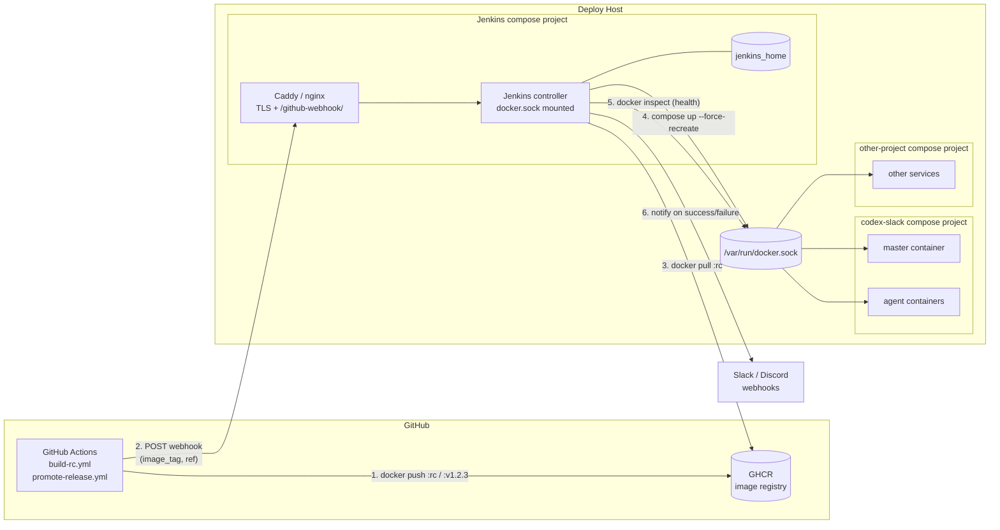

# Design: Jenkins-based CD

**Status:** draft
**Author:** architect-agent
**Date:** 2026-05-05
**Related ADRs:** ADR-0006 (`docs/decisions/0006-jenkins-cd.md`),
extends/supersedes ADR-0005 (`docs/decisions/0005-cicd-pipeline-design.md`)

---

## Context

ADR-0005 left us with GitHub Actions for CI and a custom Python CD daemon
(`src/cd/`) for staging/production deploy. The daemon polls GHCR, redeploys via
`docker compose`, health-checks the master container, and rolls back on
failure.

The daemon has been a recurring source of bugs because it runs Docker
orchestration *from inside a container* (PR #116 closed five separate issues in
a single fix). The project owner also wants to host CD for other projects on
the same Docker host. ADR-0006 decides to replace the daemon with Jenkins.

This document specifies how that Jenkins deployment is laid out, how GHA hands
off to it, what the pipeline does, how secrets are scoped, and how multiple
projects coexist on the same controller.

## Goals

- Replace the Python CD daemon for **staging** and **production** with a
  Jenkins-driven pipeline that preserves the current rollback behaviour.
- Run **one** Jenkins controller on the deploy host that can serve this project
  *and* other projects; no per-project Jenkins instances.
- Keep deploy credentials (GHCR pull token, Slack/Discord webhooks, app env)
  in Jenkins Credentials, not duplicated into per-host `.env` files.
- Trigger Jenkins from GitHub Actions via webhook **after** the image is pushed
  to GHCR, eliminating the daemon's 5–10 minute polling lag.
- Keep the Jenkinsfile(s) in this repository so the deploy logic is versioned
  and reviewed alongside application code.
- Preserve ADR-0005's image flow end-to-end: RC tag → `build-rc.yml` →
  `:rc`/`:v1.2.3-rcN` in GHCR → staging deploy; release tag → `promote-release.yml`
  retag → `:v1.2.3` in GHCR → production deploy.

## Non-Goals

- Replacing GitHub Actions for CI. GHA continues to build, test, and push
  images. This document does not change `ci-pr.yml`, `build-on-demand.yml`,
  `build-rc.yml`, or `promote-release.yml`.
- Adding Jenkins to the **test bed**. The test bed remains LLM-agent-managed
  (per ADR-0005 §2 still in force).
- Migrating to Kubernetes, Nomad, ArgoCD, Flux, or any cluster orchestrator.
  Single-host Docker Compose deploys remain the model.
- Self-hosted GitHub Actions runners. (Considered and rejected; see
  Alternatives.)
- Designing the Jenkins host's OS, backups, or TLS termination beyond
  identifying that they exist and have owners.

## Proposed Design

### Topology — where Jenkins runs

Jenkins runs as a **container on the deploy host**, started by Docker Compose
in its own project directory (e.g. `/opt/jenkins/`), separate from the
codex-slack project directory. One controller serves all projects on the host.

```
deploy host (single Docker daemon, single host)
│
├── /opt/jenkins/
│   ├── docker-compose.yml              # jenkins controller + reverse proxy
│   ├── jenkins_home/                   # bind-mounted, persisted
│   └── (Jenkins controller container)
│
├── /opt/codex-slack/                   # this project
│   ├── docker-compose.yml              # master + agent services
│   ├── .env                            # APP runtime env (NOT deploy creds)
│   └── data/
│
└── /opt/<other-project>/               # future projects, same shape
    ├── docker-compose.yml
    └── .env
```

The Jenkins controller container is built on the official `jenkins/jenkins:lts`
image with a few preinstalled plugins (Pipeline, Git, Credentials Binding,
GitHub plugin, Generic Webhook Trigger, optionally Configuration as Code). The
controller has the host Docker socket mounted (`/var/run/docker.sock`) and the
controller's UID is added to the host `docker` group, so any pipeline step
running on the controller can run `docker` and `docker compose` directly
against the host daemon.

We use the **built-in agent** on the controller for now. A separate agent
container is not required for a single-host deployment; if the controller
becomes a contention point we can add a Docker-based agent later (see Open
Questions). Pipelines explicitly opt in by using `agent { label 'built-in' }`.

A reverse proxy (Caddy or nginx) in the same compose project terminates TLS
and exposes Jenkins at a public hostname (e.g. `https://jenkins.example.com`).
The webhook endpoint `/github-webhook/` is the only path that needs to accept
unauthenticated POSTs from GitHub; everything else requires a logged-in user.

### How CI hands off to CD — webhook from GHA

ADR-0005's GHA workflows build images and push them to GHCR. We trigger
Jenkins by adding a final step to `build-rc.yml` and `promote-release.yml`
that POSTs to the relevant Jenkins job:

- `build-rc.yml` (after pushing `:rc` and `:v1.2.3-rcN`) → trigger
  `codex-slack/cd-staging` with the rc tag as a parameter.
- `promote-release.yml` (after retagging `:rc` → `:v1.2.3`) → trigger
  `codex-slack/cd-production` with the release tag as a parameter.

The trigger uses **Jenkins' Generic Webhook Trigger plugin** with a
per-job token (stored in GitHub Actions secrets as `JENKINS_WEBHOOK_TOKEN_*`).
The job itself decides what to deploy from the parameters in the POST body —
the webhook does not pass code, only intent ("deploy tag X to env Y").

```
GitHub Actions (build-rc.yml)
  1. checkout, build, push :rc + :v1.2.3-rc1 to GHCR
  2. curl -X POST                                                 \
       -H "Authorization: Bearer ${{ secrets.JENKINS_WEBHOOK_TOKEN_STAGING }}" \
       -d '{"image_tag":"rc","ref":"v1.2.3-rc1"}'                  \
       https://jenkins.example.com/generic-webhook-trigger/invoke?token=cd-staging
                                       │
                                       ▼
Jenkins controller (cd-staging job)
  3. parse webhook body → image_tag=rc
  4. checkout this repo @ ref=v1.2.3-rc1 to read Jenkinsfile.staging
  5. run pipeline (see "Pipeline stages" below)
```

#### Why webhook from GHA, not the alternatives

We considered three handoff models:

1. **Webhook from GHA after image push** *(chosen)*. Sub-second handoff. The
   image is guaranteed to be in GHCR before Jenkins starts (GHA only POSTs
   after a successful `docker push`). Idempotent: re-triggering a tag re-runs
   the deploy with the same image bits.
2. **Jenkins polls GHCR.** Reproduces the daemon's 5–10 minute lag for no
   benefit. Adds GHCR API auth to the controller. Rejected.
3. **Self-hosted GitHub Actions runner on the deploy host.** Eliminates the
   need for a webhook but pulls the entire GHA execution model onto our host
   (Docker-in-Docker for builds, runner registration, runner version updates,
   no native multi-project view). It also means the deploy script lives in a
   GHA workflow, not a Jenkinsfile, contradicting the multi-project goal.
   Rejected.

### Component diagram



### Pipeline stages

Two Jenkinsfiles live in the repo root:

- `ci/jenkins/Jenkinsfile.staging`
- `ci/jenkins/Jenkinsfile.production`

(Subdirectory `ci/jenkins/` keeps the repo root from gaining several files;
existing GHA workflows already live under `.github/workflows/`.)

Both follow the same shape; only parameter defaults and notification channels
differ.

```groovy
pipeline {
  agent { label 'built-in' }
  parameters {
    string(name: 'IMAGE_TAG', defaultValue: 'rc',
           description: 'GHCR tag to deploy (e.g. rc, v1.2.3)')
    string(name: 'REF',       defaultValue: '',
           description: 'Source ref (informational, recorded in build name)')
  }
  options {
    timeout(time: 15, unit: 'MINUTES')
    disableConcurrentBuilds()        // serialize per environment
    buildDiscarder(logRotator(numToKeepStr: '50'))
  }
  environment {
    PROJECT_DIR = '/opt/codex-slack'
  }
  stages {
    stage('Checkout')        { /* git this repo at REF (or master) */ }
    stage('Resolve digest')  { /* docker pull, capture @sha256 */ }
    stage('Record previous') { /* read current digest from running master */ }
    stage('Deploy')          { /* docker compose up -d --force-recreate */ }
    stage('Health check')    { /* poll docker inspect for N seconds */ }
    stage('Verify')          { /* container is running, no crash loop */ }
  }
  post {
    failure { /* rollback to recorded previous digest, then notify */ }
    success { /* notify success */ }
  }
}
```

Stage-by-stage:

| Stage | What it does | Maps to current daemon behaviour |
|---|---|---|
| Checkout | `git checkout` this repo at `REF` (or `master` for production), read `docker-compose.yml` and helper scripts | n/a — daemon used files from a bind mount |
| Resolve digest | `docker pull ghcr.io/<org>/codex-slack-master:${IMAGE_TAG}` then `docker inspect --format '{{index .RepoDigests 0}}'` | `cd.pull_start` / `cd.pull_done` |
| Record previous | Read the running master container's image digest into a Jenkins env var | replaces `state.json.previous_digest` (Jenkins build-scoped, not file-scoped) |
| Deploy | `MASTER_RUNTIME_IMAGE=<new-digest> docker compose -f /opt/codex-slack/docker-compose.yml up -d --force-recreate master` | `cd.deploy_*` |
| Health check | `docker inspect` master every 5s for `CD_HEALTH_CHECK_DELAY_SECONDS` seconds; require `State.Status == running` and `State.Restarting == false` at the end | `cd.health_*` |
| Verify | Final assertion; on failure raise `error('unhealthy')` so `post.failure` runs | feeds rollback decision |
| `post.failure` | Re-deploy `previous_digest`; health-check again; on second failure raise loud failure (Slack/Discord critical) | `cd.rollback_*` and `cd.rollback_also_unhealthy` |
| `post.success` / `post.failure` | POST to Slack and/or Discord webhooks bound from Jenkins Credentials | `notify.py` |

The previous-digest read is the only behavioural change worth calling out: the
daemon persisted previous-digest in `state.json` *across* deploys. Jenkins
re-reads it from the *running* container at the start of each deploy. This is
arguably better — it can never drift from reality — at the cost of being
unable to roll back if the running container is already broken before the
deploy starts. That edge case is rare and is detected anyway (the deploy will
fail and the failure notification will fire).

### Credentials and secrets

All deploy-time secrets live in **Jenkins Credentials**, scoped per project's
folder, never in repo `.env` files on the host.

| Credential | Type | Used in stage | Notes |
|---|---|---|---|
| `ghcr-pull-token` | Username/password | Resolve digest, Deploy | Username = `<gh-user>`, password = PAT with `read:packages` only. Bound to `DOCKER_PASSWORD` and piped into `docker login ghcr.io` in a tightly scoped step. |
| `slack-webhook-staging` | Secret text | post.success / post.failure | Per-environment channel. |
| `slack-webhook-production` | Secret text | post.success / post.failure | Per-environment channel. |
| `discord-webhook-staging` | Secret text | optional | |
| `discord-webhook-production` | Secret text | optional | |
| `app-env-staging` | Secret file | Deploy | The full `.env` file forwarded to compose via `--env-file` (replaces today's host-resident `.env`). |
| `app-env-production` | Secret file | Deploy | Same, production. |
| `jenkins-webhook-token-staging` | Secret text (mirror of GH secret) | webhook trigger | Validated by Generic Webhook Trigger plugin. |
| `jenkins-webhook-token-production` | Secret text | webhook trigger | |

Why this fixes the `DOCKER_GID` forwarding problem: the Jenkins controller
runs **as a member of the host's docker group at controller-start time** (set
once in the Jenkins compose file). Pipeline steps that need Docker do not
forward `DOCKER_GID` per-deploy — they inherit it from the controller. The
controller's group membership is the single, static, host-specific
configuration; nothing per-deploy or per-project needs to know it.

The application's `.env` file is moved out of the host filesystem and into
Jenkins Credentials as a "Secret file". The Deploy stage writes it to a
`workspace`-scoped temp file (auto-cleaned on build end) and passes it to
`docker compose --env-file <path>`. This is a strict improvement over today's
model: rotation is one Jenkins UI action, not "ssh to host, edit `.env`,
restart daemon".

### Multi-project support

Jenkins **folders** namespace projects. Each project gets a folder with its
own credentials scope and its own jobs:

```
Jenkins root
├── codex-slack/                                ← folder
│   ├── cd-staging               (pipeline, Jenkinsfile.staging)
│   ├── cd-production            (pipeline, Jenkinsfile.production)
│   └── credentials              (folder-scoped: ghcr token, webhooks, env files)
└── <other-project>/                            ← folder
    ├── cd-staging
    └── credentials
```

Folder-scoped credentials cannot be read by jobs in sibling folders, which is
the primary multi-project safety property. We use **Role-Based Authorization
Strategy** to restrict project owners to their folder.

The "Jenkins Configuration as Code" plugin (JCasC) is recommended so the
controller's folder layout, plugins, and role assignments are described in a
YAML file under version control on the deploy host (in `/opt/jenkins/casc/`).
This makes the controller reproducible from scratch.

A single shared agent (the controller's built-in node) executes all projects'
pipelines. This is acceptable for single-host CD; pipelines are short-lived
(minutes) and serialised per environment via `disableConcurrentBuilds`. We
explicitly do **not** run a per-project Docker agent — the operational cost
outweighs any isolation benefit at this scale, given that all projects already
share the same host Docker daemon.

### What goes away, what stays

Removed in the implementing PR:

| Path | Reason |
|---|---|
| `src/cd/` (config.py, daemon.py, deploy.py, main.py, notify.py, state.py) | Daemon logic replaced by Jenkinsfile pipeline. |
| `Dockerfile.cd-daemon` | The image is no longer built or used. |
| `.github/workflows/publish-cd-daemon.yml` | No daemon image to publish. |
| `docker-compose.cd-daemon.example.yml` | Daemon compose project no longer runs on the host. |
| `docs/design/containers/cd-container-design.md` | Replaced by this design doc. |
| `docs/guides/runbooks/cd-daemon.md` | Replaced by `docs/guides/runbooks/jenkins-cd.md` (written in the implementing PR). |
| `tests/cd/...` (any unit tests pinned to daemon internals) | No longer applicable. |

Kept and unchanged:

| Path | Reason |
|---|---|
| `.github/workflows/ci-pr.yml` | PR-time test gate is unchanged. |
| `.github/workflows/build-on-demand.yml` | Test-bed flow is unchanged. |
| `.github/workflows/build-rc.yml` | RC build still pushes `:rc` + `:vX.Y.Z-rcN`; gains a final webhook-POST step. |
| `.github/workflows/promote-release.yml` | Retag is unchanged; gains a final webhook-POST step. |
| `docker-compose.yml`, `Dockerfile`, `Dockerfile.agent-minimal` | Application images and master compose are unchanged. |
| `docs/decisions/0005-cicd-pipeline-design.md` | Most of it stays in force; this design extends it. |
| `docs/design/cicd-pipeline.md` | Updated to point CD-engine references at Jenkins; image flow text unchanged. |

Added in the implementing PR:

| Path | Purpose |
|---|---|
| `ci/jenkins/Jenkinsfile.staging` | Staging deploy pipeline. |
| `ci/jenkins/Jenkinsfile.production` | Production deploy pipeline. |
| `docs/guides/runbooks/jenkins-cd.md` | Operator runbook (deploy controller, configure credentials, troubleshoot). |
| `docs/guides/runbooks/jenkins-bootstrap.md` *(optional)* | One-time host setup of `/opt/jenkins/` (compose, reverse proxy, JCasC). |

### Rollback

Three layers, in increasing severity:

1. **Automatic, in-pipeline.** `post.failure` re-deploys the previous digest
   captured in the "Record previous" stage and re-runs the health check. This
   is parity with today's daemon `CD_ROLLBACK_ON_FAILURE`.
2. **Manual replay.** A failed Jenkins build can be re-run with a different
   `IMAGE_TAG` parameter (e.g. a known-good `v1.2.2`) without touching GHCR.
   This is strictly easier than today's "edit `.env`, restart daemon" loop.
3. **Manual recovery.** The runbook documents how to bypass Jenkins and run
   `docker compose up` directly with a pinned digest if the controller itself
   is unavailable. The host `docker compose` setup is unchanged, so this path
   exists as a backstop.

The "rollback also unhealthy" loud-failure case (today's
`cd.rollback_also_unhealthy`) becomes a critical Slack/Discord notification
plus a red Jenkins build that sits in the build history awaiting human action.
We do **not** auto-promote a third digest beyond the one previous-digest, by
design — past one rollback we want a human in the loop.

## Alternatives Considered

### Keep the Python CD daemon (status quo)

Closest to today; rejected by ADR-0006 because the
"compose-from-inside-a-container" failure mode is structural and re-emerges
every time the master service gains a new env or mount. Jenkins eliminates the
class of bug rather than playing whack-a-mole.

### Watchtower

Considered for parity with the daemon's pull-based model; rejected because
Watchtower has no concept of compose-service-scoped redeploy with a custom
health check and digest-aware rollback. Adopting it would be a regression on
rollback parity. Also doesn't help the multi-project goal — it's a single-job
auto-updater.

### Self-hosted GHA runner on the deploy host

Considered as a way to keep "everything in GHA". Rejected because:
- pulls the GHA runner upgrade lifecycle onto our host;
- runner sandboxing for non-trivial deploy steps is awkward (Docker-in-Docker,
  privileged containers, etc.);
- doesn't generalise to other projects without re-implementing per-repo;
- conflicts with the desire to have CD logic visible across projects in one
  central UI with one unified history.

### Push-based GHA-over-SSH

Considered briefly. Rejected on the same grounds as ADR-0005: requires
inbound SSH from the GHA runner IP set, and spreads deploy SSH keys across
GitHub repo secrets. Jenkins concentrates the inbound surface to one
authenticated webhook endpoint instead.

### Kubernetes + ArgoCD / Flux

Out of scope. Single-host Docker Compose is the deployment model accepted by
ADR-0005; revisit only if we move to multi-host or HA.

## Open Questions

- [ ] **Jenkins agent strategy** — start with the built-in agent only, or
      provision a Docker-based agent on day 1 for isolation? *Owner: sre-agent
      during runbook authoring.* Recommendation: start built-in; revisit if
      we add a third project.
- [ ] **JCasC vs UI configuration** — full Configuration-as-Code on day 1
      versus accepting one-time UI setup and capturing it in JCasC later?
      *Owner: sre-agent.* Recommendation: capture JCasC after the first
      working setup so we have a known-good baseline to encode.
- [ ] **Webhook source authentication** — token-only via Generic Webhook
      Trigger, or also restrict source IPs to GitHub's published webhook
      ranges at the reverse-proxy layer? *Owner: sre-agent.* Recommendation:
      both. Defence in depth is cheap here.
- [ ] **Production approval gate** — should `cd-production` require a
      Jenkins `input` step (manual approval) before the Deploy stage, or trust
      the human action of pushing the release tag? *Owner: project-owner.*
      ADR-0005 treated the release-tag push as the human gate; staying
      consistent argues for no extra approval. But Jenkins makes adding it
      essentially free, so revisit if we ever auto-tag releases.
- [ ] **Backup of `jenkins_home`** — what is the backup cadence and what is
      the recovery target? *Owner: sre-agent during runbook authoring.*
- [ ] **Plugin update discipline** — monthly LTS upgrade window, or
      ad-hoc on CVE? *Owner: project-owner.*
- [ ] **GHA → Jenkins reachability when Jenkins is down** — should
      `build-rc.yml` fail loudly, or push the image and continue with a
      warning? *Owner: engineer-agent during implementation.*
      Recommendation: fail the GHA job (loud) so a missed deploy is impossible
      to ignore; the image is in GHCR regardless and can be deployed later.

## Implementation Plan

Phased so the daemon stays in service until Jenkins is proven; nothing about
production deploy stops working mid-migration.

**Phase 1 — Jenkins host setup, no behaviour change in this repo.**
Stand up `/opt/jenkins/` on the deploy host with controller, reverse proxy,
TLS, JCasC skeleton, and folder structure. Add the `codex-slack` folder with
empty placeholder pipelines. Capture in `docs/guides/runbooks/jenkins-bootstrap.md`.

**Phase 2 — Staging on Jenkins, daemon still on production.**
Author `Jenkinsfile.staging`, configure folder credentials, add the webhook
trigger to `build-rc.yml` (additive — does not remove the daemon). Run RC
deploys on staging through Jenkins for at least one full UAT cycle. Daemon
stays running as a fallback.

**Phase 3 — Production on Jenkins, daemon retired.**
Author `Jenkinsfile.production`, configure production credentials, add the
webhook trigger to `promote-release.yml`. Cut a release through Jenkins.
After one successful release, remove the daemon: delete `src/cd/`,
`Dockerfile.cd-daemon`, `publish-cd-daemon.yml`,
`docker-compose.cd-daemon.example.yml`; replace
`docs/guides/runbooks/cd-daemon.md` with `docs/guides/runbooks/jenkins-cd.md`;
update `docs/design/cicd-pipeline.md` and
`docs/design/containers/cd-container-design.md`. Move ADR-0006 from
`proposed` to `accepted`.

Each phase is a separate PR; phase 3 is the only one that removes code.
