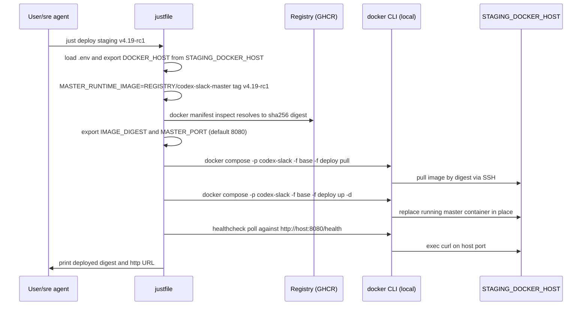

# Design: Justfile + dotenv for compose deploys

**Status:** draft
**Author:** architect
**Date:** 2026-07-11
**Related ADRs:** ADR-0005 (CI/CD Pipeline Design — superseded in part by ADR-0016), ADR-0016 (Singleton tag-based staging/prod deploys), issue #245

## Problem Statement

Deploy tooling today is a set of ad-hoc bash scripts under `.sre/` that each
export a slightly different subset of environment variables, plus one operator
runbook per script. Operators (human or the `sre` agent) have to memorise which
variables belong to which script, export them by hand, and know which
`docker-compose.*.yml` files to combine. There is no first-class notion of
"deploy this version to *that* environment" — staging is hardwired to
`STAGING_DOCKER_HOST` and production has no path at all.

In parallel, ADR-0005's pull-based CD daemon (`src/cd/`) has proven to be more
machinery than we need for a single-host project with an already-explicit
promotion pipeline. Its polling lag, its own `.env` generator
(`scripts/gen-env.sh`), and its coexistence footprint on every staging/prod
host add operational surface that a single `just deploy` command replaces
cleanly. Issue #245 is the trigger to consolidate.

Issue #245 asks us to:

1. Make `docker-compose.yml` variables and per-environment Docker host endpoints
   configurable from a single `.env` file at the repo root.
2. Provide justfile targets that deploy the compose stack to `dev`, `staging`,
   or `prod` — with an explicit image version tag for staging/prod and the
   current commit for dev.

The environments do not share a topology. Dev runs many stacks per host behind
Traefik (one per branch); staging and prod each run a single stack per host
published on a fixed port. The tooling has to respect that split — see
"Environment shapes (invariant)" below.

## Goals

- One documented entry point (`just <recipe>`) that humans and the `sre`
  operator agent both use. No more per-script argument idioms.
- A single `.env` at repo root drives per-machine configuration
  (Docker host endpoints, registry, secrets); `.env.example` documents every
  variable in one place.
- Per-environment singleton deploys are generic: `just deploy <env> <tag>`
  works for `staging` today and `prod` the day a `PROD_DOCKER_HOST` is
  populated. The two envs share one recipe body because they share a shape.
- Preserve ADR-0005's immutability guarantees for staging/prod: recipes accept
  a human tag, resolve to a digest, deploy by digest.
- Dev flow keeps its build-from-source-per-commit shape, N-per-host, and
  Traefik hostname routing.
- **Retire the CD daemon.** `just deploy <env> <tag>` is the only staging/prod
  deploy path going forward. `src/cd/`, `Dockerfile.cd-daemon`,
  `docker-compose.cd-daemon.example.yml`, `scripts/gen-env.sh`, the
  `cd-daemon.md` runbook, and the `build-cd-daemon` CI job are removed. This
  supersedes ADR-0005 §2 and §4 — see ADR-0016.
- **Retire the multi-version Traefik staging shape.** The feature-branch
  staging UAT flow (`.sre/operations/staging-up.md` /
  `staging-down.md`, `docker-compose.staging.yml`, `VERSION_SLUG`-based
  hostnames on `STAGING_DOCKER_HOST`) is removed. Staging becomes a
  singleton, matching production.
- Existing dev-side runbook contracts (`env-up`, `env-down`, `status`,
  `logs`, `shell`, `test`) keep working for the `sre` agent with minimal
  churn — recipes are the new implementation but the named operations,
  inputs, and outputs are unchanged.
- Real shell environment continues to override `.env` so CI, the `sre` agent's
  exported vars, and one-off overrides still win.

## Non-Goals

- Standing up a production environment. Prod support is a *code path*, not a
  running host — no `PROD_DOCKER_HOST` is provisioned here.
- Reintroducing implicit local-Docker fallback. `DEV_DOCKER_HOST=unix://...` is
  the supported way to target a local socket; the recipes never guess.
- Rewriting the Slack bot config or Master runtime settings. Only
  compose-visible variables are in scope.
- Changing ADR-0005's CI build/tag/promotion flow. `build-push.yml`'s
  `build-master`, `build-agent-minimal`, and `promote` jobs — plus the
  `:sha-<hash>` / `:v*-rc*` / `:rc` / `:v*` tagging strategy — remain as
  ADR-0005 specified. Only the CD-daemon-related job (`build-cd-daemon`) and
  the CD-daemon-based deploy model are removed.

## Proposed Design

### Environment shapes (invariant)

The environments have two topologies, not three. The tooling must preserve the
split — a recipe that flattened them into one would break either the dev
workflow (which needs many stacks per host) or the staging/prod workflow
(which expects a single, host-port-published stack).

| Aspect | Dev (`DEV_DOCKER_HOST`) | Staging / Prod (`STAGING_DOCKER_HOST`, `PROD_DOCKER_HOST`) |
|---|---|---|
| Instances per host | N (one per branch) | 1 (singleton) |
| Compose project name | Branch slug (`<branch>-master`) | Fixed per env (`codex-slack`) |
| Host port publication | None | `${MASTER_PORT:-8080}:8080` on the host |
| Ingress | Traefik on `sre-traefik-public`, routed by `master.<slug>.<ip-dashed>.nip.io` | Direct host port; no Traefik dependency |
| Image | Built from source (`target: dev`) per branch | Pulled by digest (`${MASTER_RUNTIME_IMAGE}@${IMAGE_DIGEST}`) |
| Compose files | `docker-compose.yml` + `docker-compose.override.yml` | `docker-compose.yml` + **new** `docker-compose.deploy.yml` |
| Upgrade path | `build` + `up -d` under branch-slug project | `up -d` under fixed project name replaces the running container in place |

There is no separate "staging-UAT" shape. Pre-merge UAT of a release
candidate happens by deploying the `v*-rc*` tag to the staging singleton
(one candidate at a time). Branch-level exploratory testing stays in the dev
shape. See "Workflow implication" below.

Recipes must preserve this split:

- Dev recipes (`dev-up`, `dev-down`) — Traefik shape, project name = branch
  slug, N-per-host.
- Deploy recipes (`deploy`, `undeploy`) — singleton shape, fixed project
  name per env, 1-per-host, published on `${MASTER_PORT:-8080}`.

### Recipe surface (justfile)

Recipes stay aligned with `.sre/operations/*.md` names so runbook rewrites are
mechanical. Positional args match the current script signatures where possible.

The staging-UAT recipes (`staging-up`, `staging-down`) do not appear in this
table — they are retired along with `docker-compose.staging.yml`.

| Recipe | Shape | Purpose | Args | Runbook it backs |
|---|---|---|---|---|
| `just dev-up [branch]` | Traefik / dev | Build dev stage on `DEV_DOCKER_HOST`, bring up, wait for health. Defaults `branch` to current git branch. | `branch?` | `env-up.md` |
| `just dev-down [branch]` | Traefik / dev | Tear down dev env for a branch. | `branch?` | `env-down.md` |
| `just deploy <env> <tag>` | Singleton | **New for #245.** Resolve `<tag>` to a digest, pull, `up -d` on `<env>_DOCKER_HOST` using `docker-compose.yml` + **new** `docker-compose.deploy.yml`. Fixed project name `codex-slack` per env. Publishes `${MASTER_PORT:-8080}:8080` on the host. Replaces the running singleton in place. `<env>` in {`staging`,`prod`}. | `env`, `tag` | `deploy.md` (new) |
| `just undeploy <env>` | Singleton | **New for #245.** `down` the fixed-name compose project on `<env>_DOCKER_HOST`. Takes no tag — there is only one instance to bring down. | `env` | `undeploy.md` (new) |
| `just status` | — | List active compose projects on all configured hosts. | — | `status.md` |
| `just logs <env> <service> [key]` | — | Stream logs for a service. `env` in {`dev`,`staging`,`prod`}. `key` is branch slug for dev; ignored for singleton `deploy` targets. | `env`, `service`, `key?` | `logs.md` |
| `just shell <env> <service> [key]` | — | Exec interactive shell. Same `key` semantics as `logs`. | `env`, `service`, `key?` | `shell.md` |
| `just test [pattern]` | — | Build test stage and run pytest on `DEV_DOCKER_HOST`. | `pattern?` | `test.md` |
| `just post-merge-cleanup <branch> [tag]` | Mixed | Refresh the staging singleton with the new master image (`deploy staging <tag>`, default `<tag>=master`) and tear down any dev env for `<branch>`. | `branch`, `tag?` | `post-merge-cleanup.md` |

`deploy`/`undeploy` are the singleton, port-8080 path introduced by
issue #245. There is no longer a Traefik multi-version staging path.

Composite/private helpers (leading `_`) hold shared logic so recipes stay flat:

- `_slug SLUG_INPUT` — the branch slug transform (`tr '/_.' '-' | lower`).
- `_host-ip DOCKER_HOST` — extract and dash the host IP for `.nip.io` (dev
  only).
- `_docker-gid DOCKER_HOST` — the remote `stat -c '%g' /var/run/docker.sock`
  probe used by `env-up.sh` today.
- `_resolve-digest IMAGE_REF` — `docker buildx imagetools inspect` to turn a
  tag into a `sha256:...`.

### Environment layering

`justfile` uses `set dotenv-load := true` so `.env` at repo root is auto-loaded.
Precedence (highest to lowest):

1. Vars already exported in the caller's shell (CI, `sre` agent env, ad-hoc).
2. Vars in `.env` at repo root.
3. Recipe defaults (e.g. `DOCKER_GID` fallback via the `_docker-gid` probe).

`just` merges dotenv values *without* overriding existing environment
variables (this is `just`'s documented behaviour when `dotenv-load` is on).
That preserves the "real env wins" rule the SRE agent depends on.

### How compose sees the variables

Two layers, made explicit:

1. **Recipe → compose exports** — the recipe `export`s the variables that
   `docker-compose.yml` and its overlays interpolate. The exact set depends on
   the shape:
   - Dev (Traefik): `MASTER_RUNTIME_IMAGE`, `DOCKER_GID`, `BRANCH_SLUG`,
     `HOST_IP_DASHED`, `APP_VERSION`, `MASTER_SSH_AUTH_SOCK_PATH`,
     `DOCKER_HOST`.
   - Singleton `deploy` (staging/prod): `MASTER_RUNTIME_IMAGE`, `DOCKER_GID`,
     `IMAGE_DIGEST`, `MASTER_PORT`, `DOCKER_HOST`. No `BRANCH_SLUG` or
     `HOST_IP_DASHED` — the singleton overlay has no Traefik labels or
     hostname routing.

   Compose reads these from the process environment. This mirrors what
   `.sre/*.sh` do today for the dev shape; the singleton set is new.
2. **`.env` file** — carries the values that are stable per-machine (secrets,
   host endpoints, registry). `just` loads them into its own environment before
   the recipe body runs, so compose picks them up transitively.

We do **not** rely on `docker compose`'s own auto-load of `.env` from the
project directory. On remote `DOCKER_HOST=ssh://...` targets the compose CLI
still runs locally, so its notion of "project directory" is the local repo
and its `.env` search would collide with ours in confusing ways. Explicit
export from the recipe is unambiguous and matches current script behaviour.
`--env-file` is not used for the same reason (adds a fourth precedence layer).

### New overlay: `docker-compose.deploy.yml`

The singleton path needs its own overlay. It sits next to `docker-compose.yml`
and is used only by `just deploy` / `just undeploy`. `docker-compose.staging.yml`
is deleted (see Implementation Plan). Sketch:

```yaml
# Singleton overlay for `just deploy <env> <tag>`. One master per host,
# published on the host port. No Traefik labels, no external Traefik network.
services:
  master:
    image: ${MASTER_RUNTIME_IMAGE:?MASTER_RUNTIME_IMAGE must be set}@${IMAGE_DIGEST:?IMAGE_DIGEST must be set}
    environment:
      MASTER_AGENT_NETWORK: "codex-slack_internal"
    ports:
      - "${MASTER_PORT:-8080}:8080"
    deploy:
      resources:
        limits:
          memory: 1g
          cpus: "1.0"
    networks:
      - internal
  mosquitto:
    deploy:
      resources:
        limits:
          memory: 128m
          cpus: "0.25"
```

Key differences from the (retired) `docker-compose.staging.yml`:

- No `traefik.*` labels.
- No `sre-traefik-public` network.
- Publishes `${MASTER_PORT:-8080}:8080` on the host.
- `MASTER_AGENT_NETWORK` uses the fixed project name (`codex-slack_internal`)
  because there is exactly one instance.

The fixed compose project name (`-p codex-slack`) is what makes `up -d`
behave as an in-place replacement: `docker compose` compares the running
containers against the desired spec (which now points at a new digest), and
recreates the master container. That is the deploy = upgrade path.

### Variable inventory

Split by *who computes it* and *whose secret it is*.

#### In `.env` (per-machine, human/agent maintained)

| Variable | Purpose | Example | Notes |
|---|---|---|---|
| `DEV_DOCKER_HOST` | Dev host endpoint | `ssh://ubuntu@10.10.10.238` | Required for `dev-up`, `test`, `logs dev`, `shell dev`. `unix:///var/run/docker.sock` allowed. |
| `STAGING_DOCKER_HOST` | Staging endpoint | `ssh://ubuntu@10.10.10.227` | Required for `deploy staging`, `undeploy staging`. |
| `PROD_DOCKER_HOST` | Prod endpoint | `ssh://ubuntu@prod.example.com` | Reserved. Recipes check for presence before `deploy prod`. |
| `REGISTRY` | Image namespace for staging/prod pulls | `ghcr.io/pandazxx` | Same semantics as today. |
| `REGISTRY_TOKEN` | Registry auth (non-GHCR) | (secret) | Optional. GHCR uses shell `GITHUB_TOKEN` per current setup. |
| `DOCKER_GID` | Host docker group GID | `988` | Optional; recipe probes if unset (same behaviour as `env-up.sh`). |
| `MASTER_PORT` | Host port for singleton `deploy` targets | `8080` | Optional (default `8080`). Per-machine; only meaningful for the singleton `deploy` shape. Ignored by the dev shape. |
| `ANTHROPIC_API_KEY`, `OPENAI_API_KEY`, `CLAUDE_CODE_OAUTH_TOKEN`, `GH_TOKEN` | Agent runtime secrets consumed by the `master` service via `docker-compose.yml` interpolation. | (secret) | Optional individually; the running app decides what's required. |
| `MASTER_SSH_AUTH_SOCK_PATH` | Path to host ssh-agent socket to bind into master | `/run/user/1000/ssh-agent.sock` | Optional; has recipe default. |
| `MASTER_CODEX_AUTH_JSON_PATH`, `MASTER_SSH_KNOWN_HOSTS_PATH`, `MASTER_GIT_USER_NAME`, `MASTER_GIT_USER_EMAIL`, `MASTER_AGENT_BASE_IMAGE`, `MASTER_DRY_RUN`, `AGENT_IDLE_TIMEOUT_SECONDS`, `AGENT_AUTH_REFRESH_INTERVAL_SECONDS` | Compose interpolation pass-through | — | Optional; documented for completeness. |

#### Computed by recipes at deploy time (never in `.env`)

| Variable | How derived | Used by | Shape |
|---|---|---|---|
| `BRANCH_SLUG` | `_slug` on branch name | `docker-compose.override.yml` labels, project name | Dev only |
| `HOST_IP_DASHED` | `_host-ip` on the target `DOCKER_HOST` | Traefik host rule | Dev only |
| `APP_VERSION` | git branch + short SHA + dirty flag | Dockerfile build arg (dev) | Dev only |
| `IMAGE_DIGEST` | `_resolve-digest` on `<registry>/<image>:<tag>` | `docker-compose.deploy.yml` `image:` | Singleton `deploy` |
| `MASTER_RUNTIME_IMAGE` | dev: `${BRANCH_SLUG}-master:dev`; `deploy`: `${REGISTRY}/codex-slack-master:<tag>` | Compose `image:` | All |
| `MASTER_AGENT_NETWORK` | Dev: `${BRANCH_SLUG}_internal`; singleton `deploy`: `codex-slack_internal` | Master runtime | All |
| `DOCKER_HOST` | Selected from `.env` by target env | All compose calls | All |

`VERSION_SLUG` is gone — it existed only for the retired multi-version
staging shape.

#### Not in scope for `.env` (kept elsewhere)

- CI-only variables — GitHub Actions handles those via workflow secrets.

### `.env.example` layout

The committed `.env.example` at repo root is reorganised into two sections
with clear ownership markers:

```
# ============================================================================
# SECTION A — Justfile / deploy configuration
#   Consumed by: justfile recipes + docker-compose.*.yml at deploy time
#   Loaded by:   `set dotenv-load` in justfile
# ============================================================================
DEV_DOCKER_HOST=
STAGING_DOCKER_HOST=
# PROD_DOCKER_HOST=
REGISTRY=
# REGISTRY_TOKEN=
# DOCKER_GID=
# MASTER_SSH_AUTH_SOCK_PATH=
# Host port for singleton `just deploy` targets. Default 8080. Per-machine.
# MASTER_PORT=8080

# ============================================================================
# SECTION B — Master service runtime secrets & config
#   Consumed by: docker-compose.yml `environment:` interpolation
# ============================================================================
ANTHROPIC_API_KEY=
OPENAI_API_KEY=
CLAUDE_CODE_OAUTH_TOKEN=
GH_TOKEN=
# MASTER_DRY_RUN=false
# ...
```

The CD-daemon `.env` section (previously written by `scripts/gen-env.sh`) is
gone with the daemon.

`.env` is already gitignored (`.gitignore` line 17). No change there.

### Recipe behaviour details

- `just dev-up [branch]` — sets `DOCKER_HOST=$DEV_DOCKER_HOST`, computes
  `BRANCH_SLUG`, `HOST_IP_DASHED`, `APP_VERSION`, probes `DOCKER_GID` if
  unset, then `docker compose -p <slug> -f docker-compose.yml -f
  docker-compose.override.yml build master && up -d`, then healthcheck poll
  against `master.<slug>.<ip-dashed>.nip.io`. Identical to `env-up.sh`
  semantics.
- `just deploy <env> <tag>` — **new for #245**, singleton shape. Resolves
  `${REGISTRY}/codex-slack-master:<tag>` to a digest, exports `IMAGE_DIGEST`,
  `MASTER_RUNTIME_IMAGE`, `MASTER_PORT` (default `8080`),
  `DOCKER_HOST=$<ENV>_DOCKER_HOST`, then `docker compose -p codex-slack -f
  docker-compose.yml -f docker-compose.deploy.yml pull && up -d`. The fixed
  project name (`codex-slack`) means `up -d` replaces the running master
  container in place — that is the upgrade path. Healthcheck polls
  `http://<host>:${MASTER_PORT:-8080}/health` (no `nip.io` URL, no Traefik).
  Does not export `BRANCH_SLUG` or `HOST_IP_DASHED`. Aborts with a clear
  error if `<env>=prod` and `PROD_DOCKER_HOST` is empty.
- `just undeploy <env>` — **new for #245**. `docker compose -p codex-slack
  -f docker-compose.yml -f docker-compose.deploy.yml down` on
  `$<ENV>_DOCKER_HOST`. Takes no tag argument — the singleton project name
  is fixed, so there is nothing to disambiguate.
- `just post-merge-cleanup <branch> [tag]` — thin wrapper: calls
  `deploy staging <tag>` (default `<tag>=master` — CI publishes
  `codex-slack-master:master` on every master push per
  `.github/workflows/build-push.yml`) to refresh the staging singleton, then
  tears down the dev env for `<branch>` if one exists. There is no
  feature-branch staging env to tear down anymore.

### Workflow implication: RC UAT is serialized

Retiring the multi-version staging shape has one honest process consequence
that has to be called out.

Under the old design, several `v*-rc*` tags could run in parallel on
`STAGING_DOCKER_HOST` under different `VERSION_SLUG`s, so reviewers could
compare candidates side by side and multiple PRs could be in UAT at the same
time. That is gone.

Going forward:

- Pre-merge UAT for a release candidate happens by running
  `just deploy staging v1.2.3-rcN`. Only one candidate can occupy the
  staging singleton at a time. UAT is serialized across in-flight PRs.
- Branch-level exploratory testing that used to be run against a
  feature-branch staging env stays in the dev shape (`just dev-up`) — that
  path is unchanged and still supports N branches in parallel per host.
- The tradeoff: UAT throughput drops when multiple RCs are queued; teams
  coordinate on who holds staging. The saved complexity (no `VERSION_SLUG`
  hostname routing, no per-tag project juggling, no CD-daemon polling model
  to reason about) is judged worth it for a project of this size.

`docs/sre.md` and `.claude/CLAUDE.md` currently describe the multi-version
UAT flow as if it were still the norm. The Implementation Plan below has a
docs step to bring those in line. Those edits are intentionally deferred to
the implementation PR so this design can be reviewed independently of the
prose rewrite.

### Runbook migration

- `.sre/operations/env-up.md`, `env-down.md`, `status.md`, `logs.md`,
  `shell.md`, `test.md` — each has its "Run `.sre/<script>.sh ...`" step
  replaced with "Run `just <recipe> ...`". Inputs, pre-conditions,
  on-failure handling, and output-passthrough contracts stay identical.
- `.sre/operations/staging-up.md` and `.sre/operations/staging-down.md` are
  **replaced** by new `.sre/operations/deploy.md` and
  `.sre/operations/undeploy.md`. The named operations, arguments, and
  behaviour differ (singleton, not multi-version), so this is a runbook
  swap, not a rename. The `sre` agent's operation set changes at the same
  time as the code.
- `.sre/operations/post-merge-cleanup.md` — updated to describe the
  singleton refresh flow (`deploy staging master`) plus dev-env teardown for
  the merged branch.

`.sre/*.sh` scripts for the dev-shape recipes become thin wrappers around
`just` for one release cycle (they `exec just <recipe> "$@"`) so any
external caller has a deprecation window. `.sre/staging-up.sh` and
`.sre/staging-down.sh` are deleted outright — there is no equivalent
recipe to wrap.

### `just` availability

- Add `just` to the agent container image (Debian/Ubuntu package `just` or the
  official static binary release). The container image build is the
  `senior-sre` change that lands with this design.
- Document install for human users in `docs/guides/onboarding.md` (macOS:
  `brew install just`; Linux: distro package or `cargo install just`).
- CI is unaffected — CI workflows call `docker compose` directly (per
  ADR-0005), not the runbook scripts. If CI later wants to reuse a recipe,
  install `just` in the workflow step.

### Sequence example: `just deploy staging v4.19-rc1`

Singleton shape. Fixed compose project name `codex-slack`, published on host
port `${MASTER_PORT:-8080}`, no Traefik. Mermaid note: message text below
contains no `;` characters (they terminate mermaid statements and break
rendering on GitHub — this has bitten us before).



## Alternatives Considered

### A. Justfile as a thin wrapper over existing `.sre/*.sh` scripts

Recipes would `exec .sre/env-up.sh "$@"` etc. Pros: minimal change, keeps two
sources of truth in sync during migration. Cons: leaves two languages for
deploy logic (bash + justfile) permanently; the `.env` question is answered
inside bash where precedence is fiddly; doesn't address issue #245's
`deploy <env> <tag>` generalisation without still editing every script.
Rejected — the wrapping is temporary migration scaffolding, not the endpoint.

### B. Make (Makefile) instead of justfile

`make` is universally available. Pros: no new tool. Cons: recipe args are
awkward (`make deploy ENV=staging TAG=v4.19-rc1`), tab-based syntax is
error-prone, `.PHONY` bookkeeping, and it wasn't asked for. `just` was
explicitly named in issue #245.

### C. Compose-native `.env` (rely on `docker compose`'s auto-load)

Drop the recipe-level export entirely; let `docker compose` load `.env` from
the project directory. Pros: simplest possible answer. Cons: (1) values like
`BRANCH_SLUG`, `IMAGE_DIGEST`, `APP_VERSION` are per-invocation and computed
at recipe time — they cannot live in a static `.env`; (2) with remote
`DOCKER_HOST=ssh://...` the "project directory" concept still resolves
locally but the operational model becomes muddy; (3) precedence rules
between compose's `.env`, `--env-file`, and process env differ from `just`'s
`dotenv-load` semantics, giving four sources of truth to explain. Rejected.

### D. direnv instead of justfile-loaded dotenv

Auto-load `.env` into the shell via `direnv allow`. Pros: works for direct
`docker compose` calls too. Cons: extra tool to install and trust; the `sre`
agent does not run through a login shell so hooking direnv is another wart;
still doesn't give us the recipe surface issue #245 asks for.

### E. One recipe per environment (`just deploy-staging`, `just deploy-prod`)

Pros: obvious names. Cons: duplicates recipe bodies; adding an env means
editing justfile *and* runbooks. Generic `just deploy <env> <tag>` is
cheaper to extend and matches how `<env>_DOCKER_HOST` scales.

### F. Keep the CD daemon; add `just deploy` for manual overrides only

Pros: preserves ADR-0005's pull-based model. Cons: two ways to deploy the
same singleton container that will fight each other on the same host; two
sources of `.env` truth (repo-root `.env` for `just`, generated
`gen-env.sh` output for the daemon); two runbook trees; the daemon's polling
lag stays in the loop even when a human explicitly deploys. The whole
motivation for `just deploy` was to make deploys explicit and
digest-transparent — keeping the daemon undoes that. Rejected. See ADR-0016.

### G. Keep the multi-version Traefik staging shape for pre-merge UAT

Pros: parallel RC UAT stays possible. Cons: two staging topologies to
document, two overlays to maintain (`docker-compose.staging.yml` +
`docker-compose.deploy.yml`), `VERSION_SLUG` plumbing on top of the
singleton plumbing, and the mental model "staging is one thing… except
when it's several things" becomes the largest permanent complexity in the
tree. Rejected in favour of a one-shape staging with serialized RC UAT,
accepting the throughput tradeoff called out in "Workflow implication"
above. See ADR-0016.

## Open Questions

The recommended answers below are proposals; call them out in review if you
want any changed.

- [ ] **Recipe surface is fine?** Are the recipe names/args above the right
  surface, or do we want e.g. `just up staging <tag>` / `just down` style
  verbs? *Recommended:* keep the runbook-aligned names above so
  `.sre/operations/*.md` filenames and recipe names line up. `deploy` and
  `undeploy` are new operations for issue #245 with matching new runbooks.
- [ ] **Justfile as source of truth vs. thin wrapper?** *Recommended:* source
  of truth. Dev-shape `.sre/*.sh` become one-line wrappers for a single
  release cycle then are removed. Staging-shape `.sre/*.sh` are deleted
  outright. Owner: engineer implementing.
- [ ] **First-class prod today or reserved slot only?** *Recommended:*
  reserved slot — `PROD_DOCKER_HOST` is documented in `.env.example`,
  recipes work when it is set, but no `senior-sre` bootstrap of a prod host
  is part of this change.
- [ ] **`.env` vs. `.env.deploy`?** Do we want deploy config in the same
  `.env` as Master runtime settings, or a dedicated `.env.deploy`?
  *Recommended:* single `.env` with sectioned `.env.example`. Two files
  split the user's mental model without solving a real problem — they'd
  both be gitignored and both loaded by `just`.
- [ ] **Precedence: shell overrides `.env`.** *Recommended:* yes — matches
  `just`'s default `dotenv-load` behaviour and preserves the current
  contract where the `sre` agent's exported vars win. Owner: doc-writer to
  call out in `docs/sre.md`.
- [ ] **Digest resolution tool?** `docker buildx imagetools inspect` vs
  `docker manifest inspect` vs `crane digest`. *Recommended:*
  `docker buildx imagetools inspect --format '{{json .Manifest.Digest}}'` —
  already available wherever docker is, no extra tool. Owner: engineer.
- [ ] **How aggressively to consolidate `.env.example`?** *Recommended:* one
  file, two labelled sections as sketched above. The CD-daemon section is
  gone with the daemon. Owner: doc-writer.
- [ ] **Local docker host wording in docs/sre.md.** The issue mentions "local
  or remote docker host". *Recommended:* keep the existing rule — no
  implicit local fallback; `DEV_DOCKER_HOST=unix:///var/run/docker.sock` is
  the explicit local target. Owner: doc-writer.
- [ ] **`just` in the agent container.** Who lands the Dockerfile change to
  install `just`? *Recommended:* `senior-sre` in the same PR as the
  justfile so the agent's first `just` invocation cannot fail on a missing
  binary.
- [ ] **Dev-shape wrapper deprecation window.** How long do the dev-shape
  `.sre/*.sh` remain as wrappers before removal? *Recommended:* one merge
  cycle — remove after the first canonical staging refresh through the new
  recipes has been observed green.

## Implementation Plan

1. **Justfile scaffold + dotenv loading.** Land `justfile` at repo root with
   recipes above, `set dotenv-load := true`, and private helpers. Rewrite
   `.env.example` into the two-section layout (Section A now includes
   `MASTER_PORT`; the CD-daemon section is deleted). Add `just` to the
   agent container image (senior-sre).
2. **Recipe bodies — dev shape.** Port `env-up.sh`, `env-down.sh`,
   `env-status.sh`, `run-tests.sh` into `dev-up`, `dev-down`, `status`,
   `test`. Preserve healthcheck poll, DOCKER_GID probe, APP_VERSION
   derivation verbatim so behaviour is unchanged.
3. **New singleton deploy overlay.** Add `docker-compose.deploy.yml` as
   sketched above — no Traefik, no external network, publishes
   `${MASTER_PORT:-8080}:8080`, pins `${MASTER_RUNTIME_IMAGE}@${IMAGE_DIGEST}`.
4. **New singleton recipes.** Implement `just deploy <env> <tag>` and
   `just undeploy <env>` against the new overlay with fixed project name
   `codex-slack`. Wire staging first, prod behind a `PROD_DOCKER_HOST`
   presence check.
5. **New runbooks.** Author `.sre/operations/deploy.md` and
   `.sre/operations/undeploy.md`. Delete `.sre/operations/staging-up.md`
   and `.sre/operations/staging-down.md` — they no longer describe an
   operation that exists.
6. **Dev-shape wrapper scripts.** Replace each surviving dev-shape
   `.sre/*.sh` body with `exec just <recipe> "$@"` so existing callers
   still work.
7. **Retire the staging-UAT shape.** Delete `docker-compose.staging.yml`,
   `.sre/staging-up.sh`, and `.sre/staging-down.sh`. Update any repo-wide
   references (README, docs, comments) that mention the old shape.
8. **Retire the CD daemon.** Delete `src/cd/`, `Dockerfile.cd-daemon`,
   `docker-compose.cd-daemon.example.yml`, `scripts/gen-env.sh`, and
   `docs/guides/runbooks/cd-daemon.md`. Remove the `build-cd-daemon` job
   from `.github/workflows/build-push.yml` (leave `build-master`,
   `build-agent-minimal`, and `promote` intact). Remove any lingering
   `CD_*` references from tests/config. See ADR-0016.
9. **Existing runbook rewrite.** Update `.sre/operations/env-up.md`,
   `env-down.md`, `status.md`, `logs.md`, `shell.md`, `test.md`,
   `post-merge-cleanup.md` to invoke recipes. Verify each end-to-end with
   the `sre` agent on a scratch branch.
10. **Docs.** Update `docs/sre.md` and `.claude/CLAUDE.md` so their SRE
    workflow prose describes the two-shape topology, the serialized RC UAT
    flow, and the removal of the CD daemon. Update env-var table to point
    at `.env` + `.env.example` and add `MASTER_PORT`. Add `just` install
    note to `docs/guides/onboarding.md`.
11. **Post-adoption cleanup.** After one green canonical staging refresh via
    `just deploy staging master`, delete the surviving dev-shape wrapper
    scripts (`.sre/env-up.sh`, `env-down.sh`, `env-status.sh`,
    `run-tests.sh`). Runbooks and justfile remain.
