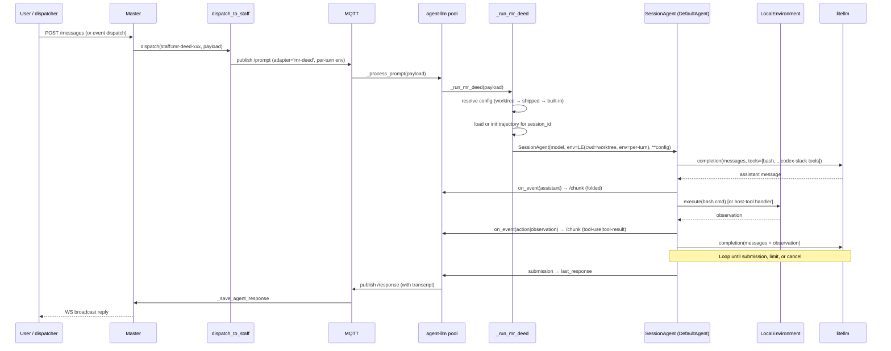
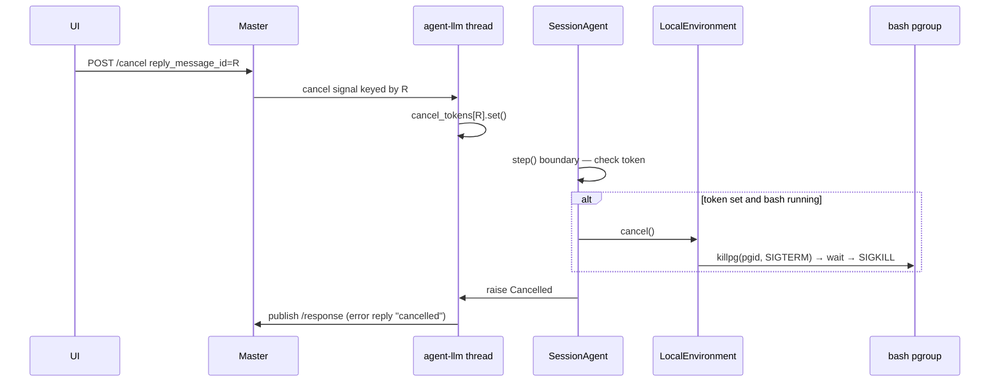

# Design: Mr-deed agent adapter

**Status:** draft
**Author:** architect
**Date:** 2026-10-09
**Related ADRs:** [ADR-0018](../decisions/0018-mr-deed-agent-adapter.md);
builds on ADR-0001 (agent provisioning), ADR-0014 (Codex adapter),
ADR-0017 (orchestration protocol), ADR-0009 (staff system), ADR-0012
(streaming reply), ADR-0015 (notes feature).
**Issue:** [#265](https://github.com/pandazxx/codex-slack/issues/265)
(folds in [#256](https://github.com/pandazxx/codex-slack/issues/256) at P2).
**Upstream repo:** [`pandazxx/mr-deed`](https://github.com/pandazxx/mr-deed).

## Context

The platform runs two adapters today: `claude-code` and `codex`. Both are
CLI subprocesses that stream JSONL on stdout, keep their own session
state, and discover tools through MCP config files. We want to add
`mr-deed` — a fork of mini-swe-agent v2 (package `minisweagent`, dist
`mini-swe-agent`) owned by the same project-owner — as a third adapter.
The intent is a side-kick / orchestrator / assistant that can also
handle simple tasks end-to-end, with the latitude to iterate on agent
flow and tool-call behaviour in-tree because both repositories are
co-owned.

The gaps vs. the two existing adapters, read off `pandazxx/mr-deed`
`main` at `52c3c5c` (open mr-deed PR #5 adds `model.extra_tools` to
`litellm_model` only):

- Mr-deed is in-process (`DefaultAgent(model, env, **config).run(task)`);
  no CLI.
- `run()` resets `self.messages` — no session or resume concept.
- `tools=[BASH_TOOL]` is hardcoded in the model classes;
  `LocalEnvironment` runs bash via `subprocess.run` and accepts a
  per-instance `env` dict and `cwd`.
- No event hooks and no cancel. Each `step` just calls `add_messages()`
  and `save()`.
- `dotenv.load_dotenv()` runs at import time from the importing
  process's cwd, mutating `os.environ`.
- `GLOBAL_MODEL_STATS` is process-global.

The design converged in issue #265 (comments from 2026-10-04 through
2026-10-08). This document records the settled decisions and fills in
mechanism detail. Open items that are genuinely unresolved are called
out in §Open Questions.

## Goals

- **New adapter `mr-deed`** behind the same dispatch envelope used by
  `claude-code` and `codex`. Master dispatch payload, `staff_sessions`
  and session scope are unchanged beyond the enum; the UI only gains
  classifier branches for `mr_deed.*` chunk events (§6).
- **In-process execution** on the existing `agent-llm` ThreadPoolExecutor
  (4 workers) in `src/agent/mqtt_loop.py`. No child process per turn.
- **Per-turn env isolation.** `DISPATCH_TOKEN`, `TASK_DEPTH`, `TOPIC_ID`,
  `AGENT_NAME`, `PROMPT_MESSAGE_ID`, `WORKSPACE_ID`, `MASTER_URL` ride
  on `LocalEnvironment(env=...)` and never on `os.environ`.
- **Config resolution** worktree → shipped → mr-deed built-ins, first
  match wins. Runner always forces `environment.type=local,
  cwd=<worktree>`.
- **Session resume.** Persist trajectory per `session_id` on a volume;
  resume on `is_new_session=false` by appending a new user message
  rendered through `continue_template`.
- **Streaming.** Each agent event becomes a `/chunk` frame; the
  submission becomes `last_response`. `LimitsExceeded`, `TimeExceeded`,
  `RepeatedFormatError`, `Cancelled` map to named error replies.
- **Cancel.** Per-reply cancel token checked between steps; in-flight
  bash process group killed on cancel.
- **Native host tools** (P2). The tool set per turn is `[bash] +
  <codex-slack tools gated by TASK_DEPTH and role per ADR-0017 T1>`;
  handlers call master's HTTP endpoints directly (reusing the client
  code already in `src/orchestrate_mcp/` and `src/notes_mcp/`), no MCP
  hop. Master still validates every call.
- **Credentials.** Reuse the config-var → container env mechanism;
  litellm reads `ANTHROPIC_API_KEY` / `OPENAI_API_KEY` / etc.
- **Clean cross-repo boundary.** Interface requirements are mr-deed
  issues; each codex-slack-side stopgap has a named removal trigger.
- **Generic agent interface.** `hermes` is an experiment; no special
  casing.

## Non-Goals

- **Memory management.** Out of scope for this ADR / design. Session
  resume is the foundation; agent-memory lands in a later ADR.
- **History compaction.** Linear history, no compaction in v1 — a
  documented limitation. Long sessions hit context/cost ceilings.
- **Codex OAuth or Claude subscription login.** Litellm cannot use
  them. API-key billing only.
- **Text-based mini configs with host tools.** Host tools are tool-
  call-mode only (ADR-0017 T1 depends on structured tool calls).
- **Alternate `environment.type`s** (docker, modal, …). The runner
  always forces `local` so a repo config cannot break out of the
  worktree.
- **Expanding the dispatch payload.** `staff.model`,
  `staff.system_prompt`, `staff.agent`, `staff.session_scope` already
  carry everything we need.
- **hermes-specific plumbing.** It is one config in mr-deed, not a
  codex-slack concept.

## Design

### 1. Component layout and one-turn flow



Touch-points in the existing code:

| File | Change |
|---|---|
| `src/master/staffs.py` | `_VALID_ADAPTERS.add("mr-deed")`; schema docs for valid values |
| `src/master/dispatch.py` | No change (adapter string travels unchanged) |
| `src/agent/mqtt_loop.py::_process_prompt` (~line 636) | `elif adapter == "mr-deed": _run_mr_deed(...)` |
| `src/agent/mqtt_loop.py` | New `_run_mr_deed` + streaming helpers next to `_run_claude` / `_run_codex` |
| `src/agent/mr_deed_runner.py` (new) | `SessionAgent` subclass, config loader, event-hook wiring, cancel plumbing |
| `src/orchestrate_mcp/`, `src/notes_mcp/` (P2) | Extract call-time client functions taking a per-turn context; MCP servers become thin wrappers |
| `src/master/orchestration.py` or a shared module (P2) | `orchestration_tools_for(depth, max_depth)` — single gating function used by the MCP server and mr-deed |
| `frontend/src/views/TopicChat.vue` | Classifier branches for `mr_deed.*` event types (§6) |
| `requirements.txt` (agent image) | Pin `mini-swe-agent @ git+https://github.com/pandazxx/mr-deed@<tag-or-sha>` |

### 2. Adapter dispatch mapping

The staff → runner mapping. Nothing on master changes beyond the enum.

| Payload field | Source | Mr-deed binding |
|---|---|---|
| `adapter` | `staff.adapter` | Selects `_run_mr_deed` |
| `subagent` | `staff.agent` | Config name (resolution order §3) |
| `model` | `staff.model` | Overrides `model.model_name` |
| `system_prompt` | `staff.system_prompt` | Appended to `system_template` |
| `session_id` | `_get_staff_session()` | Trajectory file name (§5) |
| `is_new_session` | `_get_staff_session()` | `false` → load and resume |
| `session_scope` | `staff.session_scope` | Already honoured by master; mr-deed just sees the resolved `session_id` |
| `task_depth` | master task machinery | Chooses tool subset (ADR-0017 T1) |
| `dispatch_token` | master | Carried in per-turn env for host-tool handlers |

### 3. Config resolution

First match wins:

1. `<worktree>/.prj_assistant/mr-deed/<staff.agent>.yaml` (arrives in P3).
2. `/opt/codex-slack/config/mr-deed/<staff.agent>.yaml` (shipped with
   the agent image; checked into this repo under `config/mr-deed/`).
3. Mr-deed built-ins (`default`, `mini`, `hermes` and friends).

Resolution lives in `src/agent/mr_deed_runner.py::resolve_config(worktree,
name)`. Once a YAML is picked, the runner applies overrides:

```
model.model_name    ← staff.model if present
system_template     ← system_template + "\n\n" + staff.system_prompt (if present)
environment.type    ← "local"           # forced
environment.cwd     ← <worktree>        # forced
environment.env     ← <per-turn env dict>   # from _prompt_orch_env + master-url
```

Project configs (P3) are trusted like `CLAUDE.md`: anything committed to
the repo is treated as part of the code. The forced `environment.type=
local` means a repo config cannot switch execution to docker or any other
environment, so the blast radius of a malicious repo config is the same
as a malicious script in the repo.

### 4. Tool gating (ADR-0017 T1 for mr-deed)

Each turn builds a tool list from `TASK_DEPTH` and the turn's role.
`bash` is always present and primary. Host tools are additive and
registered through the mr-deed pluggable-tool interface (R4; stopgap
until R4 lands: a mr-deed `model` subclass that extends `tools` and
dispatches by name — the same shape as mr-deed PR #5).

The rule set is exactly the one `src/orchestrate_mcp/server.py` applies to
Claude/Codex today. P2 extracts it into one shared function
(`orchestration_tools_for(depth, max_depth)`) so the MCP server and the
mr-deed runner cannot drift:

| Tool | Present when | Notes |
|---|---|---|
| `bash` | always | Primary tool; unchanged |
| `ask_sender` | always | Depth 0 → asks the user; depth ≥ 1 → asks the dispatcher |
| `delegate_task` | `TASK_DEPTH < MAX_DELEGATION_DEPTH` | Default max = 1 → depth-0 turns only |
| `submit_result` | `TASK_DEPTH ≥ 1` | Assignee of a delegated task |
| `answer_question`, `accept_result` | `TASK_DEPTH == 0` | Dispatcher turns |
| `reject_result`, `give_up_task` | `TASK_DEPTH == 0` | Added when ADR-0017 phase (c) ships them; not in the MCP server yet |
| `notes.*` | always | Workspace + topic notes |

Text-based mini configs (no tool-call mode) get `bash` only.

Handlers are plain Python callables that reuse the HTTP client code of
the orchestrate/notes MCP servers (`src/orchestrate_mcp/` and
`src/notes_mcp/`). **That code cannot be imported as-is:**
`orchestrate_mcp/server.py` reads `MASTER_URL`, `TOPIC_ID`,
`DISPATCH_TOKEN`, `TASK_DEPTH`, … into module-level globals at import
time (safe today only because each CLI turn spawns a fresh MCP process).
In one long-lived agent process those globals would freeze the first
turn's values for every later turn — the same failure as the 2026-05-18
`alwaysLoad` lesson. P2 therefore refactors the client into call-time
functions that take an explicit per-turn context; the MCP servers become
thin wrappers that build that context from their own env. Each handler:

1. Reads `DISPATCH_TOKEN` / `TOPIC_ID` / `WORKSPACE_ID` / `MASTER_URL`
   from the `LocalEnvironment.env` dict (not `os.environ`).
2. Calls master's HTTP endpoint directly (no MCP hop).
3. Returns the structured response, which mr-deed renders as an
   observation message.

Master still validates every call server-side against the
communication-matrix and the task-state machine (ADR-0017 §1 and §3).
A fabricated call is rejected at the API, not at the client.

### 5. Session file layout and resume

```
/workspace/sessions/mr-deed/<session_id>.traj.json
```

`<session_id>` is the dispatch payload's `session_id` (which is already
scoped by `staff.session_scope` on the master side — this adapter stays
agnostic). File shape:

```json
{
  "schema_version": 1,
  "staff": "<staff.name>",
  "config_name": "<staff.agent>",
  "created_at": "...",
  "updated_at": "...",
  "messages": [
    {"role": "system", "content": "<rendered system_template + staff.system_prompt>"},
    {"role": "user", "content": "<rendered instance_template>"},
    {"role": "assistant", "content": "..."},
    {"role": "tool", "name": "bash", "content": "..."}
  ],
  "exit_status": null,
  "cost_so_far": 0.0,
  "step_count": 0
}
```

On `is_new_session=true` the runner creates a fresh file and renders the
prompt through `instance_template`. On `is_new_session=false` it loads
the file, appends the new prompt as a `user` message rendered through
`continue_template` (a config key; defaults to the raw prompt, so the
full task framing isn't repeated every turn), and continues the loop
from there. Per-run counters (`n_calls`, `cost`, wall time) reset per
continuation, so mr-deed config limits apply per turn; cumulative values
stay in the file. No compaction; the file grows linearly. The volume holding
`/workspace/sessions/` is the same one used for existing session state;
file naming shares the pattern.

### 6. Streaming event → chunk mapping

Mr-deed calls `add_messages()` for every assistant / action / observation
step. The runner installs an override (R2 stopgap: a thin
`SessionAgent.add_messages` wrapper, deleted once R2 lands) that
publishes each message as an `event` on the existing `/chunk` pipeline
(ADR-0012), the same transport `_stream_codex_once` uses.

The frontend classifier in `TopicChat.vue` dispatches on `event.type`
and maps unknown types to `hidden`, so mr-deed events get their own
`mr_deed.*` types plus classifier branches onto the existing display
kinds. Native event types keep the chunk payload a faithful copy of the
trajectory message instead of forging claude/codex shapes.

| Mr-deed message | Chunk `event.type` | Classifier → display kind |
|---|---|---|
| Assistant message (text / reasoning) | `mr_deed.assistant` | `text` (reasoning → `thinking`) |
| Action (bash or host tool) | `mr_deed.action` | `tool_use` |
| Observation (bash or host-tool result) | `mr_deed.observation` | `folded` |
| Exit (submission, limit, cancel, error) | `mr_deed.exit` | `hidden` (the reply itself carries the outcome) |

The `COMPLETE_TASK_AND_SUBMIT_FINAL_OUTPUT` submission text becomes
`last_response` in the `/response` payload.

`transcript` in the `/response` is the full `messages` list from the
trajectory file.

### 7. Exit-status and failure mapping

| Mr-deed outcome | Reply type | Error text |
|---|---|---|
| `COMPLETE_TASK_AND_SUBMIT_FINAL_OUTPUT` | normal reply | — |
| `LimitsExceeded` (cost / step) | error reply | `"mr-deed hit a limit: <which> (<value>)"` |
| `TimeExceeded` (wall) | error reply | `"mr-deed timed out after <N>s"` |
| `RepeatedFormatError` | error reply | `"mr-deed could not produce a parseable action"` |
| `Cancelled` (our cancel token) | error reply | `"cancelled by user"` |
| Litellm / provider exception | error reply | `"mr-deed model call failed: <summary>"` |
| Any other exception in `agent.run()` | error reply | `"mr-deed crashed: <type>"` (full traceback goes to logs) |

The runner catches every exception around `agent.run()` so a litellm
failure stays confined to its worker thread (crash isolation).

### 8. Cancel flow



The existing cancel mechanism (`_active_procs` + `_active_procs_lock`)
is subprocess-shaped. For mr-deed we add a parallel in-memory
`_cancel_tokens[reply_message_id] -> threading.Event`. The runner polls
the event at the top of each `step` and raises `Cancelled` when set.
When bash is in flight, the token also fires `LocalEnvironment.cancel()`
which kills the pgroup (stopgap env subclass until R3 ships). Both maps
are serialised by the same lock discipline as `_active_procs`.

### 9. Per-turn env hygiene (lesson 2026-08-16)

The lesson is: when a value crosses process/thread boundaries, write at
least one test per hop. For mr-deed the hops are:

```
master dispatch payload
    → MQTT prompt
    → _process_prompt (thread-local _prompt_orch_env.env)
    → _run_mr_deed (local dict)
    → LocalEnvironment(env=...)  [bash sees it here]
    → host-tool handler (reads env dict, not os.environ)
```

**Each arrow is a test.** Specifically:

| Hop | Test |
|---|---|
| Payload → thread-local | `test_process_prompt_mr_deed_sets_orch_env` |
| Thread-local → runner | `test_run_mr_deed_builds_env_dict_from_thread_local` |
| Runner → LocalEnvironment | `test_run_mr_deed_passes_env_to_local_environment` |
| LocalEnvironment → bash | `test_bash_sees_dispatch_token_in_env` |
| Runner → host-tool handler | `test_host_tool_handler_reads_env_dict_not_os_environ` |

Concurrency: `test_two_mr_deed_turns_in_one_process_do_not_cross_
contaminate` runs two staffs with distinct `DISPATCH_TOKEN` values on
the pool in parallel and asserts each handler sees its own token. This
addresses R5 (thread-safe globals) with observable behaviour.

### 10. Stopgaps and their removal triggers

Each codex-slack-side wrapper exists only until the matching mr-deed
release pins. The table is the source of truth; a stopgap deletion PR
cites its row.

| Stopgap (codex-slack) | mr-deed issue | Removal trigger |
|---|---|---|
| `SessionAgent(DefaultAgent)` loading / resuming `messages` from the trajectory file | [#6](https://github.com/pandazxx/mr-deed/issues/6) (R1) | Pinned mr-deed release ships a `resume=` kwarg or equivalent |
| `add_messages` override that emits events to the `/chunk` pipeline | [#7](https://github.com/pandazxx/mr-deed/issues/7) (R2) | Pinned release exposes an `on_event(kind, message)` hook |
| Cancel-check in a `step` override + `LocalEnvironment` subclass that kills the pgroup | [#8](https://github.com/pandazxx/mr-deed/issues/8) (R3) | Pinned release accepts a cancel token and propagates it to bash |
| Import-time `os.environ` snapshot/restore (or cwd guard) around `import minisweagent` | [#10](https://github.com/pandazxx/mr-deed/issues/10) (R5) | Pinned release makes `dotenv.load_dotenv()` opt-in and makes `GLOBAL_MODEL_STATS` thread-safe |
| `litellm_model` subclass that extends `tools` and dispatches host tools by name | [#9](https://github.com/pandazxx/mr-deed/issues/9) (R4) | Pinned release lands a general `extra_tools` + `extra_handlers` interface in `DefaultAgent` (generalising mr-deed PR #5) |
| Git-SHA pin instead of a tag in `requirements.txt` | [#11](https://github.com/pandazxx/mr-deed/issues/11) (R6) | Mr-deed cuts a `v<X.Y.Z>` tag |

### 11. Packaging and image impact

Install line in the agent base image:

```
pip install "mini-swe-agent @ git+https://github.com/pandazxx/mr-deed@<tag>"
```

Pinned by git tag once R6 lands; SHA until then. Transitive dep of
interest: **litellm** adds a noticeable amount to the image. Measured
in P1; recorded in the release notes.

### 12. Credentials

The existing config-var → container env path (ADR-0010) is reused. The
sensitive config variables set at the workspace level — e.g.
`ANTHROPIC_API_KEY`, `OPENAI_API_KEY`, `OPENROUTER_API_KEY` — flow into
`os.environ` in the agent container (as today), and litellm picks them
up from there.

**What does not work:** Codex's OAuth `auth.json` and a Claude
subscription login are both outside litellm's authentication surface.
Mr-deed staffs require a real API key for whichever provider their
model targets. Documented in the user manual and in a system-prompt
footer for the shipped configs so operators get a clear error if the
key is missing.

### 13. Phasing

Project-owner swapped P2 and P3 so orchestration tools land before
project configs.

#### P1 — adapter + runner + streaming + resume + cancel

- `_VALID_ADAPTERS.add("mr-deed")` + `_run_mr_deed` + runner module.
- Built-in and shipped (`config/mr-deed/`) config resolution.
- `SessionAgent` with trajectory persist / resume.
- Streaming via `add_messages` override.
- Cancel via token + `LocalEnvironment` subclass.
- Dotenv / globals stopgap (os.environ snapshot/restore around import).
- Pin mr-deed by git SHA until R6.
- Mr-deed deps: R1 #6, R2 #7, R3 #8, R5 #10 (stopgaps acceptable); R6
  #11 for pinning.

#### P2 — codex-slack host tools (#256 support)

- Register `delegate_task`, `ask_sender`, `answer_question`,
  `submit_result`, `accept_result`, `reject_result`, `give_up_task`,
  plus notes.*, as native in-process Python tools.
- Tool-list computation per turn per the gating table (§4).
- Handlers reuse the HTTP client code from `src/orchestrate_mcp/` and
  `src/notes_mcp/`; master still validates every call.
- Depends on R4 #9 landing in mr-deed (or the P1 stopgap in §10).

#### P3 — project configs under `.prj_assistant/mr-deed/`

- Config resolution picks up worktree-local YAMLs first.
- Trust model: repo content is trusted; `environment.type=local` stays
  forced.

### 14. Testing strategy

- **Unit tests** in `tests/agent/test_mr_deed_adapter.py` using a
  deterministic / fake model (no litellm) and a fake
  `LocalEnvironment`:
  - Adapter enum round-trips through master → MQTT → `_process_prompt`.
  - Config resolution picks worktree over shipped over built-in.
  - System-prompt override is appended, not replaced.
  - Streaming emits exactly one chunk per event in the right shape.
  - Exit-status mapping covers each exit status (`Submitted`,
    `LimitsExceeded`, `TimeExceeded`, `RepeatedFormatError`,
    `Cancelled`, uncaught exception).
  - Session trajectory load → append → save round-trip; `is_new_session
    =false` continues the loop with the prior messages.
  - Cancel: token flip at a step boundary raises `Cancelled`; bash
    pgroup is killed when a cancel fires mid-command.
- **Per-hop env-transport tests** (§9) — one per arrow in the chain.
  This is the lesson from the 2026-08-16 dispatch-token miss.
- **Concurrency test:** two `_run_mr_deed` calls on the pool with
  different per-turn env dicts prove that `GLOBAL_MODEL_STATS` and
  friends do not cross-contaminate (acceptance for R5).
- **Integration test (P2):** a mr-deed staff calls `delegate_task` via
  the host tool; master records the task row; the assignee is
  dispatched with the correct `task_depth`.
- **UAT:** a mr-deed staff executes a bash-only end-to-end task with
  streaming visible in the UI; after an agent-process restart, a
  follow-up turn resumes the trajectory.

## Alternatives Considered

### Child-process-per-turn runner

Keep the import-as-library shape but spawn a child process for each
`agent.run()` call, with JSONL on stdout mirroring `_stream_codex_once`.

Rejected on project-owner preference. The main attractions were trivial
cancel (kill PID) and `os.environ` isolation. In exchange we would lose
the in-process host-tool integration (would need IPC between
mr-deed and master's HTTP client) and pay an extra fork/exec per turn,
which defeats the primary driver — deep integration.

### Bash CLI shim for codex-slack tools

Instead of registering native Python tools in mr-deed, ship a bash CLI
(`orch delegate_task --staff engineer --goal ...`, `notes list_workspace
_notes ...`) that reads `DISPATCH_TOKEN` from env and calls master.
Mr-deed would use plain `bash` to call it.

Rejected (project-owner call). Zero mr-deed changes and reusable for
other bash-only agents, but it adds a separate binary to ship and
version, adds another env-transport hop to test, and defeats the
deep-integration intent. If a future bash-only adapter wants
orchestration, we can reconsider.

### MCP client inside mr-deed

Have mr-deed itself speak MCP to master, reusing the servers in
`src/orchestrate_mcp/` and `src/notes_mcp/`.

Rejected. It adds a transport layer we deliberately avoid for the other
adapters, needs another process (or in-process MCP implementation) to
manage, and reintroduces the dependency-pin fragility that already bit
us once with the `mcp` 2.0 release (lessons-learned 2026-08-14).

### Codex-style CLI wrapper

Treat mr-deed as a CLI binary and mirror ADR-0014's shape.

Rejected. Mr-deed's `mini` CLI is single-shot and exposes no tool or
flow hooks, and the CLI shape forces subprocess serialisation — the
opposite of the deep-integration driver.

### No session resume (fresh run per turn)

Simplest option: skip trajectory persistence and let every turn be a
cold run.

Rejected. It breaks the `staff_sessions` contract and makes mr-deed
behave visibly differently from the other adapters.

### Dedicated credential blob

Add a `MR_DEED_AUTH_JSON` sensitive config var mirroring
`CODEX_AUTH_JSON`.

Rejected. Litellm already reads provider-named env vars; adding a new
blob would be a different UX for no gain. API-key limitation is
documented.

### Treat `hermes` as a first-class concept

Give the adapter a `hermes` toggle or special path that uses mr-deed's
hermes supervisor.

Rejected. `hermes` is one YAML config inside mr-deed, experimental, and
intentionally shaped like any other config. The adapter stays generic.

## Open Questions

- [ ] **Session history growth and compaction.** Linear history will
      eventually hit model context and cost ceilings for long topics.
      Options: hard cap on messages per session, summarisation turn,
      sliding window, or require operators to start a new session.
      Owner: architect; schedule after P1 lands and we see real
      lengths.
- [ ] **Exact shape of mr-deed interfaces pending R1–R4.** Each of
      [mr-deed#6](https://github.com/pandazxx/mr-deed/issues/6),
      [#7](https://github.com/pandazxx/mr-deed/issues/7),
      [#8](https://github.com/pandazxx/mr-deed/issues/8),
      [#9](https://github.com/pandazxx/mr-deed/issues/9) will land with
      its own signature. Our stopgap classes (§10) will need to be
      replaced carefully; we may discover during that work that a
      stopgap's semantics do not match the shipped API exactly. Each
      removal PR is responsible for the fit-check and migration.
- [ ] **Image size impact of litellm.** Measure in P1 and decide
      whether to split the agent image (base + mr-deed layer) if the
      delta is significant. Owner: sre + engineer.
- [ ] **Trust boundary for `.prj_assistant/mr-deed/` (P3).** We treat
      the directory like `CLAUDE.md` for now. Project-owner marked
      "revisit later" — scheduling that review once P3 is in use and
      we have a sense of what shape config injections take.
- [ ] **Host-tool failure UX.** When a host tool errors (e.g. master
      rejects a `delegate_task` as `cycle_detected`), the mr-deed turn
      sees it as an observation. Is the observation message enough for
      the model to recover, or do we want a system-prompt footer that
      lists expected tool errors? Decide after we see a few real
      failures.
- [ ] **Streaming granularity for very chatty turns.** Mr-deed emits
      an `assistant` message per step. For long sessions the chunk
      pipeline may need backpressure. Not urgent — the existing chunk
      pipeline is already battle-tested — but worth measuring once a
      P2 orchestrator staff is live.

## Implementation Plan

Three phases as above. Each phase is a landable PR (or small stack)
with its own test plan file under `docs/test-plans/`.

Milestones:

1. **P1 merged.** `mr-deed` adapter end-to-end for a single bash-only
   staff, streaming + resume + cancel work, concurrency test green.
   Mr-deed is pinned (SHA until R6).
2. **P2 merged.** Native host tools gated by depth/role; a mr-deed
   staff can act as a dispatcher calling `delegate_task` and as an
   assignee calling `submit_result`. #256 orchestration path covered
   for the adapter.
3. **P3 merged.** Project configs under `.prj_assistant/mr-deed/`
   participate in config resolution; trust model documented.

Stopgap deletions are tracked individually against the mr-deed issues
in §10. Each deletion is reviewable in isolation.

Rollback: P1 is a pure additive change (new enum value + new code
paths); removing the enum rejects any staff that was created with
`adapter='mr-deed'` on load. P2 removes host-tool registration; mr-deed
staffs lose orchestration but keep bash. P3 removes a config-
resolution step; shipped and built-in configs still resolve.
