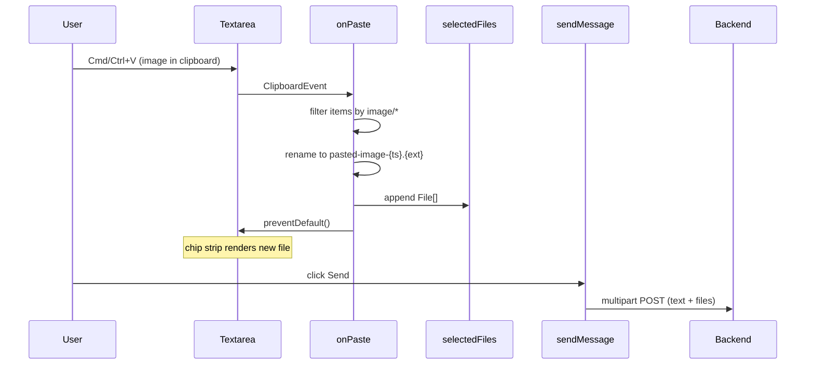

# Design: Paste Image Support in Chat Textarea

**Status:** accepted
**Author:** architect
**Date:** 2026-05-05
**Related issue:** #126
**Related design:** [attachment-management.md](./attachment-management.md)

## Context

Users frequently capture screenshots or copy images from another tool (browser, design app, terminal) and want to share them with an agent. Today they have to save the image to disk first, then click the file picker (📎) and select the file. That extra round-trip is friction for what should be a one-keystroke action.

The chat input lives in `frontend/src/views/TopicChat.vue`. The component already has a working file-attachment pipeline:

- `selectedFiles` ref holds pending `File` objects
- The 📎 button opens a hidden `<input type="file" multiple>` that pushes selected files into `selectedFiles`
- `sendMessage()` builds a `FormData`, appends every file as `files`, and POSTs to `/api/workspaces/:wsId/topics/:topicId/messages`
- The backend (per `attachment-management.md`) already accepts and stores image attachments and renders them inline in chat bubbles

The only missing piece is a path from the OS clipboard into `selectedFiles`. The browser exposes this via `ClipboardEvent.clipboardData.items` on `paste` events fired against an editable element — the existing textarea is already a valid paste target.

## Goals

- Pasting an image (Cmd/Ctrl+V) into the chat textarea adds it to `selectedFiles` so it ships on the next send, identically to a file-picker selection.
- Multiple images in a single paste event are all captured.
- Pasted images get a deterministic, sortable filename: `pasted-image-{ISO-timestamp}.{ext}` where `ext` is derived from the MIME type.
- Default browser paste behavior (inserting a binary blob or filename text into the textarea) is suppressed when at least one image was captured.
- Pasting plain text continues to work unchanged.

## Non-goals

- No clipboard image preview thumbnail in the file-chip strip beyond the existing filename chip — the existing chip UI is reused as-is.
- No drag-and-drop support (separate feature).
- No client-side image resizing, compression, or format conversion.
- No HEIC/AVIF or video-frame handling — restricted to whatever MIME types the browser surfaces under `image/*`.
- No backend changes. The upload contract is unchanged.
- No paste support outside the chat textarea (e.g. into the message list).

## Design

### Surface change

Add one event binding on the existing `<textarea>` in `TopicChat.vue`:

```html
<textarea
  v-model="text"
  placeholder="Type a message…"
  rows="3"
  :disabled="sending"
  @keydown.enter.exact.prevent="sendMessage"
  @paste="onPaste"
/>
```

### Handler

A new function `onPaste(evt)` in `<script setup>`:

```js
function onPaste(evt) {
  const items = evt.clipboardData?.items
  if (!items || !items.length) return

  const pastedImages = []
  for (const item of items) {
    if (item.kind !== 'file') continue
    if (!item.type || !item.type.startsWith('image/')) continue
    const file = item.getAsFile()
    if (!file) continue
    pastedImages.push(renamePastedImage(file))
  }

  if (pastedImages.length === 0) return  // no images — let default paste run for text
  evt.preventDefault()
  selectedFiles.value = [...selectedFiles.value, ...pastedImages]
}

function renamePastedImage(file) {
  const ext = mimeToExt(file.type) || 'png'
  const ts = new Date().toISOString().replace(/[:.]/g, '-')  // safe for filenames
  const name = `pasted-image-${ts}.${ext}`
  return new File([file], name, { type: file.type, lastModified: file.lastModified })
}

function mimeToExt(mime) {
  switch (mime) {
    case 'image/png':  return 'png'
    case 'image/jpeg': return 'jpg'
    case 'image/gif':  return 'gif'
    case 'image/webp': return 'webp'
    case 'image/bmp':  return 'bmp'
    case 'image/svg+xml': return 'svg'
    default:
      // image/foo → foo; otherwise fall back to png
      const m = /^image\/([a-z0-9.+-]+)$/i.exec(mime)
      return m ? m[1].split('+')[0] : 'png'
  }
}
```

Notes:

- `item.kind === 'file'` filters out the duplicate `text/plain` items that browsers sometimes include alongside an image (e.g. the source URL).
- `getAsFile()` can return `null` for some items; we skip those defensively.
- We rebuild the `File` with our own filename because the browser-supplied name is typically `image.png` for every paste, which would collide and is not informative.
- Replacing `:` and `.` in the timestamp keeps the filename safe on Windows and avoids confusing extension parsing on the server.
- We only call `preventDefault()` if at least one image was actually captured, so plain-text pastes (and mixed pastes that the user might still want as text) behave normally. In practice browsers do not deliver a useful text payload alongside a screenshot, so this is conservative.

### Flow



No state lives outside Vue refs; nothing async happens inside the handler; nothing needs unmounting.

## Alternatives considered

1. **Listen for `paste` on `document` / `window`.** Rejected — global listeners fire in contexts where the user is pasting elsewhere (e.g. into the URL bar, into the message detail panes), and risk swallowing pastes meant for other inputs. Scoping to the textarea is simpler and matches user intent.

2. **Convert pasted images to base64 data URLs and embed them in the message text.** Rejected — bypasses the attachment pipeline that the backend, agents, and chat-bubble rendering already support; bloats the message body; and breaks the existing `attachment-management.md` contract.

3. **Show a thumbnail preview in the chip strip for pasted images.** Deferred. The current chip UI shows filenames only and is consistent for both file-picker and paste paths. A thumbnail row is a separate UX improvement that should apply to both paths.

4. **Auto-send on paste.** Rejected — users typically paste an image *and then* type context. Auto-send would surprise users and prevent them from pasting multiple images into one message.

5. **Use `navigator.clipboard.read()` instead of the `ClipboardEvent`.** Rejected — requires async permission prompts on some browsers, has worse cross-browser support, and is unnecessary when the `paste` event already gives us synchronous access to clipboard data inside a user gesture.

## Open Questions

- [ ] Do we want a one-line toast or aria-live announcement when an image is captured ("1 image attached"), for accessibility? Default plan: no — the chip appearing in the strip is visible feedback, and screen-reader users will hear the textarea content unchanged because we suppress default paste. Owner: tester to flag during UAT if it feels off.
- [ ] Should we cap the size of a pasted image to surface a friendlier error than the backend's? Default plan: no — defer to whatever limit the backend enforces today; revisit if UAT shows confusing failure modes.

## Implementation Plan

Single PR on `topic/support-paste-images-3646392`:

1. Add `onPaste`, `renamePastedImage`, `mimeToExt` to `TopicChat.vue` `<script setup>`.
2. Wire `@paste="onPaste"` on the textarea.
3. Tests (authored by `tester` in parallel):
   - Unit: `mimeToExt` mapping (png/jpeg/gif/webp/svg/unknown → png).
   - Component: simulated `ClipboardEvent` with one `image/png` item appends one renamed file to `selectedFiles` and calls `preventDefault`.
   - Component: simulated event with two image items appends both.
   - Component: simulated event with only `text/plain` does not call `preventDefault` and does not touch `selectedFiles`.
   - UAT (manual): screenshot → paste into textarea on Chrome, Firefox, Safari → chip appears → Send → image renders in the bubble.
4. No backend, schema, or API changes.
