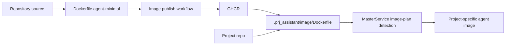

# Separate Base Agent Image Detailed Design

**Status:** proposed  
**Issue:** [#38](https://github.com/pandazxx/codex-slack/issues/38)  
**ADR:** [`docs/decisions/0002-separate-base-agent-image.md`](../decisions/0002-separate-base-agent-image.md)

## Goal

Define the detailed implementation design for separating and publishing a reusable base agent image that projects can extend safely.

This design covers:

- base image ownership and scope
- GHCR publication workflow
- project customization contract
- docs that project teams need in order to consume the image

## Product Decision

The canonical published agent base image should come from `Dockerfile.agent-minimal`.

Projects should customize agent runtime through:

- `.prj_assistant/image/Dockerfile`

In this design, "project specific manifest" means that repo-local Dockerfile contract, not a separate metadata file.

## Current State

The repository currently has:

- `Dockerfile`
  - broader runtime image
  - includes master-oriented tooling such as `podman`, `gh`, `jq`, and `make`
- `Dockerfile.agent-minimal`
  - leaner image closer to agent-worker needs

The docs already reference a published base image, but the workflow is not yet defined as a complete contract.

## Desired State

### Base image role

The base image should provide only the stable runtime needed by agent containers:

- Python runtime
- `codex` CLI
- `claude` CLI
- `git`
- `openssh-client`
- agent entrypoint
- Python dependencies required by `src.agent.main`

### Non-goals for the base image

Do not include master-only tooling by default:

- `podman`
- `podman-compose`
- `gh`
- `jq`
- `make`

Projects that need additional tools should extend the base image in their own `.prj_assistant/image/Dockerfile`.

## Architecture Boundary



## Publishing Design

### Registry target

Publish to:

- `ghcr.io/<owner>/codex-slack-agent-minimal`

### Tagging policy

Required tags:

- `sha-<commit>` for immutable traceability
- exact git tag mirrors, including release candidates
- `latest` for default branch publication

### Trigger policy

Recommended workflow triggers:

- pushes to default branch affecting agent runtime/image inputs
- git tags for release and RC builds
- manual dispatch for rebuilds

### Build inputs

Workflow should build from:

- `Dockerfile.agent-minimal`

Not from:

- `Dockerfile`

### Metadata

Publish image metadata including:

- source repository
- commit SHA
- git tag when present
- build timestamp

## Project Customization Contract

### Required path

Project repos should customize through:

- `.prj_assistant/image/Dockerfile`

### Required `FROM`

Example:

```dockerfile
FROM ghcr.io/<owner>/codex-slack-agent-minimal:<tag>
```

### Allowed customization

- install OS packages
- install project CLIs or language runtimes
- add project-specific support libraries

### Discouraged customization

- replacing the entrypoint
- changing the worker startup command
- changing workspace or home-directory assumptions

## Runtime Invariants

Project images built from the base must preserve:

- `/workspace` workspace mount contract
- `/workspace/repo` checkout location
- `/workspace/home` effective home directory
- `CODEX_CONTAINER_MODE=agent-worker`
- entrypoint behavior from `docker/entrypoint.sh`

If a project must break one of these invariants, it should be treated as a non-standard image and documented separately.

## Master Integration

The existing image-plan logic already detects:

- `.prj_assistant/image/Dockerfile`

That means the base-image separation does not require a new project image manifest format.

The master-side contract remains:

- default-image agents use `MASTER_AGENT_BASE_IMAGE`
- project-customized agents use repo-local Dockerfiles

## Documentation Deliverables

Implementation should produce or update:

1. project-facing guide for using the base image
2. clear example `.prj_assistant/image/Dockerfile`
3. guidance on choosing between `latest`, RC tags, and `sha-*` tags
4. explanation of which runtime invariants must be preserved
5. clarification that "project specific manifest" means `.prj_assistant/image/Dockerfile`

Recommended doc touch points:

- [`docs/guides/tutorials.md`](../guides/tutorials.md)
- [`docs/guides/container-runtime.md`](../guides/container-runtime.md)
- [`docs/guides/runbooks/master-agent.md`](../guides/runbooks/master-agent.md)
- FAQ entry if needed

## CI/CD Design

### Workflow responsibilities

- build the base image
- log in to GHCR
- publish required tags
- optionally emit a summary with pushed image references

### Inputs and secrets

- GitHub Actions token or package publish credentials
- repository owner/org context

### Validation

The workflow should verify:

- image builds successfully from `Dockerfile.agent-minimal`
- `python -m src.agent.main` remains runnable
- expected CLIs exist in the image

## Test and Verification Plan

### Automated

- build test for `Dockerfile.agent-minimal`
- smoke check that `codex` and `claude` binaries exist
- smoke check that entrypoint can launch `src.agent.main`
- image tag calculation tests if implemented in scripts

### Manual / UAT

- project extends the base image via `.prj_assistant/image/Dockerfile`
- master loads and starts an agent using the project image path
- agent still honors auth/config injection and workspace layout

## Rollout Plan

Recommended delivery order:

1. finalize base image package contents
2. add GHCR publication workflow
3. update docs with project consumption guidance
4. verify one sample project image build from the published base

## Open Questions

- should `latest` track only default branch, or only accepted releases?
- should GHCR publication include both public and internal/private package guidance?
- do we want a sample project repo or only in-repo docs/examples?
