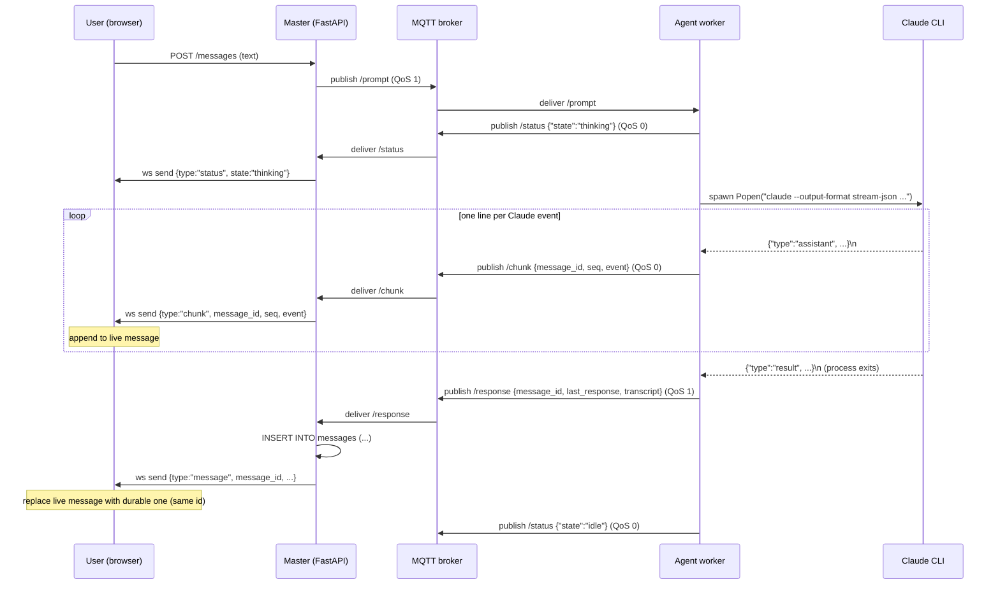

# Design: Streaming Agent Reply

**Status:** draft
**Author:** architect
**Date:** 2026-05-05
**Related ADRs:** [ADR-0011](../decisions/0011-streaming-agent-reply.md), [ADR-0005 v3 architecture](../decisions/0005-v3-system-architecture.md)

## Problem Statement

Agent replies are delivered as a single MQTT message after the Claude
subprocess finishes. Long replies (or replies involving tool calls) can take
tens of seconds to minutes; the user sees nothing until the very end. We want
incremental rendering so the UI shows the agent "typing" — text deltas, tool
calls, and tool results — as Claude emits them.

## Goals

- First visible chunk in the browser within ~1s of Claude producing its first
  `assistant` event.
- No change to the durable storage contract: the DB still receives one row
  per agent message, written from the existing `/response` MQTT path.
- Same wire format as today's transcript (Claude `stream-json` events), so
  the frontend transcript renderer is reused for both live and historical
  views.
- Additive change: if any new component fails, the system degrades to
  today's "single-shot reply" behaviour.

## Non-Goals

- Replay on browser reconnect mid-stream. A reconnecting client sees the
  `thinking` status and then the final `response`. (Defer to a future ADR
  if needed.)
- Cancellation of an in-flight Claude run. Touching `Popen` makes this
  cheaper to add later but is out of scope here.
- Streaming for the Codex adapter. Codex is request/response and not in
  current product focus; the design accommodates it but does not implement
  it.
- Backpressure-aware delivery to slow clients. Chunks are best-effort; the
  authoritative final message repairs any visual gap.

## Proposed Design

### High-level flow



### Component changes

#### 1. Agent (`src/agent/mqtt_loop.py`)

Two new helpers; `_run_claude_once` becomes a thin wrapper around them:

```python
def _chunk_topic(workspace_id: str, topic_id: str) -> str:
    return f"codex-slack/workspace/{workspace_id}/topic/{topic_id}/chunk"


def _stream_claude_once(
    client: mqtt.Client,
    workspace_id: str,
    topic_id: str,
    reply_message_id: str,        # generated by caller; chunks + response share this id
    agent_name: str,
    worktree: str,
    text: str,
    session_id: str | None,
    is_new_session: bool,
    subagent: str | None,
    model: str | None,
    system_prompt: str | None,
) -> tuple[str, str | None, str | None, bool]:
    """Run Claude streaming chunks via MQTT. Returns (output, new_sid, transcript, is_error)."""
    cmd = [...same as today...]
    chunk_topic = _chunk_topic(workspace_id, topic_id)
    events: list[dict] = []
    new_session_id: str | None = None
    output: str | None = None
    is_error = False
    seq = 0
    proc = subprocess.Popen(
        cmd, cwd=worktree,
        stdout=subprocess.PIPE, stderr=subprocess.PIPE,
        text=True, bufsize=1,            # line-buffered
    )
    try:
        for line in proc.stdout:                 # blocking line iteration
            line = line.strip()
            if not line:
                continue
            try:
                event = json.loads(line)
            except (json.JSONDecodeError, ValueError):
                continue
            events.append(event)
            client.publish(chunk_topic, json.dumps({
                "message_id": reply_message_id,
                "agent_name": agent_name,
                "seq": seq,
                "event": event,
            }), qos=0)
            seq += 1
            if event.get("type") == "result":
                new_session_id = event.get("session_id")
                output = event.get("result") or event.get("last_response")
                is_error = bool(event.get("is_error"))
        proc.wait()
        if not output:
            err = (proc.stderr.read() or "").strip()
            output = err or "(no output)"
        transcript = json.dumps(events) if events else None
        return output, new_session_id, transcript, is_error
    except FileNotFoundError:
        return "(claude CLI not found in agent container)", None, None, True
    except Exception as exc:
        try:
            proc.kill()
        finally:
            return f"(claude error: {exc})", None, None, True
```

`_process_prompt` (lines 160-243) needs three changes:

1. Generate `reply_message_id = str(uuid.uuid4())` **before** invoking the
   adapter (today it is generated at line 234, after the run).
2. Pass `client`, `workspace_id`, `topic_id`, `reply_message_id`,
   `agent_name` into `_run_claude` (and through to `_stream_claude_once`).
3. Use `reply_message_id` in the existing `/response` publish.

Codex adapter (`_run_codex`) is unchanged. Codex emits no streaming events;
the response arrives as one `/response` message exactly as today. If we ever
want streaming for Codex, the same `/chunk` topic is available.

Session-expiry retry path (`_run_claude`, lines 126-143) keeps working
unchanged: the second attempt streams its own chunks under the same
`reply_message_id`. The frontend will see the (truncated) first attempt's
chunks discarded when the second attempt's chunks overwrite by `seq` order.
This is acceptable cosmetic noise on a rare error path.

#### 2. Master (`src/master/mqtt_client.py`)

Add the chunk topic to the subscription list and a third branch in
`_on_message`:

```python
_CHUNK_TOPIC = "codex-slack/workspace/+/topic/+/chunk"

# in _on_connect:
client.subscribe(_CHUNK_TOPIC, qos=0)

# in _on_message:
if msg_type == "chunk":
    message = {"type": "chunk", **payload}   # message_id, seq, event, agent_name
    # NO db write — chunks are ephemeral
elif msg_type == "status":
    ...
elif msg_type == "response":
    ...
```

`ws_hub.ConnectionHub` requires no change — it is content-agnostic.

#### 3. Frontend (`frontend/src/views/TopicChat.vue`)

State:

```js
// keyed by message_id; values are { events: [], text: '', placeholder: true }
const liveStreams = ref({})
```

WebSocket handler (replace lines 176-189):

```js
ws.onmessage = (evt) => {
  const data = JSON.parse(evt.data)
  if (data.type === 'status') {
    agentStatus.value = data.state || ''
  } else if (data.type === 'chunk') {
    handleChunk(data)
  } else if (data.type === 'message') {
    // Final authoritative message — replace any live placeholder with same id
    const existingIdx = messages.value.findIndex(m => m.id === data.message_id)
    const finalMsg = {
      id: data.message_id,
      sender: data.sender || 'agent',
      agent_name: data.agent_name || null,
      text: data.last_response || data.text || '',
      transcript: data.transcript || null,
      created_at: new Date().toISOString(),
    }
    if (existingIdx >= 0) messages.value.splice(existingIdx, 1, finalMsg)
    else messages.value.push(finalMsg)
    delete liveStreams.value[data.message_id]
    scrollToBottom()
  }
}

function handleChunk({ message_id, agent_name, event }) {
  let live = liveStreams.value[message_id]
  if (!live) {
    live = { events: [], text: '' }
    liveStreams.value[message_id] = live
    messages.value.push({
      id: message_id,
      sender: 'agent',
      agent_name: agent_name || null,
      text: '',
      transcript: null,                          // built lazily below
      created_at: new Date().toISOString(),
      streaming: true,                            // flag for UI cue (cursor, spinner)
    })
  }
  live.events.push(event)
  if (event.type === 'assistant' && event.message?.content) {
    for (const blk of event.message.content) {
      if (blk.type === 'text' && blk.text) live.text += blk.text
    }
  }
  // mutate the placeholder message in place
  const msg = messages.value.find(m => m.id === message_id)
  if (msg) {
    msg.text = live.text
    msg.transcript = JSON.stringify(live.events)  // re-serialise for the same renderer
  }
  scrollToBottom()
}
```

Optional CSS cue: `.message.agent.streaming .bubble::after { content: '▍'; animation: blink 1s steps(2) infinite; }` so users see a cursor while the stream is open. Add a `streaming` flag in the v-bind class.

### Wire formats

#### `/chunk` MQTT payload

```json
{
  "message_id": "9c2b…",
  "agent_name": "claude",
  "seq": 7,
  "event": {
    "type": "assistant",
    "message": { "role": "assistant", "content": [{ "type": "text", "text": "Hello" }] }
  }
}
```

#### WebSocket frame to browser

```json
{
  "type": "chunk",
  "message_id": "9c2b…",
  "agent_name": "claude",
  "seq": 7,
  "event": { ... raw stream-json event ... }
}
```

#### `/response` MQTT payload (unchanged)

```json
{
  "message_id": "9c2b…",
  "agent_name": "claude",
  "reply_to": "1f0e…",
  "last_response": "Hello, world.",
  "transcript": "[ ... full event array ... ]",
  "session_id": "…"
}
```

The `message_id` in `/response` matches the `message_id` used in chunks —
this is what enables the "replace placeholder" step on the frontend.

### Failure modes and behaviour

| Failure                              | Behaviour                                                              |
|--------------------------------------|------------------------------------------------------------------------|
| Chunk dropped by broker (QoS 0)       | Visible gap until next chunk; final `/response` repairs the transcript |
| Browser disconnects mid-stream        | Live placeholder lost; on reconnect, no replay; `/response` arrives next |
| Browser connects mid-stream           | No replay; sees `thinking` status, then final `response` (today's UX)   |
| Claude exits non-zero                 | `/chunk` may have already published partial events; final `/response` carries `is_error: true`; frontend overwrites placeholder with the error message |
| Agent crashes between chunks and `/response` | Live placeholder remains on screen with `streaming: true`. Master MQTT reconnect logic re-delivers the prompt to the next agent. **Operator-visible bug**: stale placeholder until next message arrives. Acceptable for v1; track in lessons-learned. |
| Master restarts mid-stream            | Master loses in-flight chunk subscription; agent keeps publishing to `/chunk` (QoS 0, no retain) — those chunks are discarded by the broker. Final `/response` (QoS 1) is queued and delivered when master reconnects. Conversation persists faithfully. |
| Two clients on the same topic         | Both see the same chunks; both apply the same `replace placeholder` step. No coordination needed. |

### Backpressure

- Agent → broker: paho QoS 0 publish is non-blocking and uses an internal
  in-memory queue; if it fills, paho drops. Acceptable.
- Broker → master: master's MQTT client runs in its own thread (`loop_start`)
  and `_on_message` does only a JSON parse + `broadcast_threadsafe` for the
  chunk path. No DB I/O. The hot path is microseconds.
- Master → browser: `ws.send_json` is awaited per-client inside
  `ConnectionHub.broadcast`. A slow client will slow that one client's
  broadcast loop; the hub catches exceptions and discards dead sockets. We
  judge this acceptable for the single-user, self-hosted threat model
  (ADR-0009 §threat model). If a real bottleneck emerges we add
  `asyncio.wait_for(..., 1.0)` and drop the slow client.

### Configuration

No new config keys. Streaming is always on. (We could gate it behind
`STREAMING_ENABLED` if rollout risk is a concern, but the additive design
makes that unnecessary.)

### Observability

- Agent log line per stream: `agent.llm_chunk topic_id=… seq=… type=…`
  (downgraded to DEBUG to avoid log flood; INFO summary at end:
  `agent.llm_done chunks=N chars=…`).
- Master log line per chunk forwarded: DEBUG only.
- Existing `agent.llm_start` / `agent.llm_done` / `mqtt.message` lines are
  preserved.

## Alternatives Considered

See [ADR-0011](../decisions/0011-streaming-agent-reply.md) for the full
options table. Summary:

- *Option 2 — extend `/status` with stream-json* — rejected: conflates
  lifecycle and content semantics, complicates routing.
- *Option 3 — replace WebSocket with SSE* — rejected: transport rewrite for
  no streaming-specific gain.
- *Option 4 — persist each chunk to SQLite* — rejected: huge write
  amplification, still needs a push channel.

## Open Questions

- [ ] Should we add a small "first-chunk seen" log line on the master to
      help measure agent→browser latency in practice? (owner: sre)
- [ ] Do we want a CSS cursor on streaming bubbles, or is the `thinking`
      status pill in the header enough? (owner: doc-writer / UX call)
- [ ] When the session-expiry retry path fires, the frontend will see two
      streams under the same `message_id`. The proposed re-serialise of
      `live.events` makes the second stream simply append to the first.
      Is that the desired UX, or should we reset the placeholder when
      the second `system/init` arrives? (owner: tester to author UAT)

## Implementation Plan

Phase 1 — agent streaming (1 PR):

1. Refactor `_run_claude_once` → `_stream_claude_once` using `Popen`.
2. Generate reply `message_id` upfront in `_process_prompt`.
3. Add `_chunk_topic` and per-line publish at QoS 0.
4. Unit tests with a fake Popen yielding scripted lines.

Phase 2 — master forwarding (same PR or follow-up):

1. Subscribe to `_CHUNK_TOPIC` in `mqtt_client._on_connect`.
2. Add `chunk` branch in `_on_message` (no DB write).

Phase 3 — frontend live rendering (same PR or follow-up):

1. Add `liveStreams` state and `handleChunk` to `TopicChat.vue`.
2. Add `streaming` class hook for the cursor cue.
3. Wire the placeholder-replace step to `type: 'message'` handler.

Phase 4 — UAT and docs:

1. Test plan in `docs/test-plans/streaming-agent-reply.md`.
2. Lesson entry once shipped: cover the "agent crash leaves stale
   placeholder" caveat.
