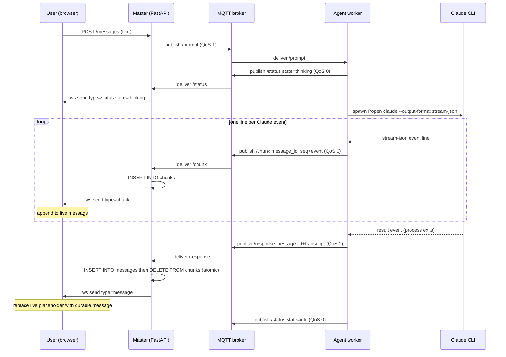
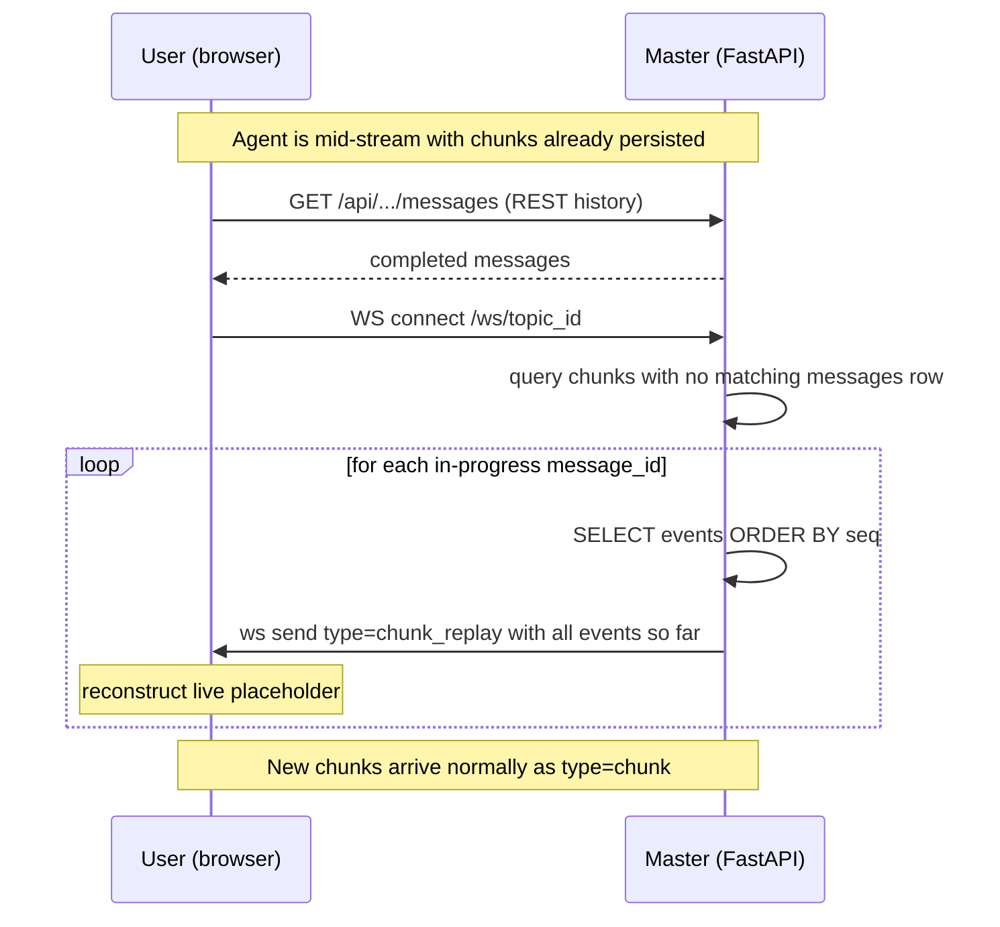

# Design: Streaming Agent Reply

**Status:** draft
**Author:** architect
**Date:** 2026-05-05
**Related ADRs:** [ADR-0011](../decisions/0011-streaming-agent-reply.md), [ADR-0005 v3 architecture](../decisions/0005-v3-system-architecture.md)

## Problem Statement

Agent replies are delivered as a single MQTT message after the Claude
subprocess finishes. Long replies (or replies involving tool calls) can take
tens of seconds to minutes; the user sees nothing until the very end. We want
incremental rendering so the UI shows the agent "typing" — text deltas, tool
calls, and tool results — as Claude emits them.

## Goals

- First visible chunk in the browser within ~1s of Claude producing its first
  `assistant` event.
- No change to the durable `messages` schema: the existing `/response` MQTT
  path still produces exactly one row per finished agent message.
- Same wire format as today's transcript (Claude `stream-json` events), so
  the frontend transcript renderer is reused for both live and historical
  views.
- Browser refresh, WS reconnect, or laptop sleep during a long agent run
  restores the partial reply within ~1s of reconnect, by replaying chunks
  that the master has persisted to a new ephemeral `chunks` table.
- Additive change: if streaming or replay fails, the system degrades to
  today's "single-shot reply" behaviour.

## Non-Goals

- Cancellation of an in-flight Claude run. Touching `Popen` makes this
  cheaper to add later but is out of scope here.
- Streaming for the Codex adapter. Codex is request/response and not in
  current product focus; the design accommodates it but does not implement
  it.
- Backpressure-aware delivery to slow clients. Chunks are best-effort on the
  wire; the authoritative final message repairs any visual gap.
- Cross-master replay (multiple master instances sharing a chunk store). The
  product is single-master; a master crash is handled by the TTL sweep, not
  by failover.

## Proposed Design

### High-level flow



### Reconnect / refresh flow



### Schema change

Add an ephemeral `chunks` table to the SQLite schema in `src/master/db.py`.
Append the following to `_SCHEMA` and add `"chunks"` to `TABLES`:

```sql
CREATE TABLE IF NOT EXISTS chunks (
    id          INTEGER PRIMARY KEY AUTOINCREMENT,
    message_id  TEXT NOT NULL,
    topic_id    TEXT NOT NULL,
    seq         INTEGER NOT NULL,       -- monotonically increasing per message_id
    event       TEXT NOT NULL,          -- raw stream-json event JSON
    created_at  REAL NOT NULL DEFAULT (unixepoch('now','subsec'))
);
CREATE INDEX IF NOT EXISTS idx_chunks_message ON chunks (message_id, seq);
CREATE INDEX IF NOT EXISTS idx_chunks_topic ON chunks (topic_id);
CREATE INDEX IF NOT EXISTS idx_chunks_created ON chunks (created_at);
```

Notes on the schema:

- No FK on `message_id` — the matching `messages` row is created **after**
  the last chunk arrives, so a FK would be violated for the entire stream.
- `topic_id` is denormalised onto the row so the WS-connect replay query
  can scope by topic without a join.
- `seq` is supplied by the agent (the per-message counter incremented in
  `_stream_claude_once`); the master trusts it. The composite index
  `(message_id, seq)` makes ordered replay an O(N) range scan.
- `created_at` is REAL (sub-second unix epoch) for cheap TTL comparison.
- No new migration entry needed in `_MIGRATIONS` — `init_db` runs
  `executescript(_SCHEMA)` with `IF NOT EXISTS`, which creates the table on
  fresh and existing DBs alike.

### Component changes

#### 1. Agent (`src/agent/mqtt_loop.py`)

Two new helpers; `_run_claude_once` becomes a thin wrapper around them:

```python
def _chunk_topic(workspace_id: str, topic_id: str) -> str:
    return f"codex-slack/workspace/{workspace_id}/topic/{topic_id}/chunk"


def _stream_claude_once(
    client: mqtt.Client,
    workspace_id: str,
    topic_id: str,
    reply_message_id: str,        # generated by caller; chunks + response share this id
    agent_name: str,
    worktree: str,
    text: str,
    session_id: str | None,
    is_new_session: bool,
    subagent: str | None,
    model: str | None,
    system_prompt: str | None,
) -> tuple[str, str | None, str | None, bool]:
    """Run Claude streaming chunks via MQTT. Returns (output, new_sid, transcript, is_error)."""
    cmd = [...same as today...]
    chunk_topic = _chunk_topic(workspace_id, topic_id)
    events: list[dict] = []
    new_session_id: str | None = None
    output: str | None = None
    is_error = False
    seq = 0
    proc = subprocess.Popen(
        cmd, cwd=worktree,
        stdout=subprocess.PIPE, stderr=subprocess.PIPE,
        text=True, bufsize=1,            # line-buffered
    )
    try:
        for line in proc.stdout:                 # blocking line iteration
            line = line.strip()
            if not line:
                continue
            try:
                event = json.loads(line)
            except (json.JSONDecodeError, ValueError):
                continue
            events.append(event)
            client.publish(chunk_topic, json.dumps({
                "message_id": reply_message_id,
                "agent_name": agent_name,
                "seq": seq,
                "event": event,
            }), qos=0)
            seq += 1
            if event.get("type") == "result":
                new_session_id = event.get("session_id")
                output = event.get("result") or event.get("last_response")
                is_error = bool(event.get("is_error"))
        proc.wait()
        if not output:
            err = (proc.stderr.read() or "").strip()
            output = err or "(no output)"
        transcript = json.dumps(events) if events else None
        return output, new_session_id, transcript, is_error
    except FileNotFoundError:
        return "(claude CLI not found in agent container)", None, None, True
    except Exception as exc:
        try:
            proc.kill()
        finally:
            return f"(claude error: {exc})", None, None, True
```

`_process_prompt` (lines 160-243) needs three changes:

1. Generate `reply_message_id = str(uuid.uuid4())` **before** invoking the
   adapter (today it is generated at line 234, after the run).
2. Pass `client`, `workspace_id`, `topic_id`, `reply_message_id`,
   `agent_name` into `_run_claude` (and through to `_stream_claude_once`).
3. Use `reply_message_id` in the existing `/response` publish.

Codex adapter (`_run_codex`) is unchanged. Codex emits no streaming events;
the response arrives as one `/response` message exactly as today. If we ever
want streaming for Codex, the same `/chunk` topic is available.

Session-expiry retry path (`_run_claude`, lines 126-143) is amended:

1. **Agent** — before starting the second attempt, publish one special chunk:
   ```python
   client.publish(chunk_topic, json.dumps({
       "message_id": reply_message_id,
       "agent_name": agent_name,
       "seq": seq,
       "event": {"type": "system", "subtype": "retry"},
   }), qos=0)
   seq += 1
   ```
   Then delete all prior chunks for this `message_id` from the broker side
   is not possible (QoS 0, no retain), but the master should delete them from
   the DB before the second stream starts — publish a `/chunk_reset` signal
   or, simpler: the agent publishes the `retry` event and increments `seq`
   continuously so the master can detect the `retry` subtype and issue the
   DELETE itself.

   Simplest implementation: agent publishes the `retry` event as a normal
   chunk; master's `_on_message` chunk branch detects
   `event.type == "system" and event.subtype == "retry"` and executes
   `DELETE FROM chunks WHERE message_id = ?` before inserting the retry
   event itself. The `seq` counter is **not** reset — it continues, so
   replay ordering is unambiguous.

2. **Frontend** — on receiving a chunk whose `event` is
   `{type: "system", subtype: "retry"}`, reset the live placeholder's
   activity rows and show a one-line notice:

   ```js
   if (event.type === 'system' && event.subtype === 'retry') {
     live.rows = [{ kind: 'retry_notice', event }]
     live.text = ''
     const msg = messages.value.find(m => m.id === message_id)
     if (msg) { msg.rows = live.rows; msg.text = '' }
     return
   }
   ```

   The `retry_notice` kind renders as a muted inline line inside the bubble:

   ```
   ⟳ Session expired — retrying…
   ```

   This line stays visible in the activity list (and in the folded trace after
   completion) so the user knows a retry happened, but it does not interrupt
   the reply text zone.

#### 2. Master (`src/master/mqtt_client.py`)

Add the chunk topic to the subscription list and a third branch in
`_on_message`. The chunk branch INSERTs into `chunks` and broadcasts; the
response branch is amended to DELETE the matching chunk rows in the same
transaction that writes the durable message.

```python
_CHUNK_TOPIC = "codex-slack/workspace/+/topic/+/chunk"

# in _on_connect:
client.subscribe(_CHUNK_TOPIC, qos=0)

# new helper:
def _save_chunk(db_path: str, topic_id: str, payload: dict) -> None:
    try:
        conn = sqlite3.connect(db_path)
        try:
            conn.execute(
                "INSERT INTO chunks (message_id, topic_id, seq, event)"
                " VALUES (?, ?, ?, ?)",
                (payload["message_id"], topic_id, payload["seq"],
                 json.dumps(payload["event"])),
            )
            conn.commit()
        finally:
            conn.close()
    except Exception:
        # Persistence failure must not break the live broadcast path.
        LOGGER.exception("mqtt.save_chunk_error topic_id=%s", topic_id)

# in _on_message:
if msg_type == "chunk":
    db_path = userdata.get("db_path")
    if db_path:
        _save_chunk(db_path, topic_id, payload)
    message = {"type": "chunk", **payload}   # message_id, seq, event, agent_name
elif msg_type == "status":
    ...
elif msg_type == "response":
    db_path = userdata.get("db_path")
    if db_path:
        _save_agent_response(db_path, topic_id, payload)   # now also deletes chunks
    message = {"type": "message", "sender": "agent", **payload}
```

The existing `_save_agent_response` is amended to delete chunks atomically
with the message insert:

```python
# inside _save_agent_response, replacing the single execute:
with conn:                                    # implicit BEGIN/COMMIT
    conn.execute(
        "INSERT OR IGNORE INTO messages (...) VALUES (...)",
        (...),
    )
    conn.execute("DELETE FROM chunks WHERE message_id = ?", (message_id,))
    if llm_session_id and agent_name:
        conn.execute("UPDATE sessions SET llm_session_id=?, updated_at=? ...", (...))
```

#### 2b. Master WebSocket connect — replay (`src/master/main.py`)

Today's `ws_endpoint` accepts the connection and registers it with the hub.
It needs one new step: query for in-progress message_ids on this topic and
emit a `chunk_replay` frame for each.

```python
@app.websocket("/ws/{topic_id}")
async def ws_endpoint(topic_id: str, websocket: WebSocket) -> None:
    await websocket.accept()
    app.state.hub.connect(topic_id, websocket)
    try:
        await _replay_in_progress_chunks(websocket, topic_id, app.state.db_path)
        while True:
            await websocket.receive_text()
    except WebSocketDisconnect:
        pass
    finally:
        app.state.hub.disconnect(topic_id, websocket)


async def _replay_in_progress_chunks(ws: WebSocket, topic_id: str, db_path: str) -> None:
    def _query() -> list[tuple[str, list[dict]]]:
        conn = sqlite3.connect(db_path)
        conn.row_factory = sqlite3.Row
        try:
            ids = [r["message_id"] for r in conn.execute(
                "SELECT DISTINCT c.message_id FROM chunks c"
                " LEFT JOIN messages m ON m.id = c.message_id"
                " WHERE c.topic_id = ? AND m.id IS NULL",
                (topic_id,),
            ).fetchall()]
            out: list[tuple[str, list[dict]]] = []
            for mid in ids:
                rows = conn.execute(
                    "SELECT event FROM chunks WHERE message_id = ? ORDER BY seq",
                    (mid,),
                ).fetchall()
                out.append((mid, [json.loads(r["event"]) for r in rows]))
            return out
        finally:
            conn.close()

    # SQLite call is sync; run in default executor to avoid blocking the loop.
    streams = await asyncio.get_running_loop().run_in_executor(None, _query)
    for message_id, events in streams:
        if not events:
            continue
        await ws.send_json({
            "type": "chunk_replay",
            "message_id": message_id,
            "events": events,
        })
```

Notes:

- The `LEFT JOIN messages` filter is what defines "in progress": chunks
  exist but no durable message row does. After `/response` arrives those
  chunks are deleted, so a finished message never replays.
- Replay is per-connection — every fresh WS connection on the topic gets
  the same replay independently. Two browsers on the same topic both see
  it; this is the desired behaviour.
- The `agent_name` is intentionally absent from the replay frame — it is
  carried in the live `chunk` payload but not stored per row. The frontend
  can derive it from any `system/init` event in `events`. (If we want
  cheaper UX, store `agent_name` on the row in v2.)

`ws_hub.ConnectionHub` requires no change — it is content-agnostic.

#### 3. Frontend (`frontend/src/views/TopicChat.vue`)

##### Visual structure

During streaming, each agent reply is a single message bubble containing two
zones stacked vertically:

```
┌─────────────────────────────────────────────────┐
│  ⚙ Bash: git log --oneline -5                   │  ← activity rows
│  📄 Read: src/master/db.py                       │    (live, scrolling)
│  ↳ Running git log --oneline                     │
│  🤖 Agent: Exploring codebase structure          │
│  ↳ Reading src/master/mqtt_client.py             │
│  ···                                             │  ← folded tool_result
│                                                  │
│  The exploration reveals great news: almost all  │  ← text zone
│  the infrastructure is already in place…▍        │    (cursor while streaming)
└─────────────────────────────────────────────────┘
```

When the final `/response` arrives, the activity rows are **folded** into a
single collapsed toggle, leaving only the clean reply text:

```
┌─────────────────────────────────────────────────┐
│  ▶ Show trace (47 steps)                         │  ← collapsed, click to expand
│                                                  │
│  The exploration reveals great news: almost all  │  ← reply text (unchanged)
│  the infrastructure is already in place…         │
└─────────────────────────────────────────────────┘
```

Clicking `▶ Show trace` expands it back to the full activity list in-place.

##### State

```js
// keyed by message_id; values are { rows: [], text: '', traceOpen: false }
// rows: classified render items (see classifyEvent below)
const liveStreams = ref({})
```

##### WebSocket handler

```js
ws.onmessage = (evt) => {
  const data = JSON.parse(evt.data)
  if (data.type === 'status') {
    agentStatus.value = data.state || ''
  } else if (data.type === 'chunk') {
    handleChunk(data)
  } else if (data.type === 'chunk_replay') {
    for (const event of data.events) {
      handleChunk({ message_id: data.message_id, agent_name: data.agent_name, event })
    }
  } else if (data.type === 'message') {
    finaliseMessage(data)
  }
}
```

##### `handleChunk` — build the live bubble

```js
function handleChunk({ message_id, agent_name, event }) {
  let live = liveStreams.value[message_id]
  if (!live) {
    live = { rows: [], text: '', traceOpen: false }
    liveStreams.value[message_id] = live
    messages.value.push({
      id: message_id,
      sender: 'agent',
      agent_name: agent_name || null,
      text: '',
      rows: live.rows,        // reactive reference — rows update in place
      streaming: true,
      traceOpen: false,
      created_at: new Date().toISOString(),
    })
  }

  const kind = classifyEvent(event)
  if (kind === 'text') {
    for (const blk of event.message?.content || []) {
      if (blk.type === 'text') live.text += blk.text
    }
    const msg = messages.value.find(m => m.id === message_id)
    if (msg) msg.text = live.text
  } else if (kind !== 'hidden') {
    // activity row — push into the shared rows array (reactive in the message object)
    live.rows.push({ kind, event })
  }

  scrollToBottom()
}
```

##### `finaliseMessage` — fold the trace, replace with durable message

`traceRows` is derived from `data.transcript` (the full event array carried
in the `/response` payload), **not** from the in-memory `live.rows`. This
ensures the same code path works in every situation: current session, after
browser refresh, and for historical messages loaded via REST — in all cases
the source of truth is the `transcript` JSON stored in the `messages` row.

```js
function transcriptToRows(transcriptJson) {
  if (!transcriptJson) return []
  try {
    return JSON.parse(transcriptJson)
      .map(event => ({ kind: classifyEvent(event), event }))
      .filter(r => r.kind !== 'hidden')
  } catch { return [] }
}

function finaliseMessage(data) {
  const existingIdx = messages.value.findIndex(m => m.id === data.message_id)

  const finalMsg = {
    id: data.message_id,
    sender: data.sender || 'agent',
    agent_name: data.agent_name || null,
    text: data.last_response || data.text || '',
    transcript: data.transcript || null,
    // Derive trace rows from transcript JSON — survives refresh and history load
    traceRows: transcriptToRows(data.transcript),
    traceOpen: false,
    streaming: false,
    created_at: new Date().toISOString(),
  }

  if (existingIdx >= 0) messages.value.splice(existingIdx, 1, finalMsg)
  else messages.value.push(finalMsg)

  delete liveStreams.value[data.message_id]
  scrollToBottom()
}
```

Historical messages loaded from `GET .../messages` (REST) go through the
same `transcriptToRows` call at render time — the template receives the same
`traceRows` shape regardless of whether the message arrived live or from
history.

##### Template sketch (message bubble component)

```html
<div class="message agent" :class="{ streaming: msg.streaming }">
  <!-- Trace section -->
  <template v-if="msg.streaming && msg.rows?.length">
    <!-- Live: show all activity rows -->
    <div class="trace-row" v-for="(row, i) in msg.rows" :key="i">
      <span v-if="row.kind === 'tool_use'">{{ toolUseLabel(row.event) }}</span>
      <span v-else-if="row.kind === 'task_progress'">↳ {{ row.event.description }}</span>
      <span v-else-if="row.kind === 'task_started'">🚀 {{ row.event.description }}</span>
      <details v-else-if="row.kind === 'folded'"><summary>···</summary>
        <pre>{{ JSON.stringify(row.event, null, 2) }}</pre>
      </details>
    </div>
  </template>
  <template v-else-if="!msg.streaming && msg.traceRows?.length">
    <!-- Finished: collapsed toggle -->
    <details :open="msg.traceOpen" @toggle="msg.traceOpen = $event.target.open">
      <summary>▶ Show trace ({{ msg.traceRows.length }} steps)</summary>
      <div class="trace-row" v-for="(row, i) in msg.traceRows" :key="i">
        <!-- same row rendering as above -->
      </div>
    </details>
  </template>

  <!-- Reply text (always visible) -->
  <MarkdownMessage :text="msg.text" />

  <!-- Streaming cursor -->
  <span v-if="msg.streaming" class="cursor">▍</span>
</div>
```

Ordering note: the REST `GET .../messages` history call (`fetch` at
`TopicChat.vue:162`) must complete and populate `messages.value` before the
WS `chunk_replay` frame is processed. The existing flow already opens the
WebSocket after the history fetch resolves — keep it that way.

The `transcript` field in the `messages` DB row is the single source of truth
for the trace. The `chunks` table is only used during an active stream; once
`/response` arrives and the chunks are deleted, everything the user needs to
expand "Show trace" is already in `transcript`.

### Wire formats

#### `/chunk` MQTT payload

```json
{
  "message_id": "9c2b…",
  "agent_name": "claude",
  "seq": 7,
  "event": {
    "type": "assistant",
    "message": { "role": "assistant", "content": [{ "type": "text", "text": "Hello" }] }
  }
}
```

#### WebSocket `chunk` frame to browser

```json
{
  "type": "chunk",
  "message_id": "9c2b…",
  "agent_name": "claude",
  "seq": 7,
  "event": { ... raw stream-json event ... }
}
```

#### WebSocket `chunk_replay` frame to browser (new)

Sent once per in-progress `message_id` immediately after a WebSocket
connect/reconnect, before any further live `chunk` frames for that id.

```json
{
  "type": "chunk_replay",
  "message_id": "9c2b…",
  "events": [
    { "type": "system", "subtype": "init", "agent_name": "claude", ... },
    { "type": "assistant", "message": { "content": [{ "type": "text", "text": "Hel" }] } },
    { "type": "assistant", "message": { "content": [{ "type": "text", "text": "lo" }] } }
  ]
}
```

#### `/response` MQTT payload (unchanged)

```json
{
  "message_id": "9c2b…",
  "agent_name": "claude",
  "reply_to": "1f0e…",
  "last_response": "Hello, world.",
  "transcript": "[ ... full event array ... ]",
  "session_id": "…"
}
```

The `message_id` in `/response` matches the `message_id` used in chunks —
this is what enables the "replace placeholder" step on the frontend.

### Failure modes and behaviour

| Failure                              | Behaviour                                                              |
|--------------------------------------|------------------------------------------------------------------------|
| Chunk dropped on agent→broker→master leg (QoS 0) | Master never sees the chunk, so it is not persisted and not broadcast. Visible gap until the next chunk arrives; final `/response` repairs the durable transcript. Replay on later reconnect also misses this chunk (master never had it). |
| Chunk dropped on master→browser leg | Frame lost in flight, but `chunks` row is persisted. On the next WS message the gap is visible until refresh; refresh triggers a `chunk_replay` containing every event including the missed one. |
| Browser disconnects mid-stream then reconnects | Live placeholder rebuilt from `chunks` via `chunk_replay`. New live chunks resume normally. Worst-case staleness = the round-trip of the WS reconnect. |
| Browser refresh (F5) mid-stream | Same as reconnect: REST history loads finished messages, WS connect triggers `chunk_replay` for the in-progress id. User sees the partial reply restored within ~1s. |
| Browser connects for the first time mid-stream | `chunk_replay` delivers everything seen so far on the master; new chunks stream normally. |
| Claude exits non-zero                 | `/chunk` may have already published partial events (now persisted in `chunks`); final `/response` carries `is_error: true` and triggers the DELETE of those chunks; frontend overwrites placeholder with the error message. |
| Agent crashes between chunks and `/response` | Persisted chunks remain in the `chunks` table for that `message_id`. The frontend keeps showing the partial reply with `streaming: true`. The next user message produces a fresh `message_id`; the stale placeholder will not collide. **UX gap**: the spinner stays until the page is refreshed. Orphaned chunk rows accumulate until manually deleted. Track in lessons-learned; a cleanup pass can be added later. |
| Master restarts mid-stream | Master loses in-flight chunk subscription; chunks already in `chunks` table survive. New chunks published while master is down (QoS 0, no retain) are dropped by the broker. On master restart, sub-resumes; new chunks persist normally. Final `/response` (QoS 1) is queued and delivered when master reconnects, triggering the chunks DELETE. Connected browsers reconnect via WS and get a `chunk_replay` of whatever survived. |
| Two clients on the same topic | Both receive the same live chunks; both receive a `chunk_replay` on connect. Both apply the same `replace placeholder` step on `/response`. No coordination needed. |
| `_save_chunk` fails (DB locked, disk full) | Logged; live broadcast still happens, so the user still sees the chunk. Replay on a future reconnect will be missing this event — accepted, this is a degraded mode and operator-visible via the log. |

### Backpressure

- Agent → broker: paho QoS 0 publish is non-blocking and uses an internal
  in-memory queue; if it fills, paho drops. Acceptable.
- Broker → master: master's MQTT client runs in its own thread (`loop_start`)
  and `_on_message` does only a JSON parse + `broadcast_threadsafe` for the
  chunk path. No DB I/O. The hot path is microseconds.
- Master → browser: `ws.send_json` is awaited per-client inside
  `ConnectionHub.broadcast`. A slow client will slow that one client's
  broadcast loop; the hub catches exceptions and discards dead sockets. We
  judge this acceptable for the single-user, self-hosted threat model
  (ADR-0009 §threat model). If a real bottleneck emerges we add
  `asyncio.wait_for(..., 1.0)` and drop the slow client.

### Chunk cleanup

Chunks are deleted synchronously when the final `/response` arrives:
`_save_agent_response` runs the message INSERT and
`DELETE FROM chunks WHERE message_id = ?` in the same transaction.
This keeps the table near-empty in steady state.

Orphaned chunks (from a crashed agent that never sent `/response`) are not
swept automatically in this version. They can be cleaned up manually with
`DELETE FROM chunks WHERE message_id NOT IN (SELECT id FROM messages)`.
A background TTL sweep can be added later if orphan accumulation becomes a
practical problem.

### Observability

- Agent log line per stream: `agent.llm_chunk topic_id=… seq=… type=…`
  (downgraded to DEBUG to avoid log flood; INFO summary at end:
  `agent.llm_done chunks=N chars=…`).
- Master log line per chunk persisted+forwarded: DEBUG only.
- Master INFO log when `seq == 0` arrives: `ws.first_chunk topic_id=… message_id=… elapsed_ms=…`
  (elapsed since the matching `/prompt` publish timestamp, if available, otherwise wall clock).
  This measures agent→browser first-token latency in production without log flood.
- Master log line per WS replay: INFO — `ws.chunk_replay topic_id=… message_id=… events=N`.
- Existing `agent.llm_start` / `agent.llm_done` / `mqtt.message` lines are
  preserved.

## Noise Filtering

Not all `stream-json` events are worth surfacing to the user. The table below
classifies every event type observed in the sample response attached to issue
#119, defining what the frontend should render and what it should fold.

### Event classification

| Event type / subtype | Frequency (sample) | Render as | Rationale |
|---|---|---|---|
| `assistant` / `text` | low | **Full text** — append to the reply bubble | Primary content; the whole point of streaming |
| `assistant` / `tool_use` | high | **Compact action label** — `⚙ Bash: git log --oneline -5` or `📄 Read: src/master/db.py` or `🤖 Agent: [description]` | Shows the agent working; extracting the key input field keeps it short |
| `system` / `task_progress` | high | **Compact progress line** — `↳ [description]` | Subagent step descriptions (e.g. "Running git log --oneline -5", "Reading src/master/db.py") are human-readable and valuable |
| `system` / `task_started` | low | **Compact label** — `🚀 Subagent: [description]` | Tells the user a subagent was spawned |
| `result` | 1 per run | **Hidden** — the final `/response` MQTT message replaces the placeholder at this point | The durable `/response` arrives on the same tick; rendering the result event would flicker |
| `user` / `tool_result` | high | **Folded** — `...` (collapsed by default, expandable on click) | Raw output can be thousands of lines of file content or command output; `task_progress` already summarises the action |
| `assistant` / `thinking` | low | **Folded** — `...` | Internal chain-of-thought; not user-facing by convention |
| `system` / `init` | 1 per run | **Hidden** | Session plumbing (tools list, model, session_id); no user value |
| `rate_limit_event` | rare | **Hidden** | Infrastructure metadata; never user-relevant |
| `user` / `text` | rare | **Hidden** | Internal artefact; not a real user message |
| `system` / `retry` (synthetic) | rare | **Retry notice** — `⟳ Session expired — retrying…` | Injected by the agent on session-expiry retry; signals a clean restart to the user |

**Folded vs. hidden:**
- *Folded* (`...`) — the row is rendered but collapsed; a click expands it to show the raw JSON. This lets power users inspect tool results without cluttering the default view.
- *Hidden* — the event is not rendered at all. It is still stored in `chunks` / `transcript` so it is available for debugging.

### Extracting compact labels for `assistant/tool_use`

```js
function toolUseLabel(event) {
  const block = event.message?.content?.find(b => b.type === 'tool_use')
  if (!block) return null
  const { name, input } = block
  if (name === 'Bash')   return `⚙ Bash: ${(input.command  || '').slice(0, 80)}`
  if (name === 'Read')   return `📄 Read: ${input.file_path || ''}`
  if (name === 'Write')  return `✏️ Write: ${input.file_path || ''}`
  if (name === 'Edit')   return `✏️ Edit: ${input.file_path || ''}`
  if (name === 'Glob')   return `🔍 Glob: ${input.pattern  || ''}`
  if (name === 'Grep')   return `🔍 Grep: ${input.pattern  || ''}`
  if (name === 'Agent')  return `🤖 Agent: ${input.description || ''}`
  if (name === 'WebFetch') return `🌐 Fetch: ${input.url   || ''}`
  return `⚙ ${name}`
}
```

### Rendering pipeline in `handleChunk`

When a chunk arrives, classify the event before updating the placeholder:

```js
function classifyEvent(event) {
  const t = event.type
  const s = event.subtype
  if (t === 'assistant') {
    const content = event.message?.content || []
    if (content.some(b => b.type === 'text'))     return 'text'
    if (content.some(b => b.type === 'tool_use')) return 'tool_use'
    if (content.some(b => b.type === 'thinking')) return 'folded'
  }
  if (t === 'system' && s === 'task_progress')    return 'task_progress'
  if (t === 'system' && s === 'task_started')     return 'task_started'
  if (t === 'user'   && content_has_tool_result(event)) return 'folded'
  return 'hidden'
}
```

The live placeholder renders a list of rows:
- `text` → append to the text bubble (existing behaviour)
- `tool_use` → compact label row (e.g. `⚙ Bash: git log …`)
- `task_progress` → compact label row (e.g. `↳ Running git log …`)
- `task_started` → compact label row (e.g. `🚀 Subagent: …`)
- `folded` → collapsed `...` row, expandable
- `hidden` → not rendered

This classification applies equally to live chunks and `chunk_replay` events,
so historical and live views are consistent.

## Alternatives Considered

See [ADR-0011](../decisions/0011-streaming-agent-reply.md) for the full
options table. Summary:

Transport:

- *Reuse `/status` with stream-json* — rejected: conflates lifecycle and
  content semantics, complicates routing.
- *Replace WebSocket with SSE* — rejected: transport rewrite for no
  streaming-specific gain.

Persistence:

- *No persistence (v1 plan)* — rejected after dogfooding: browser refresh
  and laptop sleep silently discard the partial reply, which is a poor UX
  for the multi-minute agent runs that are the whole point of streaming.
- *Append to `messages.transcript` mid-flight* — rejected: breaks the "one
  row per finished message" invariant, forcing every consumer of `messages`
  to filter `streaming = 1`; also O(N²) write amplification because each
  update rewrites the entire growing TEXT column.

## Open Questions

All resolved.

- [x] **First-chunk latency log** — yes. Master emits one INFO line
      (`ws.first_chunk … elapsed_ms=…`) when `seq == 0` arrives. See
      Observability section.
- [x] **CSS streaming cursor** — yes. Blinking `▍` at the end of the text
      zone via `.message.agent.streaming .cursor`. The topic-level status
      pill is coarse-grained; the per-bubble cursor is unambiguous.
- [x] **Session-expiry retry UX** — agent publishes a synthetic
      `{type:"system", subtype:"retry"}` chunk before restarting; master
      deletes prior chunks for that `message_id`; frontend resets the
      activity rows and shows `⟳ Session expired — retrying…` in the
      bubble. See the retry section under Agent component changes.
- [x] **`agent_name` on `chunks` row** — no extra column. Frontend derives
      it from the `system/init` event (always seq 0). Engineer may add the
      column at implementation time if derivation proves awkward.
## Implementation Plan

Phase 1 — agent streaming (1 PR):

1. Refactor `_run_claude_once` → `_stream_claude_once` using `Popen`.
2. Generate reply `message_id` upfront in `_process_prompt`.
3. Add `_chunk_topic` and per-line publish at QoS 0.
4. Unit tests with a fake Popen yielding scripted lines.

Phase 2 — master schema + persistence + forwarding (same PR or follow-up):

1. Add `chunks` table and indexes to `_SCHEMA` in `src/master/db.py`; add
   `"chunks"` to `TABLES`.
2. Subscribe to `_CHUNK_TOPIC` in `mqtt_client._on_connect`.
3. Add `_save_chunk` helper and the `chunk` branch in `_on_message`.
4. Amend `_save_agent_response` to DELETE matching chunks in the same
   transaction as the `messages` INSERT.
5. Unit test: chunk INSERT, `/response` INSERT+DELETE atomicity.

Phase 3 — master replay on WS connect (same PR):

1. Add `_replay_in_progress_chunks` helper in `src/master/main.py`.
2. Call it from `ws_endpoint` after `hub.connect`.
3. Integration test: persist N chunks, open WS, assert `chunk_replay`
   frame contents and ordering.

Phase 4 — frontend live + replay rendering:

1. Add `liveStreams` state, `handleChunk`, and `finaliseMessage` to `TopicChat.vue`.
2. Render activity rows inside the bubble during streaming; fold to `▶ Show trace` toggle on finalise.
3. Derive trace rows from `transcript` JSON for historical messages loaded via REST.
4. Add `streaming` class hook for the cursor cue.
5. Verify history-fetch-then-WS-connect ordering is preserved.

Phase 5 — UAT and docs:

1. Test plan in `docs/test-plans/streaming-agent-reply.md` (include the
   "refresh mid-stream" UAT).
2. Reference entry in `docs/references/config.md` for the new
   `CHUNK_TTL_SECONDS` / `CHUNK_SWEEP_INTERVAL_SECONDS` keys.
3. Lesson entry once shipped: cover the "agent crash leaves orphan
   chunks until TTL" caveat and the diagnostic queries from the
   Observability section.
