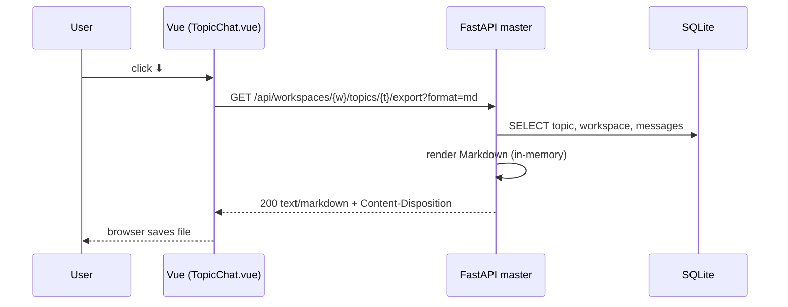

# Design: Topic Transcript Export

**Status:** accepted
**Author:** architect
**Date:** 2026-05-09
**Related ADRs:** [ADR-0014](../decisions/0014-topic-transcript-export.md);
builds on ADR-0007 (attachment download pattern) and ADR-0012 (streaming
transcript shape).

## Problem Statement

Users want to take topic conversations out of the app — into PRs, design docs,
issue write-ups, code reviews, and incident retros. Today the only way is to
copy-paste the rendered chat, which loses agent reasoning, tool calls, and
tool output, and is tedious for long topics.

We need a single-click "download this whole conversation as a file" affordance
on the topic page that produces a faithful, human-readable artifact. Markdown
is the right format because every downstream destination (GitHub, GitLab,
Notion, Obsidian, plain editors) renders it natively, and it is trivially
diffable in version control.

## Goals

- One-click export of a topic's full conversation from the topic toolbar.
- Output is a single self-contained Markdown file (no separate assets).
- Final agent text renders inline; **thinking**, **tool calls**, and
  **tool results** are present but collapsed by default via `<details>` so
  the file reads cleanly on GitHub/GitLab and any Markdown viewer that
  supports the HTML5 `details` element.
- Stable, deterministic output — same topic, same export, same bytes
  (modulo a header-line export timestamp).
- Reuse existing read paths (`messages` table, `topics` table, `workspaces`
  table) — no new persistence.
- Reasonable size limit so a 10k-message runaway topic does not OOM the
  master process.

## Non-Goals

- **PDF, HTML, JSON, or DOCX export.** Markdown only in v1. Other formats
  can be added behind the same endpoint with a `?format=` query param if
  demand emerges. (See Open Questions.)
- **Range / partial export** ("messages 50–80 only", "since yesterday").
  Whole topic only in v1.
- **Embedding attachments inline.** Attachments are referenced as relative
  links pointing back at the master's `/attachments/{id}/download`
  endpoint; the export does not bundle binary content.
- **Redaction or PII scrubbing.** The export contains exactly what the
  user can already see in the chat UI.
- **Bulk export across topics or workspaces.** One topic per request.
- **Realtime / streamed export.** The endpoint returns a finished file;
  it does not co-stream while the topic is mid-reply. The user can press
  it again once the reply lands.

## Design

### 1. API shape

New FastAPI route, mounted next to the existing topic and message routers:

```
GET /api/workspaces/{workspace_id}/topics/{topic_id}/export?format=md
```

- `format` query param — only `md` is accepted in v1; the parameter exists
  to leave the shape extensible without a breaking change.
- Auth — same auth dependency the rest of the topic routes already use
  (token from `request.app.state` per ADR-0008). No new permission tier;
  if you can read the topic, you can export it.
- Response — `text/markdown; charset=utf-8`, body is the full file,
  `Content-Disposition: attachment; filename="<slug>.md"` so the browser
  downloads instead of rendering. Mirrors the attachment download pattern
  in `src/master/attachments.py` (`download_attachment`).
- Filename — `<workspace-slug>-<topic-slug>-<YYYYMMDD>.md`, where slugs
  are produced by lowercasing, replacing non-alphanumerics with `-`, and
  trimming to 64 chars. Falls back to the workspace/topic UUID when the
  slug would be empty.
- Status codes — `200` on success; `404` if the workspace or topic is
  unknown or the caller cannot see it; `422` for an unsupported `format`;
  `413` if the rendered Markdown exceeds the configured size cap (default
  16 MiB — see Open Questions).
- Implementation lives in a new module `src/master/topic_export.py` so
  `messages.py` stays focused on dispatch. The router is included from
  `src/master/main.py` next to the existing topic and attachment routers.

The endpoint is **synchronous and in-memory** — the same model
`download_attachment` uses. A background-job path is out of scope; the
size cap is the backstop.

### 2. Markdown format spec

The exported document is a single UTF-8 Markdown file. Structure:

#### Header (once, at the top)

```markdown
# Topic: <topic.subject>
Workspace: <workspace.name>
Exported: <ISO 8601 UTC timestamp, e.g. 2026-05-09T14:23:11Z>

---
```

If `topic.subject` is empty, the header falls back to the topic UUID.
The `Exported:` line is the only non-deterministic byte in the output.

#### Per-message section (one block per message, in `created_at` order)

User messages:

````markdown
## User — <message.created_at>

<message.body>

---
````

Agent messages:

````markdown
## Agent (<agent_name>) — <message.created_at>

<final response text — message.text, rendered as-is>

<details>
<summary>Thinking</summary>

<concatenated thinking content from the transcript>

</details>

<details>
<summary>Tool: <tool-name></summary>

**Input:**
```json
{ ... pretty-printed tool input ... }
```

**Output:**
```
<tool result text, fenced as plain text>
```

</details>

---
````

Rendering rules:

- **Message order** — strict `created_at` ascending. Ties broken by
  message `id` lexicographically (stable across exports).
- **Thinking block** — emitted only if the transcript contains at least
  one `assistant` event with a `thinking` content block. Multiple
  thinking blocks are concatenated with a blank line between them.
- **Tool blocks** — one `<details>` block per `tool_use` event, in the
  order they appear in the transcript. The matching `tool_result` is
  located by `tool_use_id`; if no match exists (tool still running, or
  result was lost), the `Output:` section reads `_(no result captured)_`.
- **Tool input** — rendered as a fenced ` ```json` block, pretty-printed
  with two-space indent. If serialization fails, the raw string from the
  event is fenced as plain text and a `<!-- raw input -->` HTML comment
  is added above it.
- **Tool output** — fenced as plain text (no language tag) to avoid
  accidental Markdown rendering of tool output that contains backticks.
  If the result body itself contains a fence of `\`\`\`` or longer, the
  outer fence is bumped to `\`\`\`\`` and so on (standard CommonMark
  fence-escaping).
- **Final response text** (`message.text`) — emitted verbatim. It is
  already Markdown in the chat UI and we want fidelity; we accept that a
  malicious or messy agent could write something that confuses a viewer.
  This is identical to what the user already sees rendered in chat.
- **Attachments** — listed under each message that has them, as a
  Markdown bullet list of links: `- [filename.png](/attachments/<id>/download)`.
  Only emitted if the message has at least one attachment.
- **Streaming-only event types** (`task_progress`, `task_started`,
  `retry_notice`, `agent_result`, sub-agent traces) are dropped from
  the export. Rationale: they exist to give the user a live ticker
  during streaming (per ADR-0012); they add noise to a static archive.
  This decision is reversible — adding them later is purely additive.
- **Empty transcript** — agent messages whose transcript JSON is null
  or empty render as just `## Agent (...) — ...` followed by
  `message.text`, with no thinking or tool blocks.

#### Footer

No footer. The trailing `---` after the last message is sufficient.

### 3. UI placement

A download icon button is added to the topic header, next to the existing
settings cog (`.topic-settings-link` in
`frontend/src/views/TopicChat.vue`):

```
Workspaces / <ws> / <topic>  ⚙  ⬇
```

- Icon — a single Unicode glyph (`⬇` or `&#8615;`) matching the cog's
  visual weight; we deliberately avoid pulling in an icon library for
  one button.
- `title` attribute — `"Export transcript as Markdown"`.
- Behaviour — sets `window.location.href` (or an `<a download>` click)
  to the export endpoint URL. The browser handles the download because
  of the `Content-Disposition` header. No spinner, no toast — the
  request is fast enough for typical topics that the native browser
  download UI is the right feedback channel.
- Visibility — shown for both active and archived topics (read-only
  archived topics are still exportable). Hidden if `topic` has not yet
  loaded, same gating as the cog.
- Mobile — the icon stays in the breadcrumb row; the existing
  `.breadcrumb` styles already handle wrap.



### 4. Backend implementation sketch

`src/master/topic_export.py`:

```python
router = APIRouter(prefix="/workspaces/{workspace_id}/topics/{topic_id}",
                   tags=["topics"])

@router.get("/export")
def export_topic(workspace_id: str, topic_id: str,
                 request: Request, format: str = "md") -> Response:
    if format != "md":
        raise HTTPException(422, "unsupported format")
    conn = get_connection(request.app.state.db_path)
    try:
        topic = _load_topic(conn, workspace_id, topic_id)   # 404 if missing
        ws    = _load_workspace(conn, workspace_id)
        msgs  = _load_messages(conn, topic_id)              # ordered
    finally:
        conn.close()
    body = render_markdown(ws, topic, msgs)                 # pure function
    if len(body) > MAX_EXPORT_BYTES:
        raise HTTPException(413, "topic too large to export")
    fname = _slug_filename(ws.name, topic.subject)
    return Response(
        content=body,
        media_type="text/markdown; charset=utf-8",
        headers={"Content-Disposition": f'attachment; filename="{fname}"'},
    )
```

`render_markdown(ws, topic, msgs)` is a **pure function** taking already-fetched
rows and returning a string. This is what the unit tests exercise — no DB,
no FastAPI fixture. The DB-touching wrapper gets one in-process integration
test for the headers and the 404/413/422 paths.

Transcript parsing reuses the same shape the frontend `classifyEvent`
function in `TopicChat.vue` already understands:

- `event.type == "assistant"` with content blocks of type `text` /
  `thinking` / `tool_use`.
- `event.type == "user"` with content blocks of type `tool_result`,
  matched back to `tool_use` by `tool_use_id`.
- Everything else dropped.

A small parser helper in the same module produces a
`list[ParsedBlock]` per message that the renderer iterates over; this
keeps the renderer flat and easy to test.

### 5. Performance and limits

- **In-memory render.** Typical topics are <1 MB of Markdown. The 16 MiB
  cap (configurable via `settings.export_max_bytes`, default 16 * 1024 *
  1024) protects the master process from a pathological topic.
- **No streaming response in v1.** Adding `StreamingResponse` is a
  drop-in change later if we hit the cap in practice.
- **No caching.** Exports are cheap and topics mutate; building a cache
  is not justified.

### 6. Security

- Auth is the existing topic-read auth — same surface as
  `GET /api/workspaces/{w}/topics/{t}/messages`.
- Output is served as `text/markdown` with `Content-Disposition:
  attachment`, which prevents the browser from rendering it inline as
  HTML (the `<details>` tags are inert when the file is downloaded as
  text). When users open the file in GitHub or another renderer, that
  renderer's sanitizer applies — the same one that already handles
  `message.text` in the chat view.
- Filename is slugged to alphanumerics-and-hyphens before being
  interpolated into the `Content-Disposition` header. No user-controlled
  string reaches the header verbatim, so no header-injection risk.

## Alternatives Considered

### A. Client-side export (Vue assembles the Markdown)

The browser already has every message in memory while the chat is open.
A client-side export is one Vue function, no backend change.

- Pro: zero server work, instant.
- Pro: no new endpoint, no new tests against the master.
- Con: reproducibility — output drifts if two clients render slightly
  differently (different rounding, different time zones, different
  versions of the SPA).
- Con: cannot export from a script, a curl, or a CLI integration. Once
  it lives only in the browser, automation has to scrape the API and
  reimplement rendering.
- Con: large topics that the user can't fit in the chat view (because
  pagination or virtual scrolling didn't load them all yet) export
  incomplete.

Rejected — the lack of a stable scriptable endpoint outweighs the
implementation savings.

### B. Background job + email / signed URL

A worker renders the export and emails or links to the result.

- Pro: handles arbitrarily large topics.
- Pro: aligns with how some other apps export.
- Con: massive overkill for current topic sizes (sub-megabyte).
- Con: pulls in object storage / signed URL machinery we don't have.
- Con: the user has to wait, instead of one click and done.

Rejected — premature optimisation. Revisit if the 16 MiB cap starts
hitting.

### C. Multiple formats in v1 (Markdown + HTML + JSON)

Ship Markdown plus a sibling format from day one.

- Pro: fewer follow-up tickets.
- Pro: HTML preserves rendering more faithfully than Markdown.
- Con: triples the test surface for a feature whose primary user need
  ("paste this into a PR description") Markdown solves alone.
- Con: JSON export is `GET /messages` already — adding another shape
  for the same data is redundant.

Rejected — the `?format=` query parameter keeps the door open without
paying for it now.

### D. Embed thinking and tool blocks inline (no `<details>`)

Render thinking and tool calls as plain block-quoted Markdown, not
collapsible `<details>` HTML.

- Pro: works in the few Markdown renderers that strip raw HTML.
- Con: makes the file unreadable for the common case — long tool
  outputs swamp the actual conversation.
- Con: GitHub, GitLab, Obsidian, VS Code preview, and the major Markdown
  viewers all support `<details>` natively; the renderers that don't are
  edge cases.

Rejected — the readability win is worth the marginal compatibility loss.

## Open Questions

- [ ] **Size cap default** — is 16 MiB right? Owner: engineer (check
  `MAX(LENGTH(transcript))` across known production-shaped topics
  before merging).
- [ ] **Future formats** — when (if) we add HTML or PDF, should
  `?format=` accept multiple values, or do we add separate endpoints
  per format? Owner: architect (defer until second format is requested).
- [ ] **Attachment bundling** — should an opt-in `?include_attachments=zip`
  produce a `.zip` containing the Markdown plus all referenced files?
  Owner: product (out of scope for v1, file as a follow-up issue if
  asked).
- [ ] **Telemetry** — do we want a `topic_exported` event for
  analytics? Owner: doc-writer / SRE (file separately if needed; not
  blocking v1).

## Implementation Plan

1. Backend: `src/master/topic_export.py` — pure renderer + route, plus
   unit tests of the renderer in `tests/test_topic_export.py` and one
   integration test through the FastAPI client. Wire the router in
   `src/master/main.py`.
2. Frontend: download button in `frontend/src/views/TopicChat.vue`'s
   breadcrumb row, anchor element with the export URL and the `download`
   attribute. CSS reuses `.topic-settings-link`.
3. Docs: append a one-paragraph entry to `docs/manuals/user-manual.md`
   describing the button and the file format. Reference this design doc.
4. Test plan in `docs/test-plans/topic-transcript-export.md` covering:
   empty topic, user-only topic, agent message with no transcript,
   agent message with thinking, tool_use without tool_result, tool_use
   with tool_result, multi-tool-use, attachments, archived topic, size
   cap (413), unknown format (422), unknown topic (404), filename
   slugging including non-ASCII subjects.
